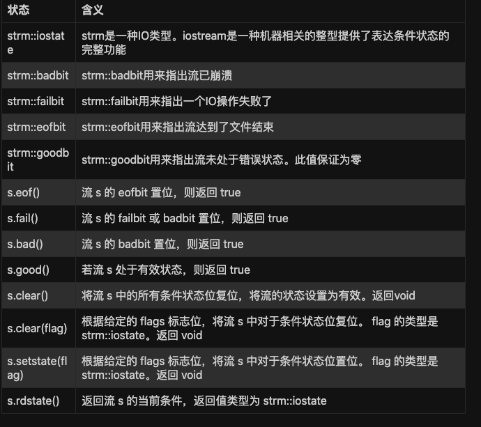

# IO流

### IO类

为了支持不同的IO操作，在iostream和ostream之外，标准库还定义了一些其他的IO类型，在三个头文件中定义，iostream定义用于基本读写的基本类型，fstream定义读写文件的类型，sstream定义了读写string对象的类型


总体来说，可以分为三类：

  1. iostream类： 负责与控制台输入输出打交道， 这个我们已经很熟悉了。   注意： 实际具体又可以区分为：istream和ostream

  2. fstream类：   负责与文件输入输出打交道， 这个我们接触过。  注意： 实际具体又可以区分为：ifstream和ofstream

  3. stringstream类：负责与string上的输入输出打交道， 这个我们暂时还真没用过。  注意： 实际具体又可以区分为：istringstream和ostringstream

```c++
#include <iostream>
#include <string>
#include <fstream>
#include <sstream>
using namespace std;

void TestIfstream() {
    ifstream in("test.txt");
    if(!in) {
        cout << "error" << endl;
    }
    string line;
    while(getline(in, line)) {
        cout << line << endl;
    }   
}

void TestStringStream() {
    ifstream in("test.txt");
    if(!in) {
        cout << "error" << endl;
    }

    string line, password;
    while(getline(in, line)) {
        // 将line读成字符串
        istringstream ss(line);
        while(ss >> password) {
            int i = 0;
            cout << password + ( 1 == ++i ? "X" : "")<< " ";
        }
        cout << endl;
    }
}

int main() {
    TestStringStream();
    return 0;
}
```

IO对象无拷贝或者对IO对象赋值，进行IO操作的函数通常以引用方式传递和生成流

```c++
void TestCopyStream(){
    ifstream in("test.txt");
    ifstream in2 = in;
}
```

Io类定义了一些函数和标志，可以帮助我们访问和操作流的条件状态，



下面看一段程序，eof是判断文件打开是否为空，当我们建立一个空的vehicle.txt文件，但是程序仍然会进入到while循环里面，并且输出ok，这就是一个错误了

```c++
void TestFileIsEmpty() {
    int vehicle_number;
    fstream infile;
    infile.open("vehicle.txt", ios::in);
    if(infile.is_open()){
        while(!infile.eof()){
            cout << "ok" << endl;
        }
        infile.close();
    }
}
```

那么结合上面的标志位，我们细看eof函数的代码，eof函数是读到文件结束符0xFF，而文件结束符是最后一个字符的下一个字符

```c++
bool
  eof() const
{ return (this->rdstate() & eofbit) != 0; }

// iostate 状态
enum _Ios_Iostate
{ 
  _S_goodbit 		= 0,
  _S_badbit 		= 1L << 0,
  _S_eofbit 		= 1L << 1,
  _S_failbit		= 1L << 2,
  _S_ios_iostate_end = 1L << 16 
};
```

要想让程序正确判断是否到达文件的尾部，可以使用peek函数或者get(ch) 方式

```c++
if(infile.is_open()){
  while(!infile.peek() == EOF){
    cout << "not empty" << endl;
  }
  infile.close();
}
```

每个输出流都会管理一个缓冲区，用来保存程序读写的数据，也就是说当程序输出一个字符串的时候，字符串有可能被理解打出来，也有可能被操作系统保存在缓冲区，随后在打印，能够导致缓冲区刷新的原因有很多，例如：

- 程序正常结束，作为 main() 函数的 return 操作的一部分，缓冲刷新被执行。
- 缓冲区满时，需要刷新缓冲，而后新的数据才能继续写入缓冲区。
- 我们可以使用操纵符如 endl 来显式刷新缓冲区。
- 在每个输出操作之后，我们可以用操作符 unitbuf 设置流的内部状态，来清空缓冲区。默认情况下，对 cerr 是设置 unitbuf 的，因此写到 cerr 的内容都是立即刷新的。
- 一个输出流可能被关联到另一个流。在这种情况下，当读写被关联的流时，关联到的流的缓冲区会被刷新。例如，默认情况下，cin 和 cerr 都关联到 cout。因此，读 cin 或写 cerr 都会导致 cout 的缓冲区被刷新。

使用操作符endl，flush、ends可以刷新缓冲区：

```c++
void TestIoBuffer() {
    cout << "hi!" << endl;  //输出换行，并且刷新缓冲区
    cout << "hi!" << flush; //直接刷新缓冲区，不输出任何额外字符
    cout << "hi!" << ends;  //输出空字符，然后刷新缓冲区
}
```

在一些比赛中，我们一般回去使用scanf或者printf进行输入或者输出，而c++的cin或者cout本来是很方便的，但是总是会被告知效率低下，甚至直接超时，主要原因是由于C++为了兼容c，保证程序在使用printf和scanf的时候不发生混乱，将输出流绑定到了一起，使用下面的一行代码取消ostream与stdio的默认关联，取消同步之后的iostream性能增倍，能与stdio相差无几

```c++
std::ios::sync_with_stdio(false);
```

同时cin默认绑定cout，也就是说每次执行<<都会导致flush，导致性能低下，可以通过解除cin与cout的绑定，进一步加快执行效率

```c++
#include <iostream>
using namespace std;
int main() 
{
    ios::sync_with_stdio(false);
    cin.tie(0);
    // IO
}
```

### 文件输入与输出

头文件fstream定义了三个类型来支持文件IO：

- ifstream从一个给定文件读取数据
- ofstream从一个给定文件写入数据
- fstream可以读写给定文件

这三个类的使用这里不再演示，创建一个文件输入与输出流，会自动的进行构造和析构，当一个fstream对象离开对象作用域的时候，与之关联的文件会自动关闭，并且会自动调用close方法

每个流都会有关联的文件模式，用来指示如何使用文件

| 模式标记                          | 适用对象                  | 作用                                                         |
| --------------------------------- | ------------------------- | ------------------------------------------------------------ |
| ios::in                           | ifstream fstream          | 打开文件用于读取数据。如果文件不存在，则打开出错。           |
| ios::out                          | ofstream fstream          | 打开文件用于写入数据。如果文件不存在，则新建该文件；如果文件原来就存在，则打开时清除原来的内容。 |
| ios::app                          | ofstream fstream          | 打开文件，用于在其尾部添加数据。如果文件不存在，则新建该文件。 |
| ios::ate                          | ifstream                  | 打开一个已有的文件，并将文件读指针指向文件末尾（读写指 的概念后面解释）。如果文件不存在，则打开出错。 |
| ios:: trunc                       | ofstream                  | 打开文件时会清空内部存储的所有数据，单独使用时与 ios::out 相同。 |
| ios::binary                       | ifstream ofstream fstream | 以二进制方式打开文件。若不指定此模式，则以文本模式打开。     |
| ios::in \| ios::out               | fstream                   | 打开已存在的文件，既可读取其内容，也可向其写入数据。文件刚打开时，原有内容保持不变。如果文件不存在，则打开出错。 |
| ios::in \| ios::out               | ofstream                  | 打开已存在的文件，可以向其写入数据。文件刚打开时，原有内容保持不变。如果文件不存在，则打开出错。 |
| ios::in \| ios::out \| ios::trunc | fstream                   | 打开文件，既可读取其内容，也可向其写入数据。如果文件本来就存在，则打开时清除原来的内容；如果文件不存在，则新建该文件。 |

### string流

sstream定义了三个类型类支持内存IO，这些类型可以向string写入数据，从string读取数据，就像是string是一个IO流一样：

- istringstraem从string读取数据
- ostringstream从string输入数据
- stringstream即可从string读取数据，也可以写入数据

关于使用，在前面已经有代码使用到了