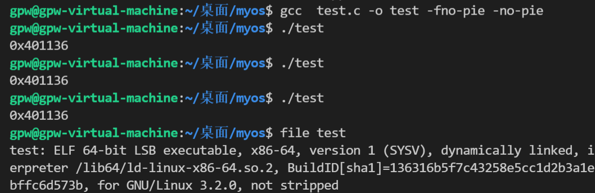
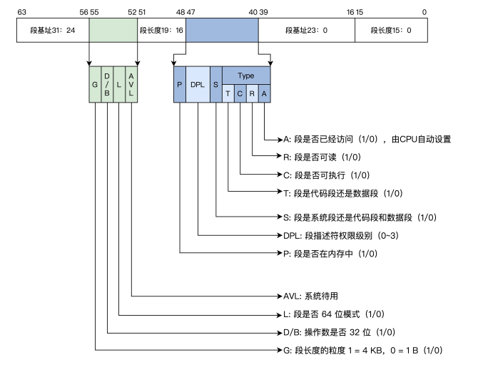

# Pic和Pie



# 虚拟机里套虚拟机

```javascript
C:\Program Files\Oracle\VirtualBox>VBoxManage.exe  modifyvm "PortableWindows10" --nested-hw-virt on
```

- https://cloud.tencent.com/developer/article/1680288


# GDT




