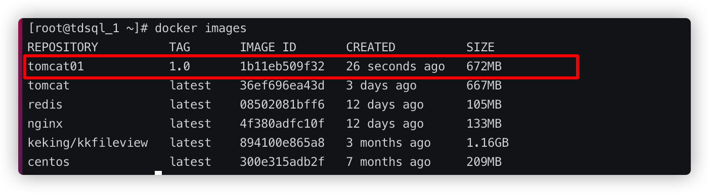

# 联合文件系统

在介绍docker镜像原理之前，得先说说联合文件系统，联合文件系统是docker镜像的基础，联合文件系统是一种分层、轻量级并且高性能的文件系统，支持为文件系统的修改作为一次提交来一层层的增加，这是一个概念，了解就好

# 镜像的定义

在前面的实例中，我们使用docker安装了centos，可以发现centos的镜像只有209MB相比一个centos发行版的操作系统几个G就太小了


可以思考为什么一个209m的centos镜像可以运行，即使缺少很多非必要的命令？

传统的虚拟机安装centos会包括两个部分，第一Linux的发行版本也就是内核，比如Linux3.0的内核，第二特定的Centos发行版本，这部分不包括Linux内核，包含一些软件包的管理等等，我们一般可以在不升级Centos版本的情况下升级Linux内核，这就理解为什么可以这样操作了

Centos的操作系统是有“Linux内核版本 Centos发行版本”组成，那么docker便利用了这一点将Centos发行版本换成任意的镜像，例如mysql + tomcat环境等等

也就是说使用docker安装mysql的话，就构成了“Linux内核 mysql镜像”，这个时候这种层级的概念就顺其自然的引出来了，==docker镜像是分层的，是由一堆只读层（为什么是只读的，在后面的容器的概念回引出）组成的，多个层级之间重叠在一起，除了最下面一层，其他层都有一个指针指向下一层，而统一文件系统为这些层提供了一个统一的视角，对用户的角度来说，感觉不到这些层级的存在==


# 容器的定义

容器的定义和镜像的定义基本一样，可能会很惊讶，对于镜像和容器的理解，也许会错误的认为就是程序和进程之间的区别，一个是静态的存储在磁盘中，另外一个是运行的运行在内存中；这样的理解是不正确的，因为docker commit的存在，docker commit允许将一个容器提交打包成一个镜像，如果只是简单的静态与动态的关系，怎么能打包？docker commit的原理通过理解容器的定义变非常简单

容器只不过是在原本镜像的只读层上添加了一层读写层，用户的所有操作都是基于这层读写层进行的

举一个例子：所有的docker镜像都会起始于一个基础镜像层，当进行操作添加新的内容的时候，就会在当前的镜像层上，创建新的镜像

假如基于 Ubuntu Linux16.04创建一个新的镜像，这就是新镜像的第一层；如果在该镜像中添加 Python包，
就会在基础镜像层之上创建第二个镜像层；如果继续添加一个安全补丁，就会创健第三个镜像层该像当前已经包含3个镜像层，如下图所示（这只是一个用于演示的很简单的例子）。


在添加额外的镜像层的同时，镜像始终保持是当前所有镜像的组合，理解这一点非常重要。下图中举了一个简单的例子，每个镜像层包含3个文件，而镜像包含了来自两个镜像层的6个文件。


上图中的镜像层跟之前图中的略有区別，主要目的是便于展示文件
下图中展示了一个稍微复杂的三层镜像，在外部看来整个镜像只有6个文件，这是因为最上层中的文件7是文件5的一个更新版


文种情況下，上层镜像层中的文件覆盖了底层镜像层中的文件。这样就使得文件的更新版本作为一个新镜像层添加到镜像当中


当我们下载一个镜像的时候，可以发现是分层下载的


这种分层下载的好处便是分用和复用，做到资源的共享，如果有多个镜像都有相同的base镜像，那么就只需要存放一份base镜像了，前面也用`docker inspect`可以查看镜像的一些元数据信息

# docker commit

docker commit提交镜像支持将正在运行的已经修改的镜像打包成一个新的镜像

下面做一个实例，首先拉去tomcat的镜像，同时运行

```shell
[root@tdsql_1 ~]# docker pull tomcat
Using default tag: latest
latest: Pulling from library/tomcat
0bc3020d05f1: Pull complete
a110e5871660: Pull complete
83d3c0fa203a: Pull complete
a8fd09c11b02: Pull complete
96ebf1506065: Pull complete
b8bf70f9cc4d: Pull complete
3f6da67b9e68: Pull complete
257407776119: Pull complete
7bd0a187fb92: Pull complete
307fc4df04c9: Pull complete
Digest: sha256:a5abf192aceed45620dbb2e09f8abdec2b96108b86365a988c85e753c28cd36b
Status: Downloaded newer image for tomcat:latest
docker.io/library/tomcat:latest
[root@tdsql_1 ~]# docker run -d -p 4433:8080 tomcat
```

将tomcat的4433端口做为物理机与docker内的tomcat镜像8080的映射地址，然后在外部访问http:主机ip:4433发现没有页面，原因是下载的tomcat镜像内webapps没有文件

```shell
[root@tdsql_1 ~]# docker exec -it f0688d11c513 /bin/bash
root@f0688d11c513:/usr/local/tomcat#
root@f0688d11c513:/usr/local/tomcat# ls
BUILDING.txt	 LICENSE  README.md	 RUNNING.txt  conf  logs	    temp     webapps.dist
CONTRIBUTING.md  NOTICE   RELEASE-NOTES  bin	      lib   native-jni-lib  webapps  work
root@f0688d11c513:/usr/local/tomcat# cd webapps
root@f0688d11c513:/usr/local/tomcat/webapps# ls
root@f0688d11c513:/usr/local/tomcat/webapps#
```

现在使用docker commit将webapps.dist文件内的内容复制到webapps内，然后打包成一个镜像

```
docker commit -m="描述信息" -a="作者" 容器id 目标镜像名:[TAG]
```

```shell
[root@tdsql_1 ~]# docker commit -m="添加webapps信息" -a="pwenguo" f0688d11c513 tomcat01:1.0
sha256:1b11eb509f3291425faf88be4fb1f2ac6af2cd5e95444258272df190c24f677
```



之后可以将这个镜像发布到docker的hub中其他人可以打包下载