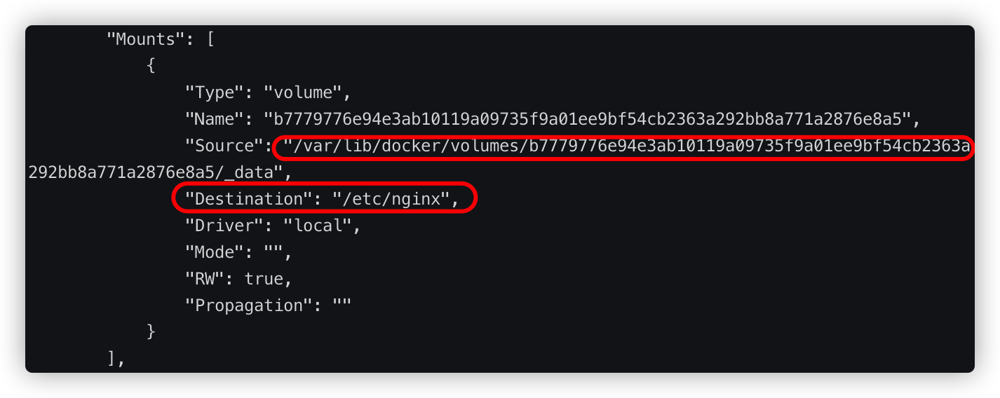
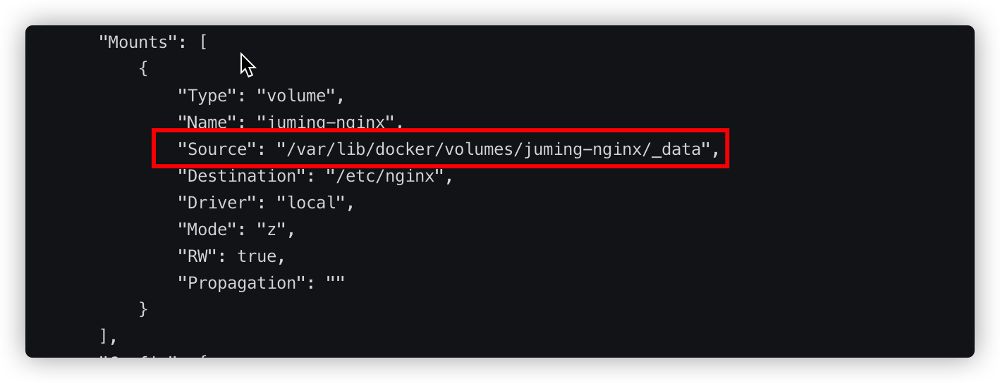
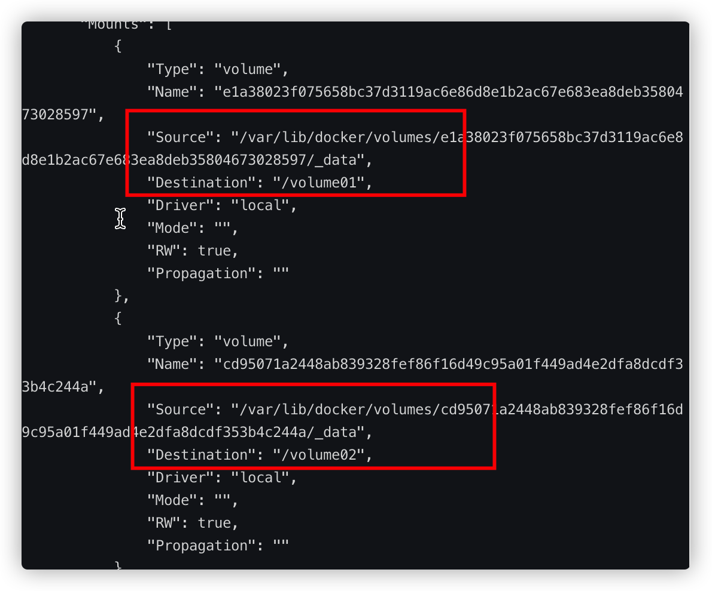

# 容器数据卷概念

docker是将应用和环境打包成为一个镜像，使得安装和部署非常的方便，比如部署一个nginx只需要拉去nginx的镜像，然后运行即可，但是有下面几个问题：

- 每次修改nginx的配置都需要进容器内部
- 当我删除容器的时候，是不是里面的数据也没有了，比如mysql环境，删除了容器那里面的数据呢？

而卷技术便解决了上面两个问题，卷技术简单来说就是将容器内的目录挂载在宿主机上，使得容器数据可以持久化和同步操作，容器之间也可以共享数据

# 使用方式

> 方式一 使用-v命令挂载

```shell
docker run -it -v 主机目录:容器内目录 -p 主机端口:容器内端口
```

```shell
docker run -it -v /home/ceshi:/home centos /bin/bash
```

上面命令代表在运行容器的时候，将容器内的/home挂载到宿主机上的/home/ceshi目录下使用docker inspect可以查看一些mount挂载的信息

```shell
[root@tdsql_1 ceshi]# docker inspect 96aca19b9145
[
    {
        "Id": "96aca19b9145c3a9b7628f5e4b73a04e79f61b59f30cef0e6ab8796f191d4eaf",
        "Created": "2021-07-06T12:24:31.364372569Z",
        "Path": "/bin/bash",
        "Args": [],
        "State": {
            "Status": "running",
            "Running": true,
            "Paused": false,
            "Restarting": false,
            "OOMKilled": false,
            "Dead": false,
            "Pid": 6277,
            "ExitCode": 0,
            "Error": "",
            "StartedAt": "2021-07-06T12:24:31.798646041Z",
            "FinishedAt": "0001-01-01T00:00:00Z"
        },
        "Image": "sha256:300e315adb2f96afe5f0b2780b87f28ae95231fe3bdd1e16b9ba606307728f55",
        "ResolvConfPath": "/var/lib/docker/containers/96aca19b9145c3a9b7628f5e4b73a04e79f61b59f30cef0e6ab8796f191d4eaf/resolv.conf",
        "HostnamePath": "/var/lib/docker/containers/96aca19b9145c3a9b7628f5e4b73a04e79f61b59f30cef0e6ab8796f191d4eaf/hostname",
        "HostsPath": "/var/lib/docker/containers/96aca19b9145c3a9b7628f5e4b73a04e79f61b59f30cef0e6ab8796f191d4eaf/hosts",
        "LogPath": "/var/lib/docker/containers/96aca19b9145c3a9b7628f5e4b73a04e79f61b59f30cef0e6ab8796f191d4eaf/96aca19b9145c3a9b7628f5e4b73a04e79f61b59f30cef0e6ab8796f191d4eaf-json.log",
        "Name": "/amazing_payne",
        "RestartCount": 0,
        "Driver": "overlay2",
        "Platform": "linux",
        "MountLabel": "",
        "ProcessLabel": "",
        "AppArmorProfile": "",
        "ExecIDs": null,
        "HostConfig": {
            "Binds": [
                "/home/ceshi:/home"
            ],
            "ContainerIDFile": "",
            "LogConfig": {
                "Type": "json-file",
                "Config": {}
            },
            "NetworkMode": "default",
            "PortBindings": {},
            "RestartPolicy": {
                "Name": "no",
                "MaximumRetryCount": 0
            },
            "AutoRemove": false,
            "VolumeDriver": "",
            "VolumesFrom": null,
            "CapAdd": null,
            "CapDrop": null,
            "CgroupnsMode": "host",
            "Dns": [],
            "DnsOptions": [],
            "DnsSearch": [],
            "ExtraHosts": null,
            "GroupAdd": null,
            "IpcMode": "private",
            "Cgroup": "",
            "Links": null,
            "OomScoreAdj": 0,
            "PidMode": "",
            "Privileged": false,
            "PublishAllPorts": false,
            "ReadonlyRootfs": false,
            "SecurityOpt": null,
            "UTSMode": "",
            "UsernsMode": "",
            "ShmSize": 67108864,
            "Runtime": "runc",
            "ConsoleSize": [
                0,
                0
            ],
            "Isolation": "",
            "CpuShares": 0,
            "Memory": 0,
            "NanoCpus": 0,
            "CgroupParent": "",
            "BlkioWeight": 0,
            "BlkioWeightDevice": [],
            "BlkioDeviceReadBps": null,
            "BlkioDeviceWriteBps": null,
            "BlkioDeviceReadIOps": null,
            "BlkioDeviceWriteIOps": null,
            "CpuPeriod": 0,
            "CpuQuota": 0,
            "CpuRealtimePeriod": 0,
            "CpuRealtimeRuntime": 0,
            "CpusetCpus": "",
            "CpusetMems": "",
            "Devices": [],
            "DeviceCgroupRules": null,
            "DeviceRequests": null,
            "KernelMemory": 0,
            "KernelMemoryTCP": 0,
            "MemoryReservation": 0,
            "MemorySwap": 0,
            "MemorySwappiness": null,
            "OomKillDisable": false,
            "PidsLimit": null,
            "Ulimits": null,
            "CpuCount": 0,
            "CpuPercent": 0,
            "IOMaximumIOps": 0,
            "IOMaximumBandwidth": 0,
            "MaskedPaths": [
                "/proc/asound",
                "/proc/acpi",
                "/proc/kcore",
                "/proc/keys",
                "/proc/latency_stats",
                "/proc/timer_list",
                "/proc/timer_stats",
                "/proc/sched_debug",
                "/proc/scsi",
                "/sys/firmware"
            ],
            "ReadonlyPaths": [
                "/proc/bus",
                "/proc/fs",
                "/proc/irq",
                "/proc/sys",
                "/proc/sysrq-trigger"
            ]
        },
        "GraphDriver": {
            "Data": {
                "LowerDir": "/var/lib/docker/overlay2/e62465f48e5dd0e9390534740acecb638d709e78f6c05d11c2bab19ac7e77f3f-init/diff:/var/lib/docker/overlay2/befa06fe1565c827dea4aeb67c401007b11b688abbe6160f61879f1b397050d9/diff",
                "MergedDir": "/var/lib/docker/overlay2/e62465f48e5dd0e9390534740acecb638d709e78f6c05d11c2bab19ac7e77f3f/merged",
                "UpperDir": "/var/lib/docker/overlay2/e62465f48e5dd0e9390534740acecb638d709e78f6c05d11c2bab19ac7e77f3f/diff",
                "WorkDir": "/var/lib/docker/overlay2/e62465f48e5dd0e9390534740acecb638d709e78f6c05d11c2bab19ac7e77f3f/work"
            },
            "Name": "overlay2"
        },
        "Mounts": [		###挂载的信息
            {
                "Type": "bind",
                "Source": "/home/ceshi",	# 源目录
                "Destination": "/home",		# 目标目录
                "Mode": "",
                "RW": true,
                "Propagation": "rprivate"
            }
        ],
        "Config": {
            "Hostname": "96aca19b9145",
            "Domainname": "",
            "User": "",
            "AttachStdin": true,
            "AttachStdout": true,
            "AttachStderr": true,
            "Tty": true,
            "OpenStdin": true,
            "StdinOnce": true,
            "Env": [
                "PATH=/usr/local/sbin:/usr/local/bin:/usr/sbin:/usr/bin:/sbin:/bin"
            ],
            "Cmd": [
                "/bin/bash"
            ],
            "Image": "centos",
            "Volumes": null,
            "WorkingDir": "",
            "Entrypoint": null,
            "OnBuild": null,
            "Labels": {
                "org.label-schema.build-date": "20201204",
                "org.label-schema.license": "GPLv2",
                "org.label-schema.name": "CentOS Base Image",
                "org.label-schema.schema-version": "1.0",
                "org.label-schema.vendor": "CentOS"
            }
        },
        "NetworkSettings": {
            "Bridge": "",
            "SandboxID": "b863c618c9d0027e406a0356a0efe553f0b5df227387047b88530a986e4f4da4",
            "HairpinMode": false,
            "LinkLocalIPv6Address": "",
            "LinkLocalIPv6PrefixLen": 0,
            "Ports": {},
            "SandboxKey": "/var/run/docker/netns/b863c618c9d0",
            "SecondaryIPAddresses": null,
            "SecondaryIPv6Addresses": null,
            "EndpointID": "088b0c2a122c77004b45b7cd562f0ccbef9d3fd88384bb5f1d1db862df2631f6",
            "Gateway": "172.17.0.1",
            "GlobalIPv6Address": "",
            "GlobalIPv6PrefixLen": 0,
            "IPAddress": "172.17.0.2",
            "IPPrefixLen": 16,
            "IPv6Gateway": "",
            "MacAddress": "02:42:ac:11:00:02",
            "Networks": {
                "bridge": {
                    "IPAMConfig": null,
                    "Links": null,
                    "Aliases": null,
                    "NetworkID": "4eda75cb17cbe081c641e9cfd2a564b862de230ee5e4105cdd2d3510cc5eb714",
                    "EndpointID": "088b0c2a122c77004b45b7cd562f0ccbef9d3fd88384bb5f1d1db862df2631f6",
                    "Gateway": "172.17.0.1",
                    "IPAddress": "172.17.0.2",
                    "IPPrefixLen": 16,
                    "IPv6Gateway": "",
                    "GlobalIPv6Address": "",
                    "GlobalIPv6PrefixLen": 0,
                    "MacAddress": "02:42:ac:11:00:02",
                    "DriverOpts": null
                }
            }
        }
    }
]

```

使用容器卷技术即使docker的容器被删除了，数据仍然保存在宿主机本地

**案例：MySQL数据挂载**

```shell
docker run --name mysql01 -e MYSQL_ROOT_PASSWORD='root' -d -p 3355:3306 -v /home/mysql/conf:/etc/mysql/conf.d -v /home/mysql/data:/var/lib/mysql mysql:5.7
```


### 具名挂载和匿名挂载

```shell
 # 匿名挂载
 docker run -d -p 4433:80 --name nginx02 -v /etc/nginx nginx
```

使用匿名挂载之后可以使用`docker inspect`查看挂载情况



也可以使用`docker volume`查看卷的挂载情况

```shell
[root@tdsql_1 ~]# docker volume ls
DRIVER    VOLUME NAME
local     b7779776e94e3ab10119a09735f9a01ee9bf54cb2363a292bb8a771a2876e8a5
```

```shell
# 具名挂载
 docker run -d -p 4455:80 --name nginx03 -v juming-nginx:/etc/nginx nginx
```



```shell
[root@tdsql_1 ~]# docker volume ls
DRIVER    VOLUME NAME
local     b7779776e94e3ab10119a09735f9a01ee9bf54cb2363a292bb8a771a2876e8a5
local     juming-nginx
```

三种挂载方式的区别：

- -v 容器内路径			**匿名挂载**
- -v 卷名：容器内路径  **具名挂载**
- -v /宿主机路径:容器内路径  **指定路径挂载**


> 方式二 使用Dockerfile的方式进行挂载

编写Dockerfile

```dockerfile
FROM centos

VOLUME ["/volume01","/volume02"]

CMD echo "-----end------"

CMD /bin/bash
```

然后进行build成为镜像

```shell
docker build -f Dockerfile -t myimg2 .
```

需要注意的是 如果在编写Dockerfile文件的时候，在VOLUME下没有使用绝对路径的话会报出一个错误

```shell
docker: Error response from daemon: OCI runtime create failed: invalid mount {Destination:volume01 Type:bind Source:/var/lib/docker/volumes/ca79be69e78e8c839b95c8bdd9353b86978cdfac3e742956d793327545a4fa1e/_data Options:[rbind]}: mount destination volume01 not absolute: unknown.
ERRO[0000] error waiting for container: context canceled
```

运行这个镜像

```shell
docker run -it myimg2
```

`docker inspect`查看信息




> 方式三：数据卷容器

数据卷容器用于多个容器之间的数据挂载，例如运行多个MySQL实例，需要在多个mysql之间共享数据的场景

```shell
--volumes-from 
```

```shell
➜  ~ docker run -d -p 3306:3306 -v /home/mysql/conf:/etc/mysql/conf.d -v /home/mysql/data:/var/lib/mysql -e MYSQL_ROOT_PASSWORD=123456 --name mysql01 mysql:5.7
➜  ~ docker run -d -p 3307:3306 -e MYSQL_ROOT_PASSWORD=123456 --name mysql02 --volumes-from mysql01  mysql:5.7
# 这个时候，可以实现两个容器数据同步！
```

容器之间的配置信息的传递，使用数据卷容器，那么数据的生命周期是到没有任何容器使用为止