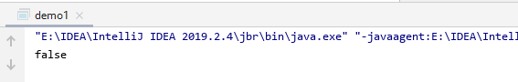

# 一、equals方法的位置

- equals方法在Object类中，源码如下

  ```java
     public boolean equals(Object obj) {
          return this == obj;
      }
  ```

  可以看到是使用 == 来判断的，== 其实就是比较两个对象的内存地址。Object1.equals(Object2)表示为Object1与Object2引用同一个对象

  

```java
public class demo1 {
    public static void main(String[] args) {
        Cat c1 = new Cat("c1");
        Cat c2 = new Cat("c1");
        System.out.println(c1.equals(c2));
    }
}
class Cat{
    public Cat(String name) {
        this.name = name;
    }

    private String name;

    public void setName(String name) {
        this.name = name;
    }

    public String getName() {
        return name;
    }
}
```

输出结果



# 二、重写过的equals

## 1.String.java中的equals

```java
String s1 = "老王";
String s2 = "老王";
System.out.println(s1.equals(s2));
```

输出结果是true，原因是String重写过equals方法。看源码（JDK11）

```java
//JDK11
    public boolean equals(Object anObject) {
        if (this == anObject) {
            return true;
        } else {
            if (anObject instanceof String) {
                String aString = (String)anObject;
                if (this.coder() == aString.coder()) {
                    return this.isLatin1() ? StringLatin1.equals(this.value, aString.value) : StringUTF16.equals(this.value, aString.value);
                }
            }

            return false;
        }
    }
//JDK1.8
	public boolean equals(Object anObject) {
        if (this == anObject) {
            return true;
        }
        if (anObject instanceof String) {
            String anotherString = (String)anObject;
            int n = value.length;
            if (n == anotherString.value.length) {
                char v1[] = value;
                char v2[] = anotherString.value;
                int i = 0;
                while (n-- != 0) {
                    if (v1[i] != v2[i])
                        return false;
                    i++;
                }
                return true;
            }
        }
        return false;
    }
```

用于比较两字符串是否相等，如果引用相同则返回true。JDK11源码还增加了判断编码格式是否一样

**2个例子：**


## 2.Integer中的equals

```java
  //JDK11
   public boolean equals(Object obj) {
        if (obj instanceof Integer) {
            return this.value == (Integer)obj;
        } else {
            return false;
        }
    }

```

总结： == 对于基本类型来说是值比较，对于引用类型来说是比较的引用，只是很多类重写了equals方法，将它变成了值比较。

# 三、Java中常用比较方法

- 对象域：使用重写过后的equals
- 类型安全的枚举类：equals或者 == 
- 可能为null的对象域

