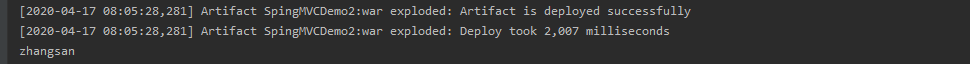
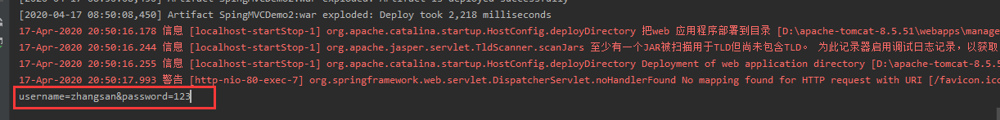
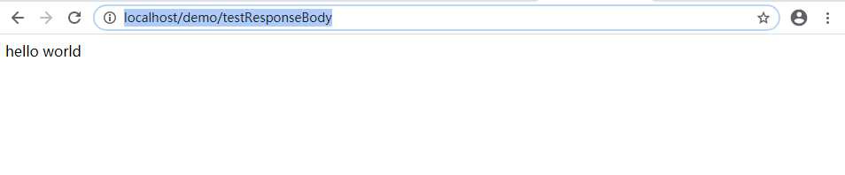
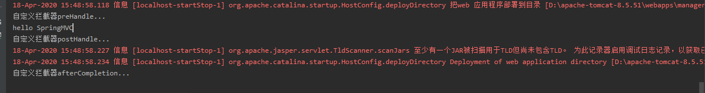

---

---

### 一、RequestMapping

在前面的入门里面，RequestMapping里面填写的是访问路径，作用是建立请求URL和处理请求方法之间的对应关系，看看它的源码

```java
@Target({ElementType.METHOD, ElementType.TYPE})
@Retention(RetentionPolicy.RUNTIME)
@Documented
@Mapping
public @interface RequestMapping {    
    String name() default "";
    @AliasFor("path")
    String[] value() default {};

    @AliasFor("value")
    String[] path() default {};

    RequestMethod[] method() default {};

    String[] params() default {};

    String[] headers() default {};

    String[] consumes() default {};

    String[] produces() default {};
}
```

##### 1.作用范围：

从元注解@Target({ElementType.METHOD, ElementType.TYPE})可以看出，RequestMapping可以作用于方法上，类上。作用在类上表示是该请求的根目录，例如：

```java
@Controller("controllerDemo1")
@RequestMapping("/demo")
public class ControllerDemo1 {
    @RequestMapping("/hello")
    public String testDemo1(){
        double random = Math.random();
        System.out.println("hello SpringMVC");
        return "success";
    }
}
```

那么如果要访问，浏览器输入的请求应该为：localhost:端口/虚拟目录/demo/hello

##### 2.属性

- value：指定请求的URL，和path的属性值一样
- method：用于指定请求的方式

```java
@Controller("controllerDemo1")
@RequestMapping("/demo")
public class ControllerDemo1 {
    @RequestMapping(value = "/hello",method = RequestMethod.GET)
    public String testDemo1(){
        double random = Math.random();
        System.out.println("hello SpringMVC");
        return "success";
    }
}
```

- params：用于指定限制请求参数的条件，支持简单的表达式
- headers：用于限制请求消息头的条件

### 二、请求参数的绑定

请求参数的绑定是什么意思呢？我们知道页面和服务器之间是通过数据来交互的，例如：最简单的一个表单提交，就要将页面中test框的内容提交到服务器中，服务器在做其中的一些逻辑判断，但是如果是pojo类，就是实体类，在之前的servlet中，需要服务器一个一个的手动下载pojo类对象的属性，然后在进行封装，SpringMVC不用，SpringMVC帮助我们省略了封装的过程。例如：

在页面简单的写一个表单项：

```jsp
<form method="post" action="/demo/login">
    用户名<input type="text" name="userName"><br>
    密码<input type="password" name="password"><br>
    <input type="submit" value="登陆">
</form>
```

Controller

```java
 @RequestMapping("/login")
    public void testLogin(User user){
        System.out.println(user);
    }
```

当然在此之前需要编写实体类，该实体类有两个属性，分别是userName和password，然后在Controllor中直接在参数列表里User user，那么SpringMVC会自动表单里的数据给我们封装到user对象中，那么这样就很方便，


很显然，这么做必然有一个前提：==实体类中的属性要和表单项中的name属性的值要一样，并且是严格区分大小写的==，后面会说到在两者不一样的时候，如何进行请求参数的绑定。

下面列举出SpingMVC可以自动帮我们进行参数绑定的类型

- 基本数据类型和String类型
- pojo实体类
- 数组和集合类型参数

那么，==如果要进行自动绑定，一定要注意参数名称和属性值要一样==

### 三、请求参数乱码问题

同样是上面的表单提交项，如果要输入中文，那么会出现乱码问题


之前在web基础中，在request对象中有setCharacterEncoding方法可以解决中文乱码问题，当然在SpringMVC中也有request对象，但是我们更常用的还是，在web.xml中配置一个中文乱码的拦截器

```xml
<!--  配置文件乱码过滤器-->
  <filter>
    <filter-name>characterEncodingFilter</filter-name>
    <filter-class>org.springframework.web.filter.CharacterEncodingFilter</filter-class>
      <!-- 设置过滤器中的属性值 -->
    <init-param>
      <param-name>encoding</param-name>
      <param-value>UTF-8</param-value>
    </init-param>
      <!-- 启动过滤器 -->
    <init-param>
      <param-name>forceEncoding</param-name>
      <param-value>true</param-value>
    </init-param>
  </filter>
<!-- 过滤所有请求 -->
  <filter-mapping>
    <filter-name>characterEncodingFilter</filter-name>
    <url-pattern>/*</url-pattern>
  </filter-mapping>
```

那么，配置好了拦截器，就不会出现乱码问题，但是也带来了一个新的问题，我们在web.xml中配置了拦截器，那么该拦截器将会对所有资源进行过滤，这样显然不太好，因为我们有一些静态的资源文件例如css，image等等，这些都是不需要过滤的，可以在springmvc.xml中配置那些资源不需要过滤，注意是在springmvc的配置文件中设置，不要在web.xml中配置了，会飘红的，没有该约束

```xml
<mvc:resources location="/css/" mapping="/css/**"/>
<mvc:resources location="/images/" mapping="/images/**"/>
<mvc:resources location="/scripts/" mapping="/javascript/**"/>
```

### 四、自定义类型转换器

前面说，以下类型SpringMVC会自动地帮助我们进行参数地绑定

- 基本数据类型和String类型
- pojo实体类
- 数组和集合类型参数

但是有些类型需要我们手动地进行类型转换，例如说日期类型data

```html
    <a href="/demo/date?date=2018-06-06">日期</a>
```

浏览器默认格式是字符串的，如果在服务器端用date类型来接受，那么将会报错，因为SpringMVC无法进行转换

##### 1.定义一个转换类实现Converter接口

```java
/**
 * author by four and ten
 * create by 2020/4/17 19:38
 */
public class dateConverter implements Converter<String, Date> {

    @Override
    public Date convert(String s) {
        if(s == null || s.length() ==0){
            throw  new NullPointerException("日期为空");
        }
        SimpleDateFormat sf = new SimpleDateFormat("yyyy-MM-dd");
        try {
            return sf.parse(s);
        } catch (ParseException e) {
            e.printStackTrace();
        }
        return null;
    }
}
```

##### 2.在springmvc的配置文件中配置类型转换器

```xml
    <bean id="conversionService" class="org.springframework.context.support.ConversionServiceFactoryBean">
        <property name="converters">
            <array>
                <bean class="com.SpringMVCDemo.converter.dateConverter"></bean>
            </array>
        </property>
    </bean>
```

##### 3.在springmvc配置文件中引用配置的类型转换

```xml
<mvc:annotation-driven conversion-service="conversionService"/>
```


那么这样就可以进行类型转换了

### 五、使用Servlet原生API

在servlet中有些api是经常使用的，例如：

- HttpServletRequest
- HttpServletResponse
- HttpSession

要想使用这些api，只需要在方法的参数列表中定义这些对象即可

```java
    @RequestMapping("/servlet")
    public void testServlet(HttpServletRequest request, HttpServletResponse response, HttpSession session){
       
    }
```

### 六、一些常用注解

- RequestMapping：建立请求URL和处理请求方法之间的对应关系
- RequestParam：指定名称的参数的形参赋值
- RequestBody：获取请求体的内容
- ResponseBody：该注解用于将Controller的方法返回的对象，通过适当的HttpMessageConverter转换为指定格式后，写入到Response对象的body数据区

##### 1.RequestParam

RequestParam作用是指定名称的参数的形参赋值，在前面请求参数的绑定的时候，说过：实体类中的属性要和表单项中的name属性的值要一样，并且是严格区分大小写的。当我们使用RequestParam这个注解的时候，那么就可以不用那么严格

jsp页面

```jsp
<a href="/demo/testParam?username=zhangsan">参数</a>
```

```java
    @RequestMapping("/testParam")
    public void testParam(@RequestParam(name = "username") String name){
        System.out.println(name);
    }
```

参数名称是username，但是在Controller中参数名称是name，如果没有指定RequestParam注解，那肯定是要报错的，如果指定了，那么不报错。



```java

@Target({ElementType.PARAMETER})
@Retention(RetentionPolicy.RUNTIME)
@Documented
public @interface RequestParam {
    @AliasFor("name")
    String value() default "";

    @AliasFor("value")
    String name() default "";

    boolean required() default true;

    String defaultValue() default "\n\t\t\n\t\t\n\ue000\ue001\ue002\n\t\t\t\t\n";
}
```

可以看到，RequestParam注解有4个属性：

- name：name属性的值必须和请求的参数一致，例如上面的username和注解里的name属性
- value：和name属性互用
- required：请求参数中是否需要提供此参数，默认值是true
- defaultValue：可以提供一个默认值

##### 2.**RequestBody**

RequestBody的作用是获取请求体的内容，得到的是key=value的格式。

```jsp
    <form action="/demo/testRequestBody" method="post">
        用户名称：<input type="text" name="username" ><br/>
        用户密码：<input type="password" name="password" ><br/>
        <input type="submit" value="保存">
    </form>
```

```java
@RequestMapping("/testRequestBody")
    public void testRequestBody(@RequestBody(required = false)String body){
        System.out.println(body);

    }
```

结果：



```java
@Target({ElementType.PARAMETER})
@Retention(RetentionPolicy.RUNTIME)
@Documented
public @interface RequestBody {
    boolean required() default true;
}

```

可以看到RequestBody就一个属性

- required：：是否必须有请求体；默认值是:true；当取值为 true 时，get 请求方式会报错；如果取值 为 false，get 请求得到是 null。 

##### 3.ResponseBody

该注解用于将Controller的方法返回的对象，通过适当的HttpMessageConverter转换为指定格式后，写入到Response对象的body数据区。

```java
    @ResponseBody
    @RequestMapping("/testResponseBody")
    public String testResponseBody(){
        return "hello world";
    }
```

当浏览器访问：localhost:/demo/testResponseBody时页面将会展示



### 七、ModeAndView对象

ModelAndView 是 SpringMVC 为我们提供的一个对象，该对象也可以用作控制器方法的返回值。下面先看一个使用案例

```java
    @RequestMapping("/testModelAndView")
    public ModelAndView testModelAndView(){
        ModelAndView mv = new ModelAndView();
        mv.addObject("username","zhangsan");
        mv.setViewName("success");
        return mv;
    }
```

jsp页面

```jsp
<%@ page language="java" contentType="text/html; charset=UTF-8"
         pageEncoding="UTF-8"  isELIgnored="false"%>
<!DOCTYPE html PUBLIC "-//W3C//DTD HTML 4.01 Transitional//EN"
"http://www.w3.org/TR/html4/loose.dtd">
<html>
<head>
    <meta http-equiv="Content-Type" content="text/html; charset=UTF-8">
    <title>执行成功</title>
</head>
<body>
执行成功！
${username}
</body>
</html>
```

也就是说，ModelAndView中的方法addObject会将参数封装到模型对象中，然后在jsp模板引擎中可以使用表达式来取出该对象的值，而方法setViewName会设置一个逻辑视图名称，视图解析器会根据名称解析出view然后进行渲染，展示该页面。

需要注意的是：使用这种方式是通过请求转发的方式，可以直接看浏览器地址栏没有发生变化


### 八、转发和重定向

这里先复习一下转发和重定向的区别

重定向的特点:redirect

> 1. 地址栏发生变化
> 2. 重定向可以访问其他站点(服务器)的资源
> 3. 重定向是两次请求。不能使用request对象来共享数据

request请求转发特点：forward

> 1. 转发地址栏路径不变
> 2. 转发只能访问当前服务器下的资源
> 3. 转发是一次请求，可以使用request对象来共享数据

在SpringMVC中，前面说到可以获取Servlet原生的api，那么这也是一种方法，获取到了原生的api，想要转发和重定向只要调用其中的方法即可

重定向： response.sendRedirect("/Request/Redirectdemo2");

请求转发：request. getRequestDispatcher(String path).forward();

在SpringMVC中提供了更简单的方法，来进行转发和重定向

##### 1.**forward** **转发**

之前的案例中，Controller中方法的返回值是String类型的话，其实这里就是转发，但是省略了forward关键字

```java
    @RequestMapping(value = "/hello",method = RequestMethod.GET)
    public String testDemo1(){
        System.out.println("hello SpringMVC");
        return "forward:/pages/success.jsp";
    }
```

不过这里需要注意：如果是显式的表明了forward关键字，那么不能写逻辑视图了，也就是视图解析器这时候不起作用了，所以这里要写实际的url也就是当前类路径下的pages/success.jsp

##### 2.redirect重定向

redirect重定向的方式和转发的写法一样：

```java
    @RequestMapping(value = "/hello",method = RequestMethod.GET)
    public String testDemo1(){
        System.out.println("hello SpringMVC");
        return "redirect:/pages/success.jsp";
    }
```


### 九、拦截器

##### 1.概念

SpringMVC中的拦截器类似于web工程里的过滤器Filter，SpringMVC的拦截器就是通过Spring的AOP来实现的，下面看看拦截器和过滤器的区别：

- SpringMVC的拦截器：
  - 拦截器式SpringMVC独有的，只能在SpringMVC的工程里面使用
  - 拦截器只会拦截访问的控制器方法，而不会拦截jsp，html，css，image，js资源

- web工程的过滤器
  - 过滤器是web规范里的，任何web工程都可以使用
  - 过滤器一但配置了url-pattern之后，会对所有的资源进行拦截

##### 2.自定义拦截器

1. 编写一个类实现**HandlerInterceptor** **接口**

```java
/**
 * author by four and ten
 * create by 2020/4/18 15:44
 */
public class MyInterceptor implements HandlerInterceptor {
    @Override
    public boolean preHandle(HttpServletRequest request, HttpServletResponse response, Object handler) throws Exception {
        System.out.println("自定义拦截器preHandle...");
        return true;
    }

    @Override
    public void postHandle(HttpServletRequest request, HttpServletResponse response, Object handler, ModelAndView modelAndView) throws Exception {
        System.out.println("自定义拦截器postHandle...");
    }

    @Override
    public void afterCompletion(HttpServletRequest request, HttpServletResponse response, Object handler, Exception ex) throws Exception {
        System.out.println("自定义拦截器afterCompletion...");
    }
}

```

2. 在配置文件中配置拦截器

```xml
<mvc:interceptors>
    <mvc:interceptor>
        <mvc:mapping path="/**"/>
        <bean class="com.SpringMVCDemo.interceptor.MyInterceptor"></bean>
    </mvc:interceptor>
</mvc:interceptors>
```

3.运行结果



