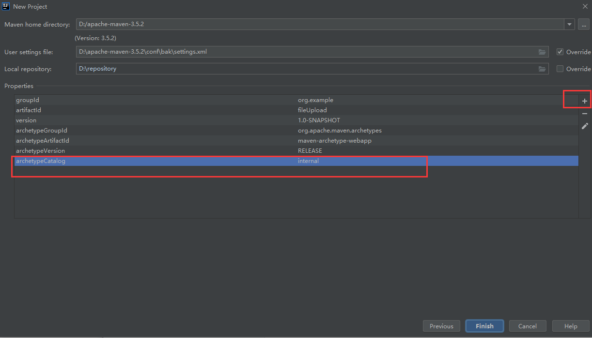
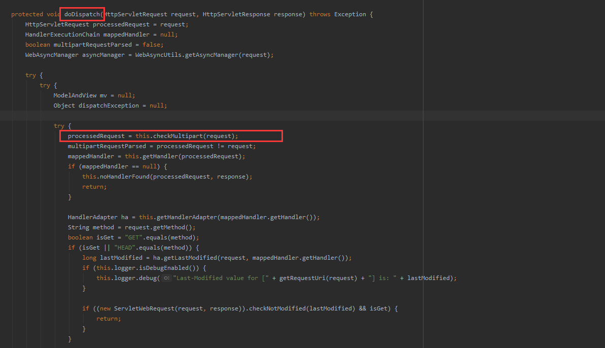

### 一、SpringMVC实现文件上传实例

##### 1.环境准备

1. 创建web工程，导入相关依赖，在创建工程的时候，可以在如下图：



```properties
archetypeCatalog
internal
```

然后在pom文件中导入：

```xml
  <properties>
    <project.build.sourceEncoding>UTF-8</project.build.sourceEncoding>
    <maven.compiler.source>1.8</maven.compiler.source>
    <maven.compiler.target>1.8</maven.compiler.target>
    <spring.version>5.0.2.RELEASE</spring.version>
  </properties>

  <dependencies>
    <dependency>
      <groupId>junit</groupId>
      <artifactId>junit</artifactId>
      <version>4.11</version>
      <scope>test</scope>
    </dependency>
    <dependency>
      <groupId>org.springframework</groupId>
      <artifactId>spring-context</artifactId>
      <version>${spring.version}</version>
    </dependency>
    <dependency>
      <groupId>org.springframework</groupId>
      <artifactId>spring-web</artifactId>
      <version>${spring.version}</version>
    </dependency>
    <dependency>
      <groupId>org.springframework</groupId>
      <artifactId>spring-webmvc</artifactId>
      <version>${spring.version}</version>
    </dependency>
    <dependency>
      <groupId>javax.servlet</groupId>
      <artifactId>servlet-api</artifactId>
      <version>2.5</version>
      <scope>provided</scope>
    </dependency>

    <dependency>
      <groupId>javax.servlet.jsp</groupId>
      <artifactId>jsp-api</artifactId>
      <version>2.0</version>
      <scope>provided</scope>
    </dependency>
      
     <!--文件上传的jar包--> 
     <dependency>
      <groupId>commons-fileupload</groupId>
      <artifactId>commons-fileupload</artifactId>
      <version>1.3.1</version>
    </dependency>
    <dependency>
      <groupId>commons-io</groupId>
      <artifactId>commons-io</artifactId>
      <version>2.4</version>
    </dependency>
  </dependencies>
```

2. 创建springmvc配置文件
3. 在web.xml中配置前端控制器

具体看：[springmvc快速入门](https://blog.csdn.net/weixin_44706647/article/details/105367408)

##### 2.编写文件上传控制器

```java
    @RequestMapping("/fileUpload")
    public String fileUpload(String pickName, MultipartFile uploadFile, HttpServletRequest request) throws IOException {
        //获取原始的文件名
        String uploadFileName = uploadFile.getOriginalFilename();

        //获取文件扩展名
        String extendName = uploadFileName.substring(uploadFileName.lastIndexOf(".") + 1, uploadFileName.length());
        //获取一个随机的uuid防止文件名重复，toUpperCase方法是将小写转为大写
        String uuid = UUID.randomUUID().toString().replace("-","").toUpperCase();

        //最后存放的文件名，加上uuid
        String fileName = uuid + "_" +  uploadFileName + "." +extendName;

        //获取上传后放置的文件夹路径
        ServletContext context = request.getSession().getServletContext();
        String realPath = context.getRealPath("/upload");
        System.out.println(realPath);
        File file = new File(realPath);
        if(!file.exists()){
            file.mkdir();
        }
        uploadFile.transferTo(new File(file,fileName));
        return "success";
    }
```

文件上传在SpringMVC中非常简单，核心的代码便是：

```java
uploadFile.transferTo(new File(file,fileName));
```

也就是MultipartFile这个接口的一些api方法，这个接口有两个实现类：

- CommonsMultipartFile
- StandardMultipartHttpServletRequest

这里使用的是CommonsMultipartFile，那么接下来的一步则很显然了，需要将CommonsMultipartFile组件添加至容器中

##### 3.配置文件解析器

```xml
    <bean id="multipartResolver" class="org.springframework.web.multipart.commons.CommonsMultipartResolver">
        <!-- 设置上传文件的最大尺寸为 5MB -->
        <property name="maxInMemorySize">
            <value>5242800</value>
        </property>
    </bean>
```

##### 4.注意事项

- 配置文件解析器时名字必须为multipartResolver
- 必须为POST请求

### 二、文件上传原理分析

在SpringMVC中要进行文件的上传，从上面的代码中可以看到非常的简单，主要是CommonsMultipartResolver帮助我们完成了一些复杂的操作，下面跟着里面的源码来探究探究其中的原理

我们知道SpringMVC在处理请求时，DispatcherServlet前端控制器是核心组件，首先会调用DispatcherServlet的doDispatch方法，下面看其源码：



```java
 processedRequest = this.checkMultipart(request);
```

这个方法会检查当前请求是否为文件上传的请求，看看这里面的代码

```java
protected HttpServletRequest checkMultipart(HttpServletRequest request) throws MultipartException {
        if (this.multipartResolver != null && this.multipartResolver.isMultipart(request)) {
            if (WebUtils.getNativeRequest(request, MultipartHttpServletRequest.class) != null) {
                this.logger.debug("Request is already a MultipartHttpServletRequest - if not in a forward, this typically results from an additional MultipartFilter in web.xml");
            } else if (this.hasMultipartException(request)) {
                this.logger.debug("Multipart resolution failed for current request before - skipping re-resolution for undisturbed error rendering");
            } else {
                try {
                    return this.multipartResolver.resolveMultipart(request);
                } catch (MultipartException var3) {
                    if (request.getAttribute("javax.servlet.error.exception") == null) {
                        throw var3;
                    }
                }

                this.logger.debug("Multipart resolution failed for error dispatch", var3);
            }
        }

        return request;
    }
```

很显然，第一步判断：

```java
this.multipartResolver != null && this.multipartResolver.isMultipart(request)
```

也就是判断当前容器中是否配置了id为multipartResolver的组件，这就是为什么在配置文件中配置文件解析器时，id值必须为multipartResolver的原因，然后调用multipartResolver中的isMultipart方法。打开这个方法会发现这是个接口的方法，要去找他的实现类。在这里可以使用一个方法，我们在这行上打一个断点，然后idea会显示这个multipartResolver的值


可以很显然的看到实现类时CommonsMultipartResolver，那么ctrl + n查找该类，进入该类里面，查看isMultipart方法：

```java
    public boolean isMultipart(HttpServletRequest request) {
        return ServletFileUpload.isMultipartContent(request);
    }
```

然后接着进入ServletFileUpload的isMultipart方法：

```java
 public static final boolean isMultipartContent(HttpServletRequest request) {
        return !"POST".equalsIgnoreCase(request.getMethod()) ? false : FileUploadBase.isMultipartContent(new ServletRequestContext(request));
    }
```

这里可以看到如果说当前的请求不是POST那么直接返回false，如果时POST请求那么进入到FileUploadBase的isMultipartContent方法里：

```java
    public static final boolean isMultipartContent(RequestContext ctx) {
        String contentType = ctx.getContentType();
        if (contentType == null) {
            return false;
        } else {
            return contentType.toLowerCase(Locale.ENGLISH).startsWith("multipart/");
        }
    }
```

那么到这里就很显然了，toLowerCase是将大写转为小写，startsWith方法是判断是否是multipart/开头，也就是说这段代码的意识是判断当前的request请求体中是否是POST请求以及是否是以multipart/开头，那么我们回到浏览器，抓一下包：


可以看到的确是以multipart/开头，那么返回true。到这里判断当前请求是否为文件上传请求就结束，然后回到checkMultipart方法，接下来执行里面的


```java
return this.multipartResolver.resolveMultipart(request);
```

打开这个方法，可以看到该方法还是CommonsMultipartResolver类实现的

```java
    public MultipartHttpServletRequest resolveMultipart(final HttpServletRequest request) throws MultipartException {
        Assert.notNull(request, "Request must not be null");
        if (this.resolveLazily) {
            return new DefaultMultipartHttpServletRequest(request) {
                protected void initializeMultipart() {
                    MultipartParsingResult parsingResult = CommonsMultipartResolver.this.parseRequest(request);
                    this.setMultipartFiles(parsingResult.getMultipartFiles());
                    this.setMultipartParameters(parsingResult.getMultipartParameters());
                    this.setMultipartParameterContentTypes(parsingResult.getMultipartParameterContentTypes());
                }
            };
        } else {
            MultipartParsingResult parsingResult = this.parseRequest(request);
            return new DefaultMultipartHttpServletRequest(request, parsingResult.getMultipartFiles(), parsingResult.getMultipartParameters(), parsingResult.getMultipartParameterContentTypes());
        }
    }
```

那么这里就开始进行对请求数据进行解析，然后将文件数据解析成MultipartFile并封装在MultipartHttpServletRequest对象中返回给DispatcherServlet。

### 三、总结

总的来说，就是DispatcherServlet先判断当前请求是否符合文件上传请求的规则，如果符合，那么multipartResolver进行文件的解析，并将数据返回DispatcherServlet。

首先，DispatcherServlet调用doDispatch方法，这个方法会调用checkMultipart方法来检查是否为文件上传请求，怎么检查呢？判断当前组件中是否有multipartResolver和调用CommonsMultipartResolver（这个类实现了MultipartResolver接口）的isMultipart方法，用这个方法来检查当前请求是否是POST请求和Content-type是否有以multipart/开头的请求头，如果都，满足那么返回true，开始执行MultipartResolver的resolveMultipart()方法对请求数据进行解析，然后将文件数据解析成MultipartFile并封装在MultipartHttpServletRequest对象中返回给DispatcherServlet。

这是我第一次自己分析源码，授人以鱼不如授人以渔，黑马的老师（b站上白嫖的）真不错能教会学生一套分析源码的办法。