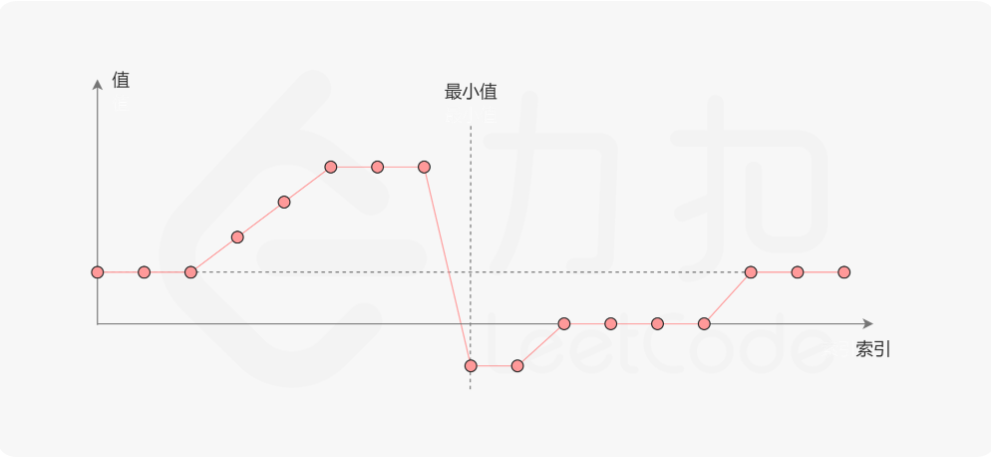
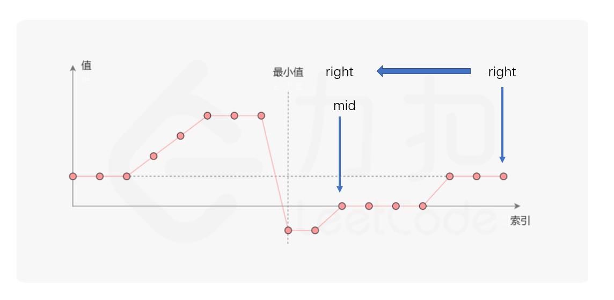
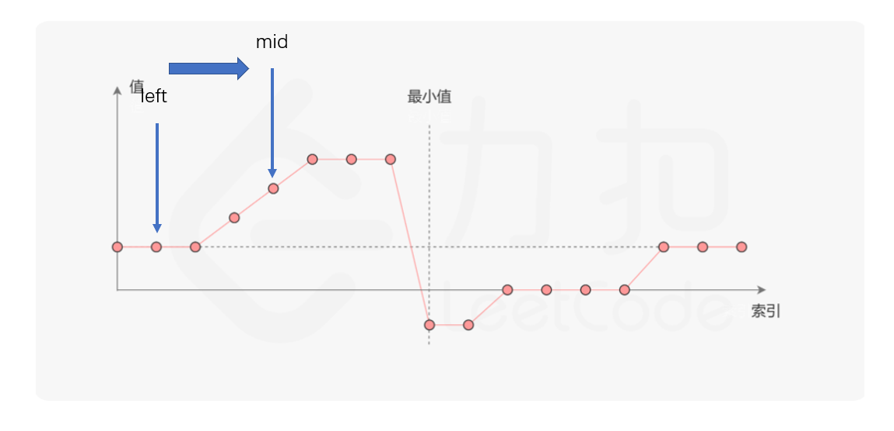
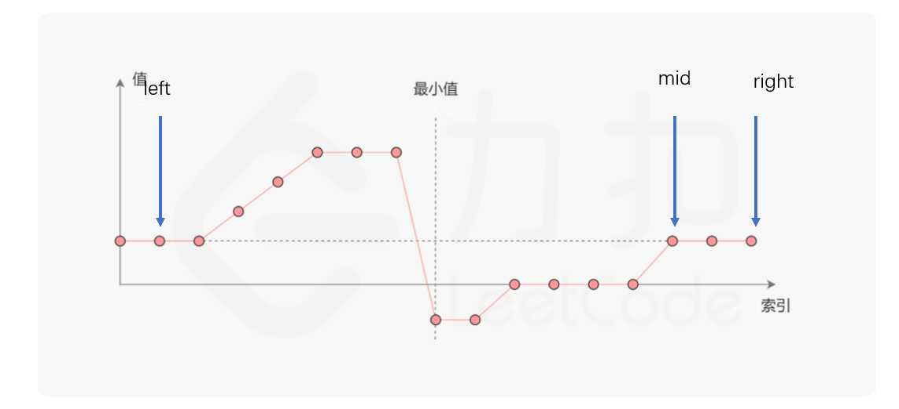

# 1.查找一个数字

给出一个升序的数组 num，数组长度为 len。补全`binary_search`函数，判断数组`num`中是否存在元素`target`，若存在则返回该数字在数组中的 **下标**，否则返回 -1。

```java
int binary_search(int target, int[] num) {
    int left = 0,right = num.length - 1,mid = 0;
    while(left <= right){
        mid = (left + right) / 2;
        if(target == num[mid])   return mid;
        if(target > num[mid]){
            left = mid + 1;
        }
        if(target < num[mid]){
            right = mid - 1;
        }
    }
    return  -1;
}
```

二分法除了用来在有序数组中找出某个特定值的关键字以外，还可以用来解决一类问题︰找出满足条件的最大or最小值。这类问题的一个最简单版本是︰对于给定的一个由0和1组成、且按照0,0,0... ..,0,1,1.....,1,1的规则排列的数组，从中快速找出第一个1的位置。

这种情况下，就不能直接用前面讲的查找某个关键字的算法来解决了，因为前面的算法只适用于有序且无重复元素的情况，对于有重复元素的情况，只能找出其中某个和关键字的值相同的元素，而不能保证找出的是在数组中第一个和它值相同的元素。既然不能直接用，那能否借鉴一下这个思路呢?


# 2.找到第一个大写字母

有一个字符串，字符串的前一部分由小写字母组成，后一部分由大写字母组成。我们希望通过`find_first_capital_letter`函数来获取字符串中第一个大写字母的 **下标**。整个字符串长度不超过 100000100000。

```java
int find_first_capital_letter(String str) {
    int left = 0, right = str.length() - 1;
    int mid = 0;
    while(left < right){
        mid = (left + right) >> 1;
        if(str.charAt(mid) >= 65 && str.charAt(mid) <= 90){
            right = mid;
        }else {
            left = mid + 1;
        }
    }
    return left;
}
```

# 3. 旋转数组的最小数字

[剑指 Offer 11. 旋转数组的最小数字](https://leetcode-cn.com/problems/xuan-zhuan-shu-zu-de-zui-xiao-shu-zi-lcof/)

把一个数组最开始的若干个元素搬到数组的末尾，我们称之为数组的旋转。输入一个递增排序的数组的一个旋转，输出旋转数组的最小元素。例如，数组 [3,4,5,1,2] 为 [1,2,3,4,5] 的一个旋转，该数组的最小值为1。  

```java
输入：[3,4,5,1,2]
输出：1
```

==思路一：==直接排序，输出最小值

==思路二：==依次比较，输出升序排序之后的第一个不满足升序排序的数字

```java
class Solution {
    public int minArray(int[] numbers) {
        for(int i = 0;i < numbers.length - 1;i++){
            if(numbers[i + 1] < numbers[i]){
                return numbers[i + 1];
            }
        }
        return numbers[0];
    }
}
```

==思路三==：题解思路，这是一道困难题，前面两种方式都不是这道题目的核心考察点，其实这是一道二分查找题。

根据题目，该数组是升序排序之后旋转过去的。看图，图来自官方题解：



假设最小值所在坐标为，满足下面三个特点：

- [0,k]数组是升序排序的
- [k+1,nums.length - 1]数组也是升序排序的
- [k+1,nums.length - 1]中的数全部小于等于[0,k]中的数

最重要的特点是第三条，那么可以考虑对于nums[left, right]，mid = (left + right) / 2进行二分查找的条件：

（注意：下面图片只是在模拟情况，并不是说mid的值为就是计算下来的。这种思维我觉得好，因为这样可以模拟出全部情况，以后做这种类似的题目可以画这种模拟图

- nums[mid] < nums[right] ，那么mid一定处于最小值的右边区间，也就是说[mid,right]区间里面没有答案



- nums[mid] > nums[right] ，那么mid一定处于最小值的左边区间 ，也就是说[left,mid]区间里面没有答案



- nums[mid] = nums[right]，此时只需要将right向后推进一位即可



```java
class Solution {
    public int minArray(int[] numbers) {
        int left = 0;
        int right = numbers.length - 1;
        while(left < right){
            int mid = left + (right - left) / 2;
            if(numbers[mid] < numbers[left]) right = mid;
            else if(numbers[mid] > numbers[left])   left = mid + 1;
            else right--;
        }
        return numbers[left];
    }
}
```

这里，思考一个问题，上述都是在