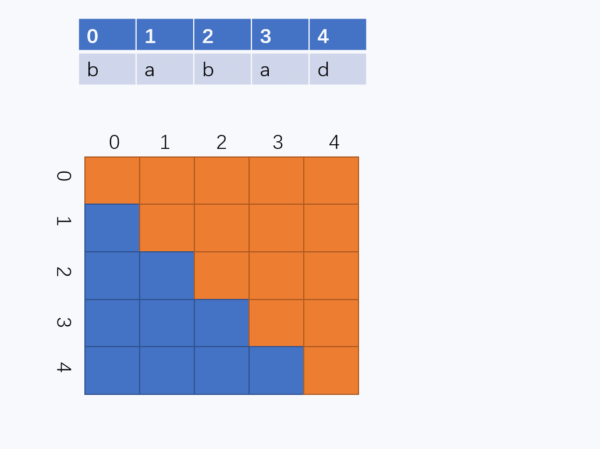
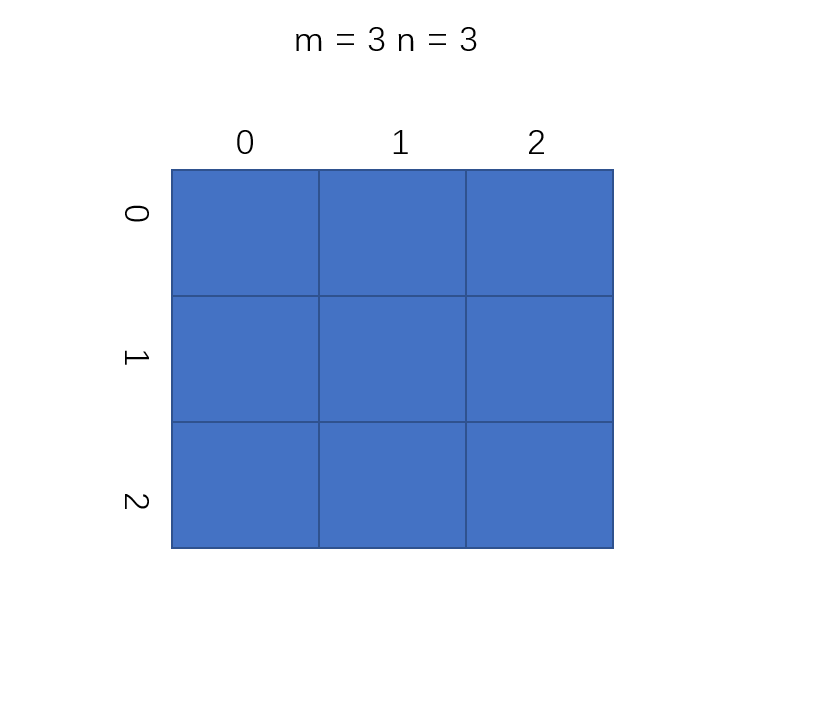
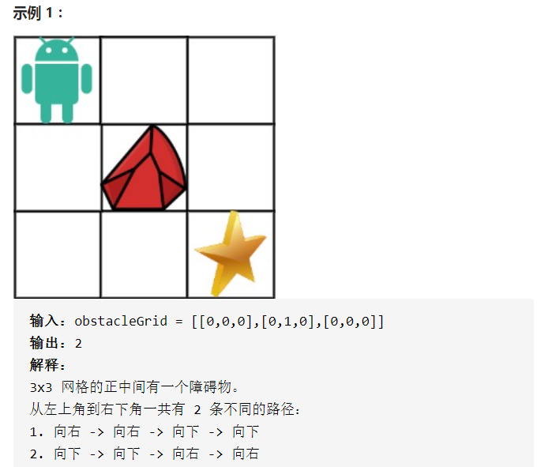
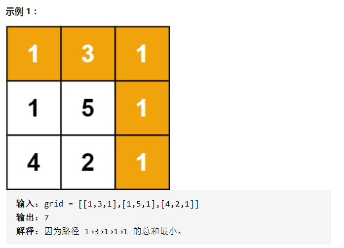

### 1.最大子序列

LeetCode53

给定一个整数数组 `nums` ，找到一个具有最大和的连续子数组（子数组最少包含一个元素），返回其最大和。

```java
输入: [-2,1,-3,4,-1,2,1,-5,4]
输出: 6
解释: 连续子数组 [4,-1,2,1] 的和最大，为 6。
```

解法一：动态规划

dp方程 dp[i] = max{dp[i-1]+nums[i], nums[i]}

解析：dp数组是代表以第 i个数结尾的连续子数组的最大和，那么显然对于第i个元素，要么就是到第i-1个数结尾的连续子数组和+nums[i]，或者就是nums[i]

```java
class Solution {
    public int maxSubArray(int[] nums) {
        int n = nums.length;
        if(n == 0) return 0;
        //定义dp数组，dp数组中的每个值dp[i]代表着以nums[i]为结尾的最大子序和
        int[] dp = new int[n];
        //以nums[0]结尾的最大子序和就是nums[0]
        dp[0] = nums[0];
        //遍历，通过状态转移方程求得dp[i]的最大子序和
        for(int i = 1; i < n; ++i){
            //dp[i]的最大子序和要么是自成一派最大，要么就是当前值加上前面i - 1个数的最大子序和
            dp[i] = Math.max(nums[i], nums[i] + dp[i - 1]);
        }

        //遍历dp数组，求得dp数组中的最大值，就是该题的答案
        int res = Integer.MIN_VALUE;
        for(int j = 0; j < dp.length; ++j){
            res = Math.max(res, dp[j]);
        }
        return res;
    }
}
```


### 2. 最长上升子序列

[300. 最长上升子序列](https://leetcode-cn.com/problems/longest-increasing-subsequence/)

给定一个无序的整数数组，找到其中最长上升子序列的长度。

```
输入: [10,9,2,5,3,7,101,18]
输出: 4 
解释: 最长的上升子序列是 [2,3,7,101]，它的长度是 4。
```


==思路一==动态规划，设dp[i]为下标i的最长上升子序列的长度，对于每一个nums[i]，都有一个结果与之对应，**注意 nums[i] 必须被选取**。那么可以写出dp方程

dp[i] = max(dp[j]) + 1，其中j属于i，可以写出下面代码

```java
class Solution {
    public int lengthOfLIS(int[] nums) {
        int res = 0;
        int[] dp = new int[nums.length];
        dp[0] = 1;
        for(int i = 1;i < nums.length;i++){
            int temp = nums[i];
            int maxTemp = 0;
            for(int j = 0;j < i;j++){
                if(nums[j] < temp){
                    maxTemp = Math.max(maxTemp,dp[j]);
                }
            }
            dp[i] = maxTemp + 1;
            
        }
        for(int i  = 0;i < dp.length;i++){
            res = Math.max(dp[i],res);
        }
        return res;
    }
}
```


### 3.斐波那契数列 1

[剑指 Offer 10- I. 斐波那契数列](https://leetcode-cn.com/problems/fei-bo-na-qi-shu-lie-lcof/)

​	写一个函数，输入 `n` ，求斐波那契（Fibonacci）数列的第 `n` 项。斐波那契数列的定义如下：

```
F(0) = 0,   F(1) = 1
F(N) = F(N - 1) + F(N - 2), 其中 N > 1.
```

斐波那契数列由 0 和 1 开始，之后的斐波那契数就是由之前的两数相加而得出。

答案需要取模 1e9+7（1000000007），如计算初始结果为：1000000008，请返回 1。

==解法一==递归，使用记忆化的递归这里不多说

==解法二==动态规划，只需要将结果依次推进即可，例如，0,1,1,2,3,5,8

设a = 0,b = 1，a是前面的数，b是后面的数，那么sum = a + b；sum就是b后面的数，依次递进即可

```java
class Solution {
    public int fib(int n) {
        if(n == 1 || n == 0)    return n;
        int sum = 0,a = 0,b = 1;
        for(int i = 1;i < n;i++){
           sum = (a + b) % 1000000007;
           a = b;
           b = sum;
        }
        return sum ;
    }
}
```

### 4.把数字翻译成字符串

[剑指 Offer 46. 把数字翻译成字符串](https://leetcode-cn.com/problems/ba-shu-zi-fan-yi-cheng-zi-fu-chuan-lcof/)

给定一个数字，我们按照如下规则把它翻译为字符串：0 翻译成 “a” ，1 翻译成 “b”，……，11 翻译成 “l”，……，25 翻译成 “z”。一个数字可能有多个翻译。请编程实现一个函数，用来计算一个数字有多少种不同的翻译方法。

```
输入: 12258
输出: 5
解释: 12258有5种不同的翻译，分别是"bccfi", "bwfi", "bczi", "mcfi"和"mzi"
```

==解法一==我的想法是使用递归，例如对于12258这个数，首先无论哪个数至少有一种方案，递归终止条件：

- num的length为1：返回1
- num的length为2：如果数值在10到25之间返回2，否则返回1

```java
class Solution {
    public int translateNum(int num) {
        String str = String.valueOf(num);
        return help(str);
    }
    public int help(String num){
        if(num.length() == 1) return 1;
        if(num.length() == 2){
            if(Integer.parseInt(num) <= 25 && num.charAt(0) != '0'){
                return 2;
            }else{
                return 1;
            }
        }
        int res = 0;
        for(int i = 0;i < num.length() - 1;i++){
            // String temp = "" + num.charAt(i) + num.charAt(i + 1);   
            String temp = num.substring(i,i+2);
            if(Integer.parseInt(temp) <= 25  && num.charAt(i) != '0' ){
                if((i + 1) != num.length() - 1){
                    String temp2 = num.substring(i + 2);
                    res += help(temp2);
                }else{
                    res++;
                }                
            }
           
        }
        return res + 1;
    }
}
```

注意：注释中的代码很影响效率

==解法二==使用动态规划，我们可以用 f(i)表示以第 i位结尾的前缀串翻译的方案数，考虑第 i 位单独翻译和与前一位连接起来再翻译对 f(i) 的贡献。单独翻译对 f(i)的贡献为f(i−1)；如果第 i - 1 位存在，并且第i−1 位和第 i位形成的数字 x 满足 10 ≤x≤25，那么就可以把第 i - 1 位和第 i位连起来一起翻译，对 f(i)的贡献为f(i−2)，否则为 0。我们可以列出这样的动态规划转移方程：

f(i) = f(i - 1) + f(i - 2)

边界条件是 f(-1) = 0，f(0) = 1。

```java
class Solution {
    public int translateNum(int num) {
        String str = String.valueOf(num);
        //int[] dp = new int[str.length() + 1];
         int p = 1;
         int q = 1;
         int r = 1;
        // dp[0] = 1;
        // dp[1] = 1;
        for(int i = 2;i < str.length() + 1; i++){
            String temp = str.substring(i-2,i);
            // String temp = "" + str.charAt(i - 2) + str.charAt(i - 1); 
            int tempnum = Integer.parseInt(temp);
            if(10 <= tempnum && tempnum <= 25){
                r = p + q;
                // dp[i] = dp[i - 1] + dp[i - 2];
            }else{
                r = q;
                // dp[i] = dp[i - 1];
            }
            p = q;
            q = r;
        }
        return r;
    }
}
```

### 5. 打家劫舍

[198. 打家劫舍](https://leetcode-cn.com/problems/house-robber/)

你是一个专业的小偷，计划偷窃沿街的房屋。每间房内都藏有一定的现金，影响你偷窃的唯一制约因素就是相邻的房屋装有相互连通的防盗系统，如果两间相邻的房屋在同一晚上被小偷闯入，系统会自动报警。

给定一个代表每个房屋存放金额的非负整数数组，计算你不触动警报装置的情况下 ，一夜之内能够偷窃到的最高金额。

 ```
输入：[1,2,3,1]
输出：4
解释：偷窃 1 号房屋 (金额 = 1) ，然后偷窃 3 号房屋 (金额 = 3)。
     偷窃到的最高金额 = 1 + 3 = 4 。

 ```

很显然，是一道动态规划题。

==我的思路：==我的dp方程为

​							dp[i] = max(dp[i - 2]) + num[i - 1]	//因为dp是从下标为1开始的

例如：**[2,1,1,2]**这个数组：

```
dp[0] = 0
dp[1] = 2
dp[2] = max(dp[0]) + nums[1] = 1
dp[3] = max(dp[0],dp[1]) + num[2] = 2
dp[4] = max(dp[0],dp[1],dp[2]) + num[3] = 4
```

```java
class Solution {
    public int rob(int[] nums) {
        if(nums.length == 0)    return 0;
        int[] dp = new int[nums.length + 1];
        dp[0] = 0;
        dp[1] = nums[0];
        for(int i = 2;i <= nums.length;i++){
            // dp[i] = dp[i - 2] + nums[i - 1];
            int maxtemp = 0;
            for(int j = 0;j <= i -2;j++){
                maxtemp = Math.max(dp[j],maxtemp);
            }   
            dp[i] = maxtemp + nums[i - 1];
        } 
        return Math.max(dp[dp.length - 1],dp[dp.length - 2]);
    }
}
```

==题解思路==仔细想想，我的思路真不算动态规划，动态规划应该是每一个解都是当前的最优解，看题解的dp方程

dp[i] = max(dp[i -2] + num[i],num[i - 1])	

直接上代码：

```java
class Solution {
    public int rob(int[] nums) {
        if(nums == null || nums.length == 0)    return 0;
        int[] dp = new int[nums.length];
        if(nums.length == 1)    return nums[0];
        if(nums.length == 2)    return (nums[0] > nums[1] ? nums[0] : nums[1]);
        dp[0] = nums[0];
        dp[1] = nums[0] > nums[1] ? nums[0] : nums[1];
        for(int i = 2;i < nums.length;i++){
            dp[i] = Math.max(dp[i - 2] + nums[i],dp[i - 1]);
        }
        return dp[nums.length - 1];
    }
}
```

优化：自然想到不需要再开一个数组的动态规划，也就是使用滚动数组

```java
class Solution {
    public int rob(int[] nums) {
        if(nums == null || nums.length == 0)    return 0;
        //int[] dp = new int[nums.length];
        if(nums.length == 1)    return nums[0];
        if(nums.length == 2)    return (nums[0] > nums[1] ? nums[0] : nums[1]);
        int p = nums[0];
       // dp[0] = nums[0];
        int q =  nums[0] > nums[1] ? nums[0] : nums[1];
        //dp[1] = nums[0] > nums[1] ? nums[0] : nums[1];
        for(int i = 2;i < nums.length;i++){
            int temp = q;
            q = Math.max(p + nums[i],q);
            p = temp;
        }
        return q;
    }
}
```


### 6. 打家劫舍2

[213. 打家劫舍 II](https://leetcode-cn.com/problems/house-robber-ii/)

你是一个专业的小偷，计划偷窃沿街的房屋，每间房内都藏有一定的现金。这个地方所有的房屋都 围成一圈 ，这意味着第一个房屋和最后一个房屋是紧挨着的。同时，相邻的房屋装有相互连通的防盗系统，如果两间相邻的房屋在同一晚上被小偷闯入，系统会自动报警 。

给定一个代表每个房屋存放金额的非负整数数组，计算你 在不触动警报装置的情况下 ，能够偷窃到的最高金额。

```
输入：nums = [2,3,2]
输出：3
解释：你不能先偷窃 1 号房屋（金额 = 2），然后偷窃 3 号房屋（金额 = 2）, 因为他们是相邻的。
```

这个题目和上题思路一样只不过多增加了“所有的房屋都 围成一圈”这个条件，那这个好办这个条件得1增加无非就是说第一间和最后一间不能同时取到，那分别求出这两种情况的结果相比较即可

```java
class Solution {
    public int rob(int[] nums) {
        if(nums == null || nums.length == 0 )    return 0;
        if(nums.length == 1)    return nums[0];
        if(nums.length == 2)    return Math.max(nums[0],nums[1]);
        return Math.max(help(Arrays.copyOfRange(nums,0,nums.length - 1)), help(Arrays.copyOfRange(nums,1,nums.length)));
    }
    public int help(int nums[]){
        int first = nums[0];
        int second = Math.max(nums[0],nums[1]);
        for(int i = 2;i < nums.length;i++){
            int temp = second;
            second = Math.max(first + nums[i],second);
            first = temp;
        }
        return second;
    }
}
```

### 7. 买卖股票的最佳时机1

给定一个数组，它的第 i 个元素是一支给定股票第 i 天的价格。

如果你最多只允许完成一笔交易（即买入和卖出一支股票一次），设计一个算法来计算你所能获取的最大利润。

注意：你不能在买入股票前卖出股票。

```
输入: [7,1,5,3,6,4]
输出: 5
解释: 在第 2 天（股票价格 = 1）的时候买入，在第 5 天（股票价格 = 6）的时候卖出，最大利润 = 6-1 = 5 。
     注意利润不能是 7-1 = 6, 因为卖出价格需要大于买入价格；同时，你不能在买入前卖出股票。
```

==解法一==双重for循环，暴力法求出最大利润

==解法二==：一次遍历，需要一个变量记录最低点，然后判断当前点卖出股票是不是比之前利润更多

```java
class Solution {
    public int maxProfit(int[] prices) {
        int min = Integer.MAX_VALUE;
        int res = 0;
        for(int i = 0;i < prices.length;i++){
            if(prices[i] < min){
                min = prices[i];
            }else if(prices[i] - min > res){
                res = prices[i] - min;
            }
        }
        return res;
    }
}
```

### 8. 买卖股票的最佳时机2

==解法一==：动态规划，我思考这个题目的时候首先难点是不知道怎么去表示dp方程，因为每天有可能卖出，有可能买入。可以用一个二维数组来表示，当前第i天的最大利润

```
dp[i][0] 	//表示第i天没有持有股票的最大利润
dp[i][1]	//表示第i天持有股票的最大利润
```

那怎么确定转移方程呢，对于每一天来说，dp[i] [0]表示今天不持有股票，那么今天的利润取决于昨天：

- 昨天有股票，那么今天要卖出，所以利润为 dp[i - 1] [1] + price[i]
- 昨天没有股票，那么今天可以保持没有股票 dp[i - 1] [0] 

那么转移方程就是取较大者：dp[i] [0] = max(dp[i - 1] [1] + price[i], dp[i - 1] [0])

dp[i] [1]的方程那么也好确定了

- 昨天有股票，那么今天可以保持有股票 dp[i - 1] [1] 
- 昨天没有股票，那么今天买入股票 dp[i - 1] [0] - price[i] 

所以：dp[i] [1] = max(dp[i - 1] [1] , dp[i - 1] [0] - price[i])

dp方程确定了，那么初始状态呢？也就是第一天的时候

- dp[1] [0] = 0
- dp[1] [1] = -price[0]

```java
class Solution {
    public int maxProfit(int[] prices) {
        
        int[][] dp = new int[prices.length][2];
        dp[0][0] = 0;
        dp[0][1] = -prices[0];
        for(int i = 1;i < prices.length;i++){
            dp[i][0] = Math.max(dp[i - 1][0], dp[i - 1][1] + prices[i]);
            dp[i][1] = Math.max(dp[i - 1][1], dp[i - 1][0] - prices[i]);
        }
        return dp[prices.length - 1][0];
    }
}
```

自然，也有优化的动态规划解法：

```java
class Solution {
    public int maxProfit(int[] prices) {
        int n = prices.length;
        //int[][] dp = new int[n][2];
        // dp[0][0] = 0;
        // dp[0][1] = -prices[0];
        int dp0 = 0;
        int dp1 = -prices[0];;
        for (int i = 1; i < n; ++i) {
            // dp[i][0] = Math.max(dp[i - 1][0], dp[i - 1][1] + prices[i]);
            // dp[i][1] = Math.max(dp[i - 1][1], dp[i - 1][0] - prices[i]);
            int newdp0 = Math.max(dp0, dp1 + prices[i]);
            int newdp1 = Math.max(dp1, dp0 - prices[i]);
            dp0 = newdp0;
            dp1 = newdp1;
        }
        return dp0;
    }
}
```


==解法二==：贪心算法

我也是看到评论区里面的解法，看到后秒懂

```
[7, 1, 5, 6] 第二天买入，第四天卖出，收益最大（6-1），所以一般人可能会想，怎么判断不是第三天就卖出了呢? 这里就把问题复杂化了，根据题目的意思，当天卖出以后，当天还可以买入，所以其实可以第三天卖出，第三天买入，第四天又卖出（（5-1）+ （6-5） === 6 - 1）。所以算法可以直接简化为只要今天比昨天大，就卖出。
```

贪心算法的意思是说，每天只得到收益为正的，上面的评论的正确性的证明其实很简单：

​	对于任意第 i 天买入，第 j 天卖出，有 a(j) - a(i) = (a(j) - a(j-1)) + (a(j-1) - a(j-1)) + ... + (a(i+1) - a(i))，

所以，给出代码：

```java
class Solution {
    public int maxProfit(int[] prices) {
        int maxProfit = 0;
        for(int i = 1;i < prices.length;i++){
            if(prices[i] > prices[i - 1])   maxProfit += prices[i] - prices[i - 1];
        }
        return maxProfit;
    }
}
```

### 9. 最长回文子串

[5. 最长回文子串](https://leetcode-cn.com/problems/longest-palindromic-substring/)

给定一个字符串 `s`，找到 `s` 中最长的回文子串。你可以假设 `s` 的最大长度为 1000。

```
输入: "babad"
输出: "bab"
注意: "aba" 也是一个有效答案。
```

==暴力法：==这个方法是我当时做的时候的，dp的题目接触不多，之前做的都是一维的dp。暴力法应该是很简单的思路，isPalindrome用来判断是否是回文串，判断回文串使用的是双指针的方法，一开始使用的是栈，其实不需要这么麻烦。接着只需要枚举就可以了，暴力法java是可以过的本题

```java
class Solution {
    public String longestPalindrome(String s) {
        if(s.length() == 1 || isPalindrome(s)) return s;
        String res = "";
        //System.out.print(isPalindrome(s));
        for(int i = 0;i < s.length();i++){
            for(int j = i;j < s.length();j++){
                String tempStr = s.substring(i,j+1);
                if(isPalindrome(tempStr)){
                    if(tempStr.length() > res.length()){
                        res = tempStr;
                    }
                }
            }
        }
        return res;
    }
    public boolean isPalindrome(String s){
        int left = 0, right = s.length() - 1;
        while(left <= right){
            if(s.charAt(left) != s.charAt(right)){
                return false;
            }
            left++;
            right--;
        }
        return true;

    }
}
```

==动态规划==

是根据主题来做题的，知道这个题目就是动态规划，但是如何确定每一个的状态呢？

根据回文串的规则可以有：

- 一个回文串(长度大于3)去掉头尾两个字符还是回文串

根据这个规律可以的出状态确定的方法：

- 如果头尾字符不相等，那么一定不是回文串
- 头尾字符相等，如果里面的子串是回文串，那么该串也是回文串，如果字串不是那么该串就不是回文串

**1. 定义状态**

有了确定状态的方法，还需要如何表示每个状态？dp一般使用数组，但是一维数组显然不能满足需求，所以使用二维数组：

==dp[i] [j] 表示区间[i,j]是不是回文串，左闭右闭==

**2.确定方法**

前面已经讨论过了，很显然可以得出下面方法(s[i]表示字符串数组)

```java
dp[i][j] = s[i] == s[j] && dp[i + 1][j - 1](j - i > 2)
```

因为要缩小区间，dp[i + 1]  [j  - 1]那必然要判断边界情况，即dp[i + 1] [j - 1]要能构成区间：

j - 1 - (i + 1) + 1 <= 1 ---->       j - i <= 2就是边界条件

**3.初始化状态**

单个字符肯定是回文串，所以dp[i] [i] == true

**4.考虑输出**

遍历dp数组，得到值为true的且j - i的最大值，最后截取该片段的字符串即可

```java
class Solution {
    public String longestPalindrome(String s) {
        if(s.length() < 2)  return s;   //特判
        int n = s.length();
        boolean dp[][] =  new boolean[n][n];
        //初始化状态
        for(int i = 0;i < n;i++){
            dp[i][i] = true;
        }
        char[] charTemp = s.toCharArray();
        //填表
        for(int j = 1;j < n;j++){
            for(int i = 0;i < j;i++){
                if(charTemp[i] != charTemp[j]){
                    dp[i][j] = false;
                }else{
                    if(j - i <= 2)  dp[i][j] = true;
                    else    dp[i][j] = dp[i + 1][j - 1];
                }
            }
        }
        int maxlen = 0;
        int begin = 0;
        //找出结果
        for(int i = 0;i < n;i++){
            for(int j = 0;j < n;j++){
                if(dp[i][j] && j - i + 1 > maxlen){
                    begin = i;
                    maxlen = j - i + 1;
                }
            }
        }
        return s.substring(begin,begin + maxlen);

    }
}
```

对上面代码的理解，相当于在填一张表格，dp[i] [j] j > i所以填的是右上角，具体过程可以看下图




### 10. 不同路径

[62. 不同路径](https://leetcode-cn.com/problems/unique-paths/)

一个机器人位于一个 m x n 网格的左上角 （起始点在下图中标记为 “Start” ）。机器人每次只能向下或者向右移动一步。机器人试图达到网格的右下角（在下图中标记为 “Finish” ）。

问总共有多少条不同的路径？


==思路一==我最先想到的思路就是排列组合，高中的时候做过这种题目，对于实例一来说，从左上角到右下角一共要走8步，其中两步向下走，所以答案为C(8,2)，也就是说对于m * n，最后得答案应该是C(m + n -2 , m - 1)，这里C(m + n -2 ,n - 1)也是一样的，所以选择数小的

想到这一点了，然后写代码还是很曲折，因为会超出数的范围，需要将公式化简

```
	C(a ,b ) = A(a, b) / b !				A(a,b) = a! / (a- b )!

--> C(a, b) = a! / [( a- b )! (b)!]

--> C(a, b) = 1*2*3*4*...b*(b+1)*..a   / (a-b)! * 1*2*3*4*...b
--> C(a, b) = (b+1)*..a / (a-b)!	//分母a-b个数 分子也是a-b个数
```

所以看代码：

```java
class Solution {
    public int uniquePaths(int m, int n) {
        
        return (int)C(m + n - 2, n - 1);
    }
    public long C(int a, int b){ 
       long res = 1;
        //注意 这里不能是 res *= x / y 也就是 res = res * (x/y)不能这样写，因为x/y可能会除不尽
       for(int x = b + 1, y = 1;x <= a && y <= a-b;x++,y++){
           res = res *  x / y;
       }
       return res;
    }

}
```

==思路二==看了题解的思路，动态规划

**1.定义状态**

dp[i] [j] 表示到达第i + 1行，j+1列的路径数，因为数组从0开始

**2.确定转移方程**

```java
dp[i][j] = dp[i - 1][j] + dp[i][j - 1]
```

**3.确定边界条件**

因为出现了i-1和j - 1所以，必须要确定边界的状态，也就是dp[0] [j]  = 1,dp[i] [0] = 1表示自己到达自己需要1步

```java
for(int i = 0;i < m;i++){
    dp[i][0] = 1;
}
for(int j = 0;j < n ;j++){
    dp[0][j] = 1;
}
```

**4.考虑输出**

直接输出dp[i - 1] [j - 1]

代码如下

```java
class Solution {
    public int uniquePaths(int m, int n) {
        int[][] dp = new int[m][n];
        for(int i = 0;i < m;i++){
            dp[i][0] = 1;
        }
        for(int j = 0;j < n ;j++){
            dp[0][j] = 1;
        }
        for(int i = 1;i < m;i++){
            for(int j = 1;j < n ;j++){
                    dp[i][j] = dp[i - 1][j] + dp[i][j - 1];
            }
        }
        return dp[m - 1][n - 1];
    }
}
```

对上面代码可看图：




### 11. 不同路径 2

[63. 不同路径 II](https://leetcode-cn.com/problems/unique-paths-ii/)

一个机器人位于一个 m x n 网格的左上角 （起始点在下图中标记为“Start” ）。机器人每次只能向下或者向右移动一步。机器人试图达到网格的右下角（在下图中标记为“Finish”）。

现在考虑网格中有障碍物。那么从左上角到右下角将会有多少条不同的路径？



==思路==这一题是上一题的增强版，有了上一题动态规划的思路，那么这一题也很好理解，但是尽管这样，我还是交了几次才正确，这题多了一个障碍物的判断，那么只需要将有障碍物的那个格子的值设置为0了，其他就是和上题一样。

```java
class Solution {
    public int uniquePathsWithObstacles(int[][] obstacleGrid) {
        if(obstacleGrid[0][0] == 1) return 0;
        int m = obstacleGrid.length;
        int n = obstacleGrid[0].length;
        int[][] dp = new int[m][n];
        for(int i = 0;i < m;i++){
            if(obstacleGrid[i][0] == 1) break;
            dp[i][0] = 1;

        }
        for(int j = 0;j < n;j++){
            if(obstacleGrid[0][j] == 1) break;
             dp[0][j] = 1;
        }
        for(int i = 1;i < m;i++){
            for(int j = 1;j < n;j++){
                if(obstacleGrid[i][j] != 1){
                    dp[i][j] = dp[i - 1][j] + dp[i][j - 1];
                }
            }
        }
        return dp[m - 1][n  - 1];
    }
}
```

但是要注意的是在给定边界的状态时，如果一遇到障碍物那么其所在的一行或者一列其余的格子都要初始化为0了，因为前面有障碍物，后面过不去

### 12.最小路径和

[64. 最小路径和](https://leetcode-cn.com/problems/minimum-path-sum/)

给定一个包含非负整数的 `*m* x *n*` 网格 `grid` ，请找出一条从左上角到右下角的路径，使得路径上的数字总和为最小。

**说明：**每次只能向下或者向右移动一步。



有了前面两题的基础，做这个题目应该轻轻松松的，按照套路走：

**1.定义状态**

dp[i] [j] 表示走到第(i-1.j-1)格的路径最小和

**2.确定转移方程**

```java
dp[i][j] = min{dp[i - 1][j],dp[i][j - 1]} + grid[i][j]
```

 **3.确定边界**

```java
for(int i = 0;i < m;i++){
    dp[i][0] = i == 0 ? grid[0][0] : dp[i - 1][0] + grid[i][0];
}
for(int j = 0;j < n;j++){
    dp[0][j] = j == 0 ? grid[0][0] : dp[0][j - 1] + grid[0][j];
}
```

**4.考虑输出**

直接输出dp[i - 1] [j - 1]

代码如下：

```java
class Solution {
    public int minPathSum(int[][] grid) {
        int m = grid.length;
        int n = grid[0].length;
        int[][] dp = new int[m][n];
        for(int i = 0;i < m;i++){
            dp[i][0] = i == 0 ? grid[0][0] : dp[i - 1][0] + grid[i][0];
        }
        for(int j = 0;j < n;j++){
            dp[0][j] = j == 0 ? grid[0][0] : dp[0][j - 1] + grid[0][j];
        }
        for(int i = 1;i < m;i++){
            for(int j = 1;j < n;j++){
                dp[i][j] = Math.min(dp[i - 1][j], dp[i][j - 1]) + grid[i][j];
            }
        }
        return dp[m - 1][n - 1];
    }
}
```

### 13. 乘积最大数组

[152. 乘积最大子数组](https://leetcode-cn.com/problems/maximum-product-subarray/)

给你一个整数数组 `nums` ，请你找出数组中乘积最大的连续子数组（该子数组中至少包含一个数字），并返回该子数组所对应的乘积。

```java
输入: [2,3,-2,4]
输出: 6
解释: 子数组 [2,3] 有最大乘积 6。
```

这道题的难点在于，数组中有负值，负数乘负数等于正数，也就是说不是简单的如下dp方程：

dp[i] = max{dp[i-1] * nums[i], num[i]}

因为不一定每次的最优解算下来就是最终的最优解，例如：，如果 a = \{ 5, 6, -3, 4, -3 }按照dp方程我们可以得到答案为 30，即前两个数的乘积，而实际上答案应该是全体数字的乘积。

那么对于每一个dp[i]来说不仅要存储当前的最大值，还需要存当前的最小值，因为这个最小值如果遇到负数，那么它具有潜力变成最大值，按照套路走

**1.确定状态**

```
dp[i][0] //取到当前数，并且最小值
dp[i][1] //取到当前数，并且最大值
```

**2.确定转移方程**

```
dp[i][0] = min(nums[i],dp[i-1][0]*nums[i],dp[i-1][0]*nums[i])
dp[i][1] = max(nums[i],dp[i-1][0]*nums[i],dp[i-1][0]*nums[i])
```

**3.确定边界**

```
dp[0][0] = nums[0]
dp[0][1] = nums[1]
```

**4.考虑输出**

最终结果就是max(dp[i] [0])

```java
class Solution {
    public int maxProduct(int[] nums) {
        int[][] dp = new int[nums.length][2];
        dp[0][0] = nums[0];
        dp[0][1] = nums[0];
        for(int i = 1;i < nums.length;i++){
            dp[i][0] = Math.min(dp[i - 1][0] * nums[i], Math.min(dp[i - 1][1] * nums[i],nums[i]));
            dp[i][1] = Math.max(dp[i - 1][0] * nums[i], Math.max(dp[i - 1][1] * nums[i],nums[i]));
        }
        int res = Integer.MIN_VALUE;
        for(int i = 0;i < nums.length;i++){
            res = Math.max(dp[i][1], res);
        }
        return res;
    }
}
```

考虑优化，可以使用滚动数组

### 14 一和零

给你一个二进制字符串数组 strs 和两个整数 m 和 n 。

请你找出并返回 strs 的最大子集的大小，该子集中 最多 有 m 个 0 和 n 个 1 。

如果 x 的所有元素也是 y 的元素，集合 x 是集合 y 的 子集 。

```
输入：strs = ["10", "0001", "111001", "1", "0"], m = 5, n = 3
输出：4
解释：最多有 5 个 0 和 3 个 1 的最大子集是 {"10","0001","1","0"} ，因此答案是 4 。
其他满足题意但较小的子集包括 {"0001","1"} 和 {"10","1","0"} 。{"111001"} 不满足题意，因为它含 4 个 1 ，大于 n 的值 3 。

```

`思路`常见的01背包问题，01背包问题：有N件物品和一个容量为V的背包，第i件物品的费用是c[i]，价值为w[i]，求解将那些物品装入背包可使价值总和最大

只不过这个题目有两个容量，所以可以定义一个三阶数组：

dp(i,j,k) 的含义为：对于第i个字符串，使用j个0和k个1的情况下最多可以得到的字符串数量

那么对于第i个字符串，如果该字符串中0的个数为ret[0]，1的个数为ret[1]，那么有以下dp递推式：

- ret[0] <= j && ret[1] <= k：

```
dp[i][j][k] = Math.max(dp[i - 1][j][k], dp[i - 1][j - ret[0]][k - ret[1]] + 1);
```

- else：

```
 dp[i][j][k] = dp[i - 1][j][k];
```

### 15 完全平方数

给定正整数 n，找到若干个完全平方数（比如 1, 4, 9, 16, ...）使得它们的和等于 n。你需要让组成和的完全平方数的个数最少。

给你一个整数 n ，返回和为 n 的完全平方数的 最少数量 。

完全平方数 是一个整数，其值等于另一个整数的平方；换句话说，其值等于一个整数自乘的积。例如，1、4、9 和 16 都是完全平方数，而 3 和 11 不是。

```
输入：n = 12
输出：3 
解释：12 = 4 + 4 + 4
```

`思路`动态规划思路，动态规划可以求解最优子问题，自底向上的求解问题，例如求解n=12的最少平方数，可以求解n = 12 - j * j的最小平方数，因为只需要在这个基础上加1即可，这必然是最小的数量关键就是j的取值，可以枚举得出

动态规划方程dp[i] 表示数i的最小平方数的数量，代码如下

```java
class Solution {
    public static int numSquares(int n) {
        int[] dp = new int[n + 1];
        for(int i = 1;i <= n;i++){
            int min = Integer.MAX_VALUE;
            for(int j = 1;j * j <= i;j++){
                min = Math.min(min, dp[i - j * j]);
            }   
            dp[i] = min + 1;
        }
        return dp[n];
    }
}
```

