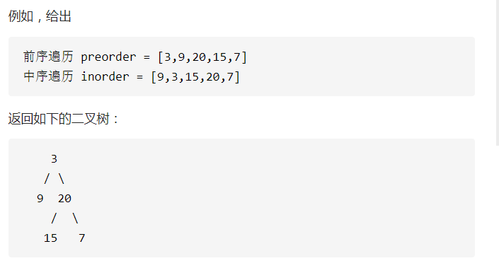

### 1. 二叉树的各种遍历，各种写法

前序（先序）遍历：根左右

中序遍历：左根右

后序遍历：左右根

层次遍历：一层一层遍历，从左到右遍历

规律：对于三种*序遍历方式，都是以根节点为基准，例如：前序遍历，说明先遍历根节点（根节点在前面遍历），层次遍历可以使用bfs，树也是一种图

##### 1.递归遍历

对于二叉树的递归写法，比较简单，各种遍历写法只是最后操作子节点的方法不一样。下面遍历要求返回的是一个list集合（以leetcode94 题为例）
			测试样例为：

```java
          1
       /    \
      2      3
            /   \
           4	 5
```


1. 中序遍历

```java
class Solution {
    ArrayList<Integer> result = new ArrayList<>();
    /**
     * 递归中序遍历
     * @param root
     * @return
     */
    public List<Integer> inorderTraversal(TreeNode root) { 
        inorder(root);
        return result;
    }
    public void inorder(TreeNode root){
        if(root == null){
            return;
        }
        if(root.left != null){
            inorder(root.left);
        }
        result.add(root.val);
        if(root.right != null){
            inorder(root.right);
        }
    }
}
```


2. 先序遍历

```java
class Solution {
    ArrayList<Integer> result = new ArrayList<>();
    /**
     * 递归先序遍历
     * @param root
     * @return
     */
    public List<Integer> inorderTraversal(TreeNode root) { 
        inorder(root);
        return result;
    }
    public void inorder(TreeNode root){
        if(root == null){
            return;
        }
        result.add(root.val);
        if(root.left != null){
            inorder(root.left);
        }
        
        if(root.right != null){
            inorder(root.right);
        }
    }
}
```

3. 后序遍历

```java
class Solution {
    ArrayList<Integer> result = new ArrayList<>();
    /**
     * 递归后序遍历
     * @param root
     * @return
     */
    public List<Integer> inorderTraversal(TreeNode root) { 
        inorder(root);
        return result;
    }
    public void inorder(TreeNode root){
        if(root == null){
            return;
        }
        
        if(root.left != null){
            inorder(root.left);
        }
        
        if(root.right != null){
            inorder(root.right);
        }
        result.add(root.val);
    }
}
```


##### 2. 非递归遍历

能使用递归实现的写法，本质上都可以使用栈来操作，所以将上面这些递归写法变成非递归写法，需要借助一种数据结构栈

为使数据更加全面，使用下面的样例：

          1
        /    \
       2      3
        \    /   \
         6   4	 5
1. 中序遍历

基本思路：先将树的所有左节点入栈，直至最后一个节点没有左孩子，也就是1,2入栈，将栈内元素依次取出，遍历其所有右节点，所以顺序为 2,6,1,4,3,5

```java
class Solution {
    public List<Integer> inorderTraversal(TreeNode root) {
        List<Integer> res = new ArrayList<Integer>();
        Deque<TreeNode> stk = new LinkedList<TreeNode>();
        while (root != null || !stk.isEmpty()) {
            while (root != null) {
                stk.push(root);
                root = root.left;
            }
            root = stk.pop();
            res.add(root.val);
            root = root.right;
        }
        return res;
    }
}

```


2. 先序遍历

```java
class Solution {
    public List<Integer> inorderTraversal(TreeNode root) {
        List<Integer> res = new ArrayList<Integer>();
        Deque<TreeNode> stk = new LinkedList<TreeNode>();
        while (root != null || !stk.isEmpty()) {
          while(root != null){
              stk.push(root);
              res.add(root.val);
              root = root.left;
          }
            root = stk.pop();
            root = root.right;
        }
        return res;
    }
}
```


3. 后序遍历

后序遍历的思路和之前两种遍历不太一样，不能只是单纯的改变res.add(root.val);这行代码的顺序，需要判断子节点的根是否有左右孩子，这比较麻烦，通过看博客，发现一种比较简单的思路，将原树的左右节点交换，然后前序遍历，最后将该序列倒过来即可

原树：

```java
      1
    /    \
   2      3
  /  \    /  \
 7   6   4	  5
```

后序遍历： 7 6 2 4 5 3 1

反转左右节点

```java
      1
    /    \
   3      2
  /  \   /  \ 
 5    4 6	 7
```

先序遍历： 1 3 5 4 2 6 7

将先序遍历反转得到：7 6 2 4 5 3 1就是原树的后序遍历，而反转左右子树比较简单可以做到，只需要在先序遍历的时候先遍历右子树，然后遍历左子树即可。

```java
class Solution {
    public List<Integer> inorderTraversal(TreeNode root) {
        List<Integer> res = new ArrayList<Integer>();
        Deque<TreeNode> stk = new LinkedList<TreeNode>();
        while (root != null || !stk.isEmpty()) {
          while(root != null){
              stk.push(root);
              res.add(root.val);
              root = root.right;
             
          }
            root = stk.pop();
             root = root.left;
        }
        Collections.reverse(res);
        return res;
    }
}
```


##### 3. 层次遍历

参考 剑指offer 32 题

从上到下按层打印二叉树，同一层的节点按从左到右的顺序打印，每一层打印到一行。

 例如：

给定二叉树: [3,9,20,null,null,15,7],

```java
    3
   / \
  9  20
    /  \
   15   7
```


返回其层次遍历结果：

```java
[
  [3],
  [9,20],
  [15,7]
]
```

有两种做法：

解法一：广度优先bfs

特例处理： 当根节点为空，则返回空列表 [] ；
		初始化： 打印结果列表 res = [] ，包含根节点的队列 queue = [root] ；
		BFS 循环： 当队列 queue 为空时跳出；
		新建一个临时列表 tmp ，用于存储当前层打印结果；当前层打印循环： 循环次数为当前层节点数（即队列 queue 长度）；
		出队： 队首元素出队，记为 node；
		打印： 将 node.val 添加至 tmp 尾部；
		添加子节点： 若 node 的左（右）子节点不为空，则将左（右）子节点加入队列 queue ；将当前层结果 tmp 添加入 res 。
		返回值： 返回打印结果列表 res 即可。。

```java
class Solution {
    public List<List<Integer>> levelOrder(TreeNode root) {
        List<List<Integer>> result = new LinkedList<>();
        Deque<TreeNode> q = new LinkedList<>();
        if(root == null){
            return result;
        }
        q.offer(root);
        while(!q.isEmpty()){
            List<Integer> temp = new LinkedList<>();
            int size = q.size();
            for(int i = 0;i < size; i++){
                TreeNode node = q.poll();
                temp.add(node.val);
                if(node.left != null){
                    q.offer(node.left);
                }
                if(node.right != null){
                    q.offer(node.right);
                }

            }
            result.add(temp);
        }
        return result;
    }
}
```

解法二：dfs

```java
public List<List<Integer>> levelOrder(TreeNode root) {
    List<List<Integer>> res = new ArrayList<>();
    levelHelper(res, root, 0);
    return res;
}

public void levelHelper(List<List<Integer>> list, TreeNode root, int level) {
    //边界条件判断
    if (root == null)
        return;
    //level表示的是层数，如果level >= list.size()，说明到下一层了，所以
    //要先把下一层的list初始化，防止下面add的时候出现空指针异常
    if (level >= list.size()) {
        list.add(new ArrayList<>());
    }
    //level表示的是第几层，这里访问到第几层，我们就把数据加入到第几层
    list.get(level).add(root.val);
    //当前节点访问完之后，再使用递归的方式分别访问当前节点的左右子节点
    levelHelper(list, root.left, level + 1);
    levelHelper(list, root.right, level + 1);
}

```


### 二叉树的锯齿形层次遍历

[103.二叉树的锯齿形层次遍历](https://leetcode-cn.com/problems/binary-tree-zigzag-level-order-traversal/)

给定一个二叉树，返回其节点值的锯齿形层次遍历。（即先从左往右，再从右往左进行下一层遍历，以此类推，层与层之间交替进行）。

例如：
			给定二叉树 `[3,9,20,null,null,15,7]`

```java
    3
   / \
  9  20
    /  \
   15   7
返回锯齿形层次遍历如下：
[
  [3],
  [20,9],
  [15,7]
]
```

==我的思路==：bfs，将每层的节点依次加入队列中，然后依次遍历该队列，使用双端队列Deque，那么这里复习一下双端队列的各种方法：

双向队列操作

==插入元素==

|       方法       |                          作用                           |
| :--------------: | :-----------------------------------------------------: |
|  **addFirst()**  |   向队头插入元素，如果元素为*null*，则发生空指针异常    |
|  **addLast()**   |       向队尾插入元素，如果为空，则发生空指针异常        |
| **offerFirst()** | 向队头插入元素，如果插入成功返回*true*，否则返回*false* |
| **offerLast()**  | 向队尾插入元素，如果插入成功返回*true*，否则返回*false* |

==移除元素==

|       方法        |                             作用                             |
| :---------------: | :----------------------------------------------------------: |
| **removeFirst()** | 返回并移除队头元素，如果该元素是*null*，则发生*NoSuchElementException* |
| **removeLast()**  | 返回并移除队尾元素，如果该元素是*null*，则发生*NoSuchElementException* |
|  **pollFirst()**  |       返回并移除队头元素，如果队列无元素，则返回*null*       |
|  **pollLast()**   |       返回并移除队尾元素，如果队列无元素，则返回*null*       |

==获取元素==

|      方法       |                             作用                             |
| :-------------: | :----------------------------------------------------------: |
| **getFirst()**  | 获取队头元素但不移除，如果队列无元素，则发生*NoSuchElementException* |
|  **getLast()**  | 获取队尾元素但不移除，如果队列无元素，则发生*NoSuchElementException* |
| **peekFirst()** |      获取队头元素但不移除，如果队列无元素，则返回*null*      |
| **peekLast()**  |      获取队尾元素但不移除，如果队列无元素，则返回*null*      |

==栈操作==

| 方法        | 作用                                                         |
| ----------- | ------------------------------------------------------------ |
| **pop():**  | 弹出栈中元素，也就是返回并移除队头元素，等价于`removeFirst()`，如果队列无元素，则发生*NoSuchElementException* |
| **push():** | 向栈中压入元素，也就是向队头增加元素，等价于`addFirst()`，如果元素为*null*，则发生*NoSuchElementException*，如果栈空间受到限制，则发生*IllegalStateException* |

有了上面这些方法的基础，然后联想栈和队列的特性便可以利用双向队列实现栈和队列，这个题目要求的是每层从不同的方向输出树，那么可以利用flag%2来判断改层是从左到右还是从右到左

```
    1
   /  \
  2     3
/  \  /  \
4  5 6 	 7
```

对于上图的二叉树，首先先将root根节点入队列，队列元素[1]，规定队首在前，队尾在后

- 遍历当前队列，判断左右节点是否为空，不为空加入当前队列，这是第一层从左到右
- 此时队列元素为[3,2]，遍历当前队列，每次取队列尾元素，同时判断该元素子节点是否为空，不为空加入队列，每次加入到队列的头元素[2,7,6]，遍历完第二层节点后队列为[7,6,5,4]
- 最后遍历第三层元素，每次遍历从队列首元素取值

```java
class Solution {
    public List<List<Integer>> zigzagLevelOrder(TreeNode root) {
        Deque<TreeNode> deque = new LinkedList<>();
        List<List<Integer>> res = new ArrayList<>();
        if(root == null)    return res;
        deque.add(root);
        int flag = 1;
        while(!deque.isEmpty()){
            List<Integer> temp = new ArrayList<>();
            for(int i = deque.size();i > 0;i--){
                TreeNode node = null;
                if(flag % 2 != 0){
                    node = deque.pollFirst();
                    if(node.left != null) deque.add(node.left);
                    if(node.right != null) deque.add(node.right);
                    System.out.println(node.val);
                    
                }else {
                    node = deque.pollLast();
                    System.out.println(node.val);
                    if(node.right != null) deque.addFirst(node.right);
                    if(node.left != null) deque.addFirst(node.left);
                    
                }
                temp.add(node.val);
                
            }
            flag++;
            res.add(temp);
        }
        return res;
    }
}
```


### 2. 二叉搜索树的第k大节点

**示例 1:**

```
输入: root = [3,1,4,null,2], k = 1
   3
  / \
 1   4
  \
   2
输出: 4
```

一开始的思路是，先对这树进行中序遍历，然后得到一个数组，最后输出这个数组中对应的值，然后一提交发现，时间和空间复杂度和别人相比，我这个太low了，后来自己慢慢思考，最后可以使用中序遍历的倒序来完成这个操作，例如上树

中序遍历：1,2,3,4

倒序中序遍历：4,3,2,1

所以最后只要维护一个计数器便可以了，下面是代码：

```java
class Solution {
    int count = 0;
    int result;
    public int kthLargest(TreeNode root, int k) { 
        count = k;
        dfs(root);
        return result;
    }
    public void dfs(TreeNode root){
        if(root.right != null) dfs(root.right);
        if(--count == 0) result = root.val;
        if(root.left != null) dfs(root.left);
    }
    
}
```

### 3. 对称的二叉树

请实现一个函数，用来判断一棵二叉树是不是对称的。如果一棵二叉树和它的镜像一样，那么它是对称的。

例如，二叉树 [1,2,2,3,4,4,3] 是对称的。

```java
    1
   / \
  2   2
 / \ / \
3  4 4  3
```


但是下面这个 [1,2,2,null,3,null,3] 则不是镜像对称的

```java
    1
   / \
  2   2
   \   \
   3    3
```

**示例 1：**

```
输入：root = [1,2,2,3,4,4,3]
输出：true
```

通过这个题目，我认识到对于这种图形结构的思维太欠缺了，我首先想到的是将这颗树正序中序遍历一下（左右根），然后逆序遍历一下（右根左），然后去比较这两个最终得到集合的值是否一一对应，这种方法肯定是行不通的，这种思维只是单纯的停留在一维空间，没有考虑到二叉树的真正结构，下面是题解，题解基本上都是复制官方的，官方写的已经很好了，最重要的是得明白，对称的二叉树所表示的意义是啥

 对于树中 任意两个对称节点 LL 和 RR ，一定有：

```java
L.val=R.val ：即此两对称节点值相等。
L.left.val = R.right.val L.left.val=R.right.val ：即 LL 的 左子节点 和 RR 的 右子节点 对称；
L.right.val = R.left.val L.right.val=R.left.val ：即 LL 的 右子节点 和 RR 的 左子节点 对称。
```

那么根据这些就可以写出递归的代码：

```java
public class offer28 {
    public boolean isSymmetric(TreeNode root) {
        if(root == null)    return true;
        return judge(root.left, root.right);
    }
    public boolean judge(TreeNode left, TreeNode right){
        if(left == null && right == null)   return true;
        if(left == null || right == null || left.val != right.val )  return false;
        return judge(left.right, right.left) && judge(left.left, right.right);
    }
}
```


### 4. 平衡二叉树

输入一棵二叉树的根节点，判断该树是不是平衡二叉树。如果某二叉树中任意节点的左右子树的深度相差不超过1，那么它就是一棵平衡二叉树。

 **示例 1:**

给定二叉树 `[3,9,20,null,null,15,7]`

```java
  	3
   / \
  9  20
    /  \
   15   7
```

暴力法：两次递归

```java
class Solution {
    public boolean isBalanced(TreeNode root) {
        if(root == null)    return true;
        //if(root.left == null && root.right == null) return true;
        //if(root.left == null  && dfsDepth(root.right) > 1)return false;
        //if(root.right == null  && dfsDepth(root.left) > 1)return false;
        if(Math.abs(dfsDepth(root.left) - dfsDepth(root.right)) > 1)  return false;
        return isBalanced(root.left) && isBalanced(root.right);
    }
    public int dfsDepth(TreeNode root){
        if(root == null)    return 0;
        return Math.max(dfsDepth(root.left) ,dfsDepth(root.right)) + 1;
    }

}
```


### 5.二叉搜索树的最近公共祖先

给定一个二叉搜索树, 找到该树中两个指定节点的最近公共祖先。

百度百科中最近公共祖先的定义为：“对于有根树 T 的两个结点 p、q，最近公共祖先表示为一个结点 x，满足 x 是 p、q 的祖先且 x 的深度尽可能大（一个节点也可以是它自己的祖先）。”

例如，给定如下二叉搜索树:  root = [6,2,8,0,4,7,9,null,null,3,5]


我的思路：因为是二叉搜索树，所以找到p所在节点，将该节点路径上的节点存入一个栈中，然后遍历这个栈依次将栈内节点当做根节点遍历，最后如果遍历得到q节点，那么返回该栈内节点，结果就是时间复杂度直接爆炸，空间复杂度还好一点，超过100%的人

```java
    public TreeNode lowestCommonAncestor(TreeNode root, TreeNode p, TreeNode q) {
        Deque<TreeNode> stack = new LinkedList<>();
        dfs(root,stack,p);
        for(int i = 0; i < stack.size();i++){
            TreeNode node = stack.pop();
            if(have(node, q)){
                return node;
            }
        }
        return null;
    }

    public void dfs(TreeNode root, Deque<TreeNode> stack, TreeNode p){
        if(root.val == p.val) {
            stack.push(root);
            return;   //
        }
        if(p.val < root.val) {
            stack.push(root.left);
            dfs(root.left, stack, p);
        }
        if(p.val > root.val){
            stack.push(root.right);
            dfs(root.right, stack, p);
        }
    }

    public boolean have(TreeNode root, TreeNode p){
        if(root == null)    return false;
        if(root.val == p.val)  return true;
        return have(root.right, p) || have(root.left, p);
    }
```

题解思路：题解思路也非常的清晰：

- 最近公共祖先的定义： 设节点 root 为节点 p,q 的某公共祖先，若其左子节点 root.left 和右子节点 root.right 都不是 p,q 的公共祖先，则称 root 是 “最近的公共祖先” 。

根据以上定义，若 root 是 p,q 的 最近公共祖先 ，则只可能为以下情况之一：

①p 和 q 在 root 的子树中，且分列 root 的 异侧（即分别在左、右子树中）；
		②p = root，且 q 在 root 的左或右子树中；
		③q = root，且 p 在 root 的左或右子树中；

本题给定了两个重要条件：① 树为 二叉搜索树 ，② 树的所有节点的值都是 唯一 的。根据以上条件，可方便地判断 p,q 与 root 的子树关系，即：

- 若 root.val < p.val，则 p 在 root右子树 中；
-  若 root.val > p.val ，则 p 在 root左子树 中；
- 若 root.val = p.val ，则 p 和 root指向同一节点 。

==具体解法：==

- 循环搜索： 当节点 root 为空时跳出；
- 当 p, q 都在 root 的 右子树 中，则遍历至 root.right；
- 否则，当 p,q 都在 root的 左子树 中，则遍历至 root.left；
- 否则，说明找到了 最近公共祖先 ，跳出。

```java
class Solution {
    public TreeNode lowestCommonAncestor(TreeNode root, TreeNode p, TreeNode q) {
        while(root != null) {
            if(root.val < p.val && root.val < q.val) // p,q 都在 root 的右子树中
                root = root.right; // 遍历至右子节点
            else if(root.val > p.val && root.val > q.val) // p,q 都在 root 的左子树中
                root = root.left; // 遍历至左子节点
            else break;
        }
        return root;
    }
}
```

### 6.二叉树的最近公共祖先

和题7一样，但是条件为二叉树，这样按照我第5题的思路就有点行不通了，因为不好判断p节点的路径（之前是因为二叉搜索树，很好知道节点p在那条路径上）。

我的初步思路是，遍历该二叉树，判断该节点是否为公共节点，判断方法为：递归其左子树，右子树，如果p、q节点在该节点的左右，那么该节点就是公共节点，如果不是(其实也不一定)，如果p、q节点都在该节点的左子树，那么公共节点一定在左子树，反之也是这样，也就是有三种情况，也就是递归中再递归

之后直接看题解，发现题解的递归思路真的太好了，

递归解析：
**终止条件：**
	当越过叶节点，则直接返回 null ；
	当 root 等于 p, q ，则直接返回 root ；
**递推工作：**
		开启递归左子节点，返回值记为 left ；
		开启递归右子节点，返回值记为 rightt ；
		返回值： 根据 left 和 right ，

可展开为四种情况；
		当 left 和 right 同时为空 ：说明 root 的左 / 右子树中都不包含 p,q，返回 null ；
		当 left和 right同时不为空 ：说明 p, q 分列在 root 的 异侧 （分别在 左 / 右子树），因此 root为最近公共祖先，返回 root ；
		当 left 为空 ，right 不为空 ：p,q 都不在 root的左子树中，直接返回 right 。具体可分为两种情况：
															p,q其中一个在 root 的 右子树 中，此时 right 指向 p（假设为 p ）；
															p,q 两节点都在 root 的 右子树 中，此时的 right 指向 最近公共祖先节点 ；
		当 left 不为空 ， rightt 为空 ：与情况 3. 同理；

```java
public TreeNode lowestCommonAncestor(TreeNode root, TreeNode p, TreeNode q) {
        if(root == null) return null; // 如果树为空，直接返回null
        if(root == p || root == q) return root; // 如果 p和q中有等于 root的，那么它们的最近公共祖先即为root（一个节点也可以是它自己的祖先）
        TreeNode left = lowestCommonAncestor(root.left, p, q); // 递归遍历左子树，只要在左子树中找到了p或q，则先找到谁就返回谁
        TreeNode right = lowestCommonAncestor(root.right, p, q); // 递归遍历右子树，只要在右子树中找到了p或q，则先找到谁就返回谁
        if(left == null) return right; // 如果在左子树中 p和 q都找不到，则 p和 q一定都在右子树中，右子树中先遍历到的那个就是最近公共祖先（一个节点也可以是它自己的祖先）
        else if(right == null) return left; // 否则，如果 left不为空，在左子树中有找到节点（p或q），这时候要再判断一下右子树中的情况，如果在右子树中，p和q都找不到，则 p和q一定都在左子树中，左子树中先遍历到的那个就是最近公共祖先（一个节点也可以是它自己的祖先）
        else return root; //否则，当 left和 right均不为空时，说明 p、q节点分别在 root异侧, 最近公共祖先即为 root
    }
```


### 7.序列化二叉树

请实现两个函数，分别用来序列化和反序列化二叉树。

示例: 

```java
你可以将以下二叉树：

    1
   / \
  2   3
     / \
    4   5

序列化为 "[1,2,3,null,null,4,5]"

```

我的思路：

对于序列化的过程，很显然就是一个层序遍历的过程，层序遍历可以使用bfs和dfs，这里使用bfs。和前面一些题目一样的，使用队列（先进先出）来辅助bfs层序遍历，

首先，先将第一层的节点入队列，之后将第1层下的左右节点队，依次循环，即每次都一次性将二叉树一层的节点入队里，然后一次性遍历完该队列，又得到下一层的节点值，所以很显然判断条件为while(队列不为空)

```JAVA
    public  String serialize(TreeNode root) {
        Deque<TreeNode> queue = new LinkedList<>();
        List<Integer> res = new LinkedList<>();
        if(root == null) return new String("null");
        queue.offer(root);
        while(!queue.isEmpty()){
            for(int i = queue.size(); i > 0; i--){
                TreeNode node = queue.poll();
                if(node == null ){
                    res.add(null);
                    continue;
                }
                res.add(node.val);
                //不管node的左右节点是否为空，都将它入队，因为最后得结果需要一个占位
                queue.add(node.left);
                queue.add(node.right);

            }
        }
        return res.toString();
    }
```

但是，这种方法会产生一个问题，比如说如上二叉树，会得到结果为"[1,2,3,null,null,4,5,null,null,null,null]"

然后我就在想如何去除最后得小尾巴，但是最后我看题解，这个题目最后输出的格式要求不是很严格，只需要能顺序的序列化==并且顺利的反序列化==即可，所以后面的这些小尾巴我们不需要去处理，因为我们在反序列化的时候也是通过“null"来判断

然后是反序列化，那其实这个就是层序创建二叉树，和上面过程是一个相反的过程，还是需要一个队列。

首先肯定要先处理字符串，为了便于处理，我是将[1,2,3,null,null,4,5,null,null,null,null]，变成了集合[1,2,3,null,null,4,5,null,null,null,null]这种形式，使用repalce替换掉[]号以及中间的空格，处理好了字符串后，还是先将root节点创建出来，最后使用循环，将这个集合里面的值依次加入的二叉树里面

```java
    public  TreeNode deserialize(String data) {

        String s = data.replace("[", "").replace("]", "").replace(" ", "");
        if(s.equals("null") )   return null;
        System.out.println(s);
        String[] datas = s.split(",");
        Integer[] dataTemp = new Integer[datas.length];
        for(int i = 0;i < datas.length; i++){
            if(datas[i].equals("null")){
                dataTemp[i] = null;
            }else {
                dataTemp[i] = Integer.parseInt(datas[i]);
            }
        }
        TreeNode root = new TreeNode(dataTemp[0]);
        Deque<TreeNode> q = new LinkedList<>();
        q.offer(root);
        int i = 1;
        while(i < dataTemp.length){
            TreeNode node = q.poll();
            Integer temp = dataTemp[i++];
            if(temp != null){
                TreeNode nodeLeftTemp = new TreeNode(temp);
                node.left = nodeLeftTemp;
                q.offer(nodeLeftTemp);
            }
            temp = dataTemp[i++];
            if(temp != null) {
                TreeNode nodeLeftTemp = new TreeNode(temp);
                node.right = nodeLeftTemp;
                q.offer(nodeLeftTemp);
            }

        }

        return root;
    }
```

### 8.二叉树的深度

```java
public int maxDepth(TreeNode root) {
    if(root == null) return 0;
    return Math.max(maxDepth(root.left),maxDepth(root.right)) + 1; 
}
```

### 9树的子结构

### 10. 二叉树的最小深度

[111.二叉树的最小深度](https://leetcode-cn.com/problems/minimum-depth-of-binary-tree/)

对于这题主要是要明白递归的终止条件

- 当前节点 root 为空时，说明此处树的高度为 0，0 也是最小值
- 当前节点 root 的左子树和右子树都为空时，说明此处树的高度为 1，1 也是最小值
- 如果为其他情况，则说明当前节点有值，且需要分别计算其左右子树的最小深度，返回最小深度 +1，+1 表示当前节点存在有 1 个深度

```java
class Solution {
    public int minDepth(TreeNode root) {
        if(root == null)    return 0;
        if(root.left == null && root.right == null)  return 1;
        int min = Integer.MAX_VALUE;
        if(root.left != null)  {
            min = Math.min(minDepth(root.left),min) ;
        }
        if(root.right != null)  {
            min = Math.min(minDepth(root.right),min) ;
        }
        return min + 1;

    }
}
```

### 11. 路径总和

[112.路径总和](https://leetcode-cn.com/problems/path-sum/)

给定一个二叉树和一个目标和，判断该树中是否存在根节点到叶子节点的路径，这条路径上所有节点值相加等于目标和。

给定如下二叉树，以及目标和 sum = 22，

              5
             / \
            4   8
           /   / \
          11  13  4
         /  \      \
        7    2      1

解法一：使用递归，终止条件：

- 节点为空，返回false

- 节点的左右节点为空，说明该节点为叶子节点，判断叶子节点是否与当前叶子节点的父节点路径和 相加为sum，也就是判断all == sum

  all为当前节点的路径之和，需要保存此值，因为要进行回溯

```java
class Solution {

    public boolean hasPathSum(TreeNode root, int sum) {

        return help(root,sum,0);
    }
    public boolean help(TreeNode root, int sum, int all){
       
        if(root == null)    return false;
        all += root.val;
        if(root.left == null && root.right == null )    return all == sum;
        return help(root.left,sum,all) || help(root.right,sum,all);
    }
}
```

可以对上面代码进行优化，上面代码还保存了一个all的变量，其实可以不需要该变量，从根节点开始，每当遇到一个节点的时候，从目标值里扣除节点值，一直到叶子节点判断目标值是不是被扣完。

```java
class Solution {
    public boolean hasPathSum(TreeNode root, int sum) {
        if(root == null)    return false;
        if(root.left == null && root.right == null) return sum == root.val;
        return hasPathSum(root.left,sum-root.val) || hasPathSum(root.right,sum-root.val);
    }
}
```

### 12. 路径总和2

[113.路径总和](https://leetcode-cn.com/problems/path-sum-ii/)

给定一个二叉树和一个目标和，找到所有从根节点到叶子节点路径总和等于给定目标和的路径。

说明: 叶子节点是指没有子节点的节点。

示例:
			给定如下二叉树，以及目标和 sum = 22，

              5
             / \
            4   8
           /   / \
          11  13  4
         /  \    / \
        7    2  5   1 

返回:

```
[
   [5,4,11,2],
   [5,8,4,5]
]
```

这题和上面一题思路一样，只不过要输出路径上的值，只需要一个数据结构来保存即可：

```java
class Solution {
    List<List<Integer>> res = new ArrayList<>();
    public List<List<Integer>> pathSum(TreeNode root, int sum) {
        helper(root, sum, new ArrayList<>());
        return res;
    }
    public void helper(TreeNode root, int sum, List<Integer> list){
        if(root == null)    return;
            //因为list是引用传递，为了防止递归的时候分支污染，我们要在每个路径
   			 //中都要新建一个subList
        List<Integer> list2 = new ArrayList<>(list);
        list2.add(root.val);
        sum -= root.val;
        if(root.left == null && root.right == null){ 
            if(sum == 0){
                res.add(new ArrayList<>(list2));
                list2.clear();
            }
            return ;
        }
        if(root.left != null){
            helper(root.left, sum, list2);
        }
        if(root.right != null){
            helper(root.right, sum, list2);
        }
        return ;

    }
}
```

看完题解，才发现我这上面的代码太浪费空间了，上面代码每个栈帧维护一个数据结构，这样浪费了大量空间，可以在每个栈帧开始的时候将当前节点元素加入List，然后每个栈帧退出的时候在将List内的最后一个值删除

```java
/**
 * Definition for a binary tree node.
 * public class TreeNode {
 *     int val;
 *     TreeNode left;
 *     TreeNode right;
 *     TreeNode(int x) { val = x; }
 * }
 */
class Solution {
    List<List<Integer>> res = new ArrayList<>();
    List<Integer> list = new ArrayList<>();
    public List<List<Integer>> pathSum(TreeNode root, int sum) {
        helper(root, sum);
        return res;
    }
    public void helper(TreeNode root, int sum){
        if(root == null)    return;
        list.add(root.val);
        sum -= root.val;
        if(root.left == null && root.right == null && sum == 0){ 
            res.add(new ArrayList<>(list));
        }
        helper(root.left, sum);
        helper(root.right, sum);
        list.remove(list.size() - 1);
        return ;

    }
}
```

### 13 相同的树

[100.相同的树](https://leetcode-cn.com/problems/same-tree/)

给定两个二叉树，编写一个函数来检验它们是否相同。

如果两个树在结构上相同，并且节点具有相同的值，则认为它们是相同的。

**示例 1:**

```
输入:       1         1
          / \       / \
         2   3     2   3

        [1,2,3],   [1,2,3]

输出: true

输入:      1          1
          /           \
         2             2

        [1,2],     [1,null,2]

输出: false

```

很明显使用DFS，对于每一个节点都有：

- 如果p、q都为空，则返回true
- 如果p、q有一个为空，返回false
- 如果p、q节点的值不相等返回false
- 同时递归左右节点

```java
class Solution {
    public boolean isSameTree(TreeNode p, TreeNode q) {
        if(p == null && q == null)   return true;
        if(p == null || q == null)  return false;
        if(p.val != q.val)  return false;
        return isSameTree(p.right,q.right) && isSameTree(p.left,q.left);  
    }
}
```

### 14 翻转二叉树

[226翻转二叉树](https://leetcode-cn.com/problems/invert-binary-tree/)

翻转一棵二叉树。

示例：

输入：

       	4
       /   \
      2     7
     / \   / \
    1   3 6   9
输出：

```JAVA
 	 4
   /   \
  7     2
 / \   / \
9   6 3   1
```

```java
class Solution {
    public TreeNode invertTree(TreeNode root) {
        reverse(root);
        return root;
    }

    public void reverse(TreeNode root){
        if(root == null) return;
        if(root.left == null && root.right == null)  return ;
        TreeNode temp = root.left;
        root.left = root.right;
        root.right = temp;
        reverse(root.left);
        reverse(root.right);   
    }
}
```

### 15 重建二叉树

[剑指 Offer 07. 重建二叉树](https://leetcode-cn.com/problems/zhong-jian-er-cha-shu-lcof/)

输入某二叉树的前序遍历和中序遍历的结果，请重建该二叉树。假设输入的前序遍历和中序遍历的结果中都不含重复的数字。

 

==我的思路==

- 前序遍历：根左右

- 中序遍历：左根右

也就是说，前序遍历的第一个节点一定是根节点，那么将这个根节点在中序遍历的数组中，假如下标为i，那么在[0,i-1]的必定是该根节点的左子树，同样[i + 1,size-1]必定是该根节点的右子树，由此层层递归

```java
class Solution {
    public TreeNode buildTree(int[] preorder, int[] inorder) {
        List<Integer> list1 = new ArrayList<>();
        List<Integer> list2 = new ArrayList<>();
        for(int num : preorder){
            list1.add(num);
        }
        for(int num : inorder){
            list2.add(num);
        }
        return help(list1, list2);
    }
    public TreeNode help(List<Integer> pre, List<Integer> ino){
        if(ino.size() == 0) return null;
        int val = pre.remove(0);
        TreeNode root = new TreeNode(val);
        int index = ino.indexOf(val);
        root.left = help(pre,ino.subList(0, index));
        root.right = help(pre,ino.subList(index + 1, ino.size()));
        return root;
    }
}
```

但是这样做效果不是很好，因为这是在分割区间了，而应该要去记住下标

### 16. 合并二叉树

给定两个二叉树，想象当你将它们中的一个覆盖到另一个上时，两个二叉树的一些节点便会重叠。

你需要将他们合并为一个新的二叉树。合并的规则是如果两个节点重叠，那么将他们的值相加作为节点合并后的新值，否则不为 NULL 的节点将直接作为新二叉树的节点。

```
输入: 
	Tree 1                     Tree 2                  
          1                         2                             
         / \                       / \                            
        3   2                     1   3                        
       /                           \   \                      
      5                             4   7                  
输出: 
合并后的树:
	     3
	    / \
	   4   5
	  / \   \ 
	 5   4   7
```

==思路==使用递归，逐个遍历二叉树，对于两个二叉树合并有以下几种情况：

- 两个二叉树都为空直接将这个节点设置为null
- 其中一个为空，返回另外一个
- 两个都不为空，则两个相加

```java
class Solution {
    public TreeNode mergeTrees(TreeNode root1, TreeNode root2) {
        if(root1 == null && root2 == null)  return null;
        TreeNode res = new TreeNode();
        dfs(root1, root2, res, 0);
        return res;
    }
    public void dfs(TreeNode root1, TreeNode root2, TreeNode res, int flag){
        if(root1 == null && root2 == null)  return;   
        root1 = (root1 != null) ? root1 : new TreeNode(0);
        root2 = (root2 != null) ? root2 : new TreeNode(0);
        if(flag == 0){
            res.val = root1.val + root2.val;
        }
        if(flag == 2){
            res.right = new TreeNode(root1.val + root2.val);
            res = res.right;
        }
        if(flag == 1){
            res.left = new TreeNode(root1.val + root2.val);
            res = res.left;
        }
        dfs(root1.left, root2.left, res, 1);
        dfs(root1.right, root2.right, res, 2); 
    }
}
```

```java
class Solution {
    public TreeNode mergeTrees(TreeNode root1, TreeNode root2) {
        if(root1 == null && root2 == null)  return null;
        if(root1 == null)   return root2;
        if(root2 == null)   return root1;
        TreeNode res = new TreeNode(root1.val + root2.val);
        res.left = mergeTrees(root1.left, root2.left);
        res.right = mergeTrees(root1.right, root2.right);
        return res;
    }
}
```

### 17.验证二叉搜索树

给定一个二叉树，判断其是否是一个有效的二叉搜索树。

假设一个二叉搜索树具有如下特征：

- 节点的左子树只包含小于当前节点的数。
- 节点的右子树只包含大于当前节点的数。
- 所有左子树和右子树自身必须也是二叉搜索树。

```
输入:
    2
   / \
  1   3
输出: true
```

==思路：==中序遍历，将结果存在一个集合里判断是否有序即可

```java
class Solution {
    public boolean isValidBST(TreeNode root) {
       List<Integer> list = new ArrayList<>();
       help(root, list);
       for(int i = 0;i < list.size() - 1;i++){
           if(list.get(i) >= list.get(i + 1)) return false;
       }
       return true;
    }
    public void help(TreeNode root, List<Integer>list){
        if(root == null){
            return;
        }
        if(root.left != null){
            help(root.left, list);
        }
        list.add(root.val);
        if(root.right != null){
            help(root.right, list);
        }
    }
}
```

==方法二==直接使用递归来做

```java
class Solution {
    //注意这里得用long类型
    long prev = Long.MIN_VALUE;

    public boolean isValidBST(TreeNode root) {
        if(root == null)    return true;
        if(!isValidBST(root.left))  return false;
        if(root.val <= prev)     return false;
        prev = root.val;
        return isValidBST(root.right);
    }

}
```

