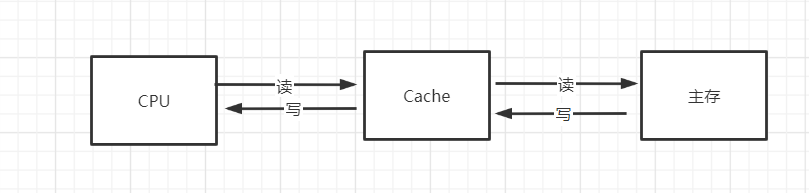
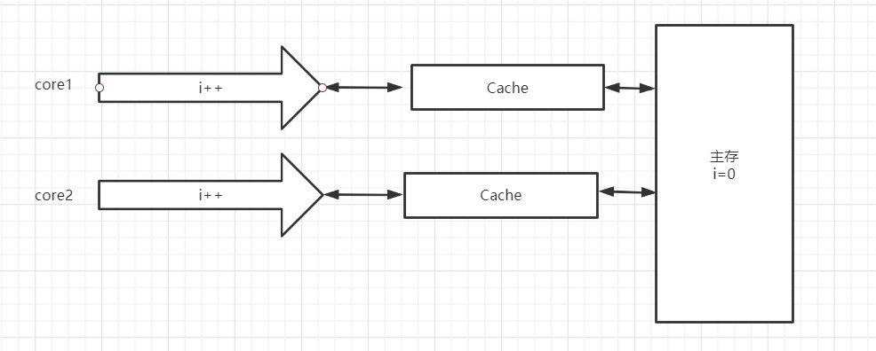
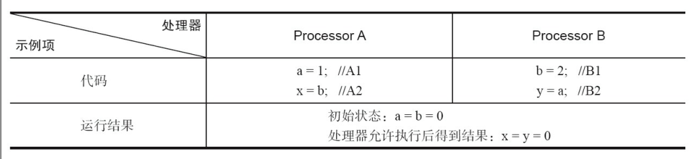
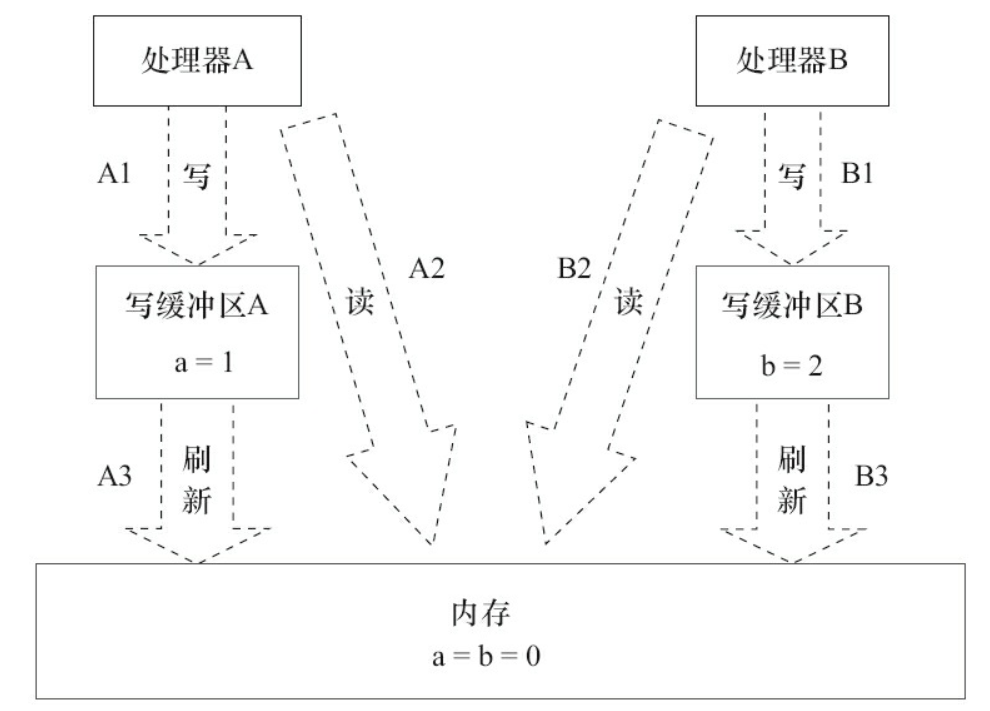
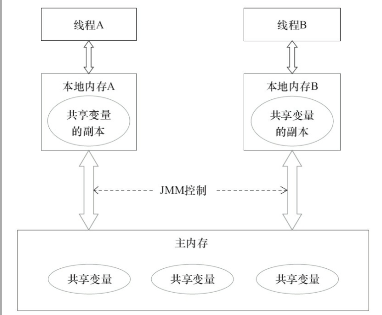

# 一、Java内存模型

### 1.1 计算机内存模型

一条指令通过CPU执行，首先要从主存中获取指令，然后执行指令，这个过程中可能会读写数据，但是cpu执行指令的速率比从主存中读取写入数据快很多，这就会造成CPU的资源浪费，为了提高CPU的效率，在CPU和主存之间增加了一个高速缓冲存储器也就是Cache，那么CPU、Cache和主存之间的关系如下图



那么，程序的执行过程如下：

- 先将数据从主存中复制一份到CPU的高速缓冲中
- 当CPU执行计算的时候直接冲Cache中读取数据和写入数据
- 当运算结束后，在将Cache中的数据更新到主存中

##### 1.1.1 缓存不一致问题

由CPU、Cache和主存组成的层次结构，虽然很好地解决了CPU和主存的执行速率不一致的问题，但是同时也带来了新的问题：

- 单核CPU，单线程，没有任何问题，cpu核心的缓存只被一个线程访问。缓存独占，不会出现访问冲突等问题。
- 单核CPU，多线程，CPU将某块内存加载到缓存后，**不同线程在访问相同的物理地址的时候，都会映射到相同的缓存位置，这样即使发生线程的切换，缓存仍然不会失效**。但由于任何时刻只能有一个线程在执行，因此不会出现缓存访问冲突
- 多核CPU，多线程，每个核都至少有一个一级缓存(Cache可以多个)。多个线程访问进程中的某个共享内存，且这多个线程分别在不同的核心上执行，则**每个核心都会在各自的caehe中保留一份共享内存的缓冲**。由于多核是可以并行的，可能会出现多个线程同时写各自的缓存的情况，而各自的cache之间的数据就有可能不同。

而现代计算机都是多核CPU，所以存在缓存不一致的问题，具体可看下面解释：

如下有两个线程，分别执行i++的操作，i的初始值为0，按照正常情况，两个线程执行i++最后结果应该是2，但是由于缓存不一致的问题，有如下两种情况：



- 线程1先将i=0从主存中读取到线程1的Cache中，然后CPU完成运算，在将i=1写入会主存中，然后线程2读取从主存中读取i=1到线程2的Cache中，然后CPU完成运算，在将i=2通过Cache写入会主存中，这是想要的结果
- 线程1先将i=0从主存中读取到线程1的Cache中，由于是多核的，线程2同时也将i=0读入到自己的Cache中，最后线程1和线程2完成运算后，也都将i=1写入回内存中，最终结果为i=1，也就出现了缓存不一致的问题

计算机内存模型中要解决缓存不一致的问题，大概有两种方法：

- 通过在总线加`LOCK#`锁的方式：因为CPU和其他部件进行通信都是通过总线来进行的，如果对总线加`LOCK#`锁的话，也就是说阻塞了其他CPU对其他部件访问（如内存），从而使得只能有一个CPU能使用这个变量的内存。在总线上发出了`LCOK#`锁的信号，那么只有等待这段代码完全执行完毕之后，其他CPU才能从其内存读取变量，然后进行相应的操作。

- 通过缓存一致性协议（Cache Coherence Protocol）：缓存一致性协议（Cache Coherence Protocol），最出名的就是Intel 的MESI协议，MESI协议保证了每个缓存中使用的共享变量的副本是一致的。

  MESI的核心的思想是：**当CPU写数据时，如果发现操作的变量是共享变量，即在其他CPU中也存在该变量的副本，会发出信号通知其他CPU将该变量的缓存行置为无效状态，因此当其他CPU需要读取这个变量时，发现自己缓存中缓存该变量的缓存行是无效的，那么它就会从内存重新读取。**

##### 1.1.2 处理器重排序问题

在多线程的场景下，还有一种硬件问题：为了使处理器内部的运算单元能够被充分利用，处理器可能会对输入代码进行乱序执行处理。这就是处理器优化。



这里处理器A和处理器B可以同时把共享变量写入自己的写缓冲区（A1，B1），然后从内存中读取另一个共享变量（A2，B2），最后才把自己写缓存区中保存的脏数据刷新到内存中（A3，B3）。当以这种时序执行时，程序就可以得到x=y=0的结果。  



从内存操作实际发生的顺序来看，直到处理器A执行A3来刷新自己的写缓存区，写操作A1才算真正执行了。虽然处理器A执行内存操作的顺序为：A1→A2，但内存操作实际发生的顺序却是A2→A1。此时，处理器A的内存操作顺序被重排序了（处理器B的情况和处理器A一样，这里就不赘述了）。  

### 1.2 Java内存模型

Java内存模型(JMM)是计算机内存模型的Java编程语言规范，使用Java内存模型可以保证在多线程场景下的原子性，可见性和有序性

JMM规定了所有的共享变量(局部变量不会在线程之间共享，不受JMM的影响)，都存储在主存中，==每个线程都有自己的工作区==，==线程对共享变量的所有操作都必须在工作区中进行==，==工作区中存储着主内存的共享变量的副本==，==不同的线程之间无法直接访问对方工作区==，==线程之间的消息传递也要通过主存来完成==。



JMM中关于同步的规定：

- 线程解锁前，必须把共享变量的值刷新回主内存
- 线程加锁前，必须读取主内存的最新值到自己的工作内存
- 加锁和解锁是同一把锁

JMM要保证原子性、可见性、有序性

# 二、volatile关键字

volatile是Java虚拟机提供的轻量级的同步机制，有以下3个特点：

- 保证可见性
- 不保证原子性
- 禁止指令重排序

### 2.1 保证可见性

先来看看一个没有可见性的例子：

```java
//资源类
class MyData{
    int num = 0;
    public void addTo60(){
        num = 60;
    }
}

public class VolatileDemo {
    public static void main(String[] args) {
        MyData myData = new MyData();
        new Thread(() -> {
            System.out.println(Thread.currentThread().getName() + "\t come in");
            //注意这里必须要休眠
			try { TimeUnit.SECONDS.sleep(3);} catch (InterruptedException e) {e.printStackTrace();}
            myData.addTo60();
            System.out.println(Thread.currentThread().getName() + "\t update number value");
        },"A").start();

        while(myData.num == 0){

        }
        System.out.println(Thread.currentThread().getName() + "\t主线程结束");
    }

}
```

.assets/image-20201217100151736.png)

一直堵塞中，也就是说main线程一直卡在while循环中，可见下图：

.assets/image-20201217100254605.png)

解释为什么A线程中要有那段堵塞代码？

如果A线程不堵塞，因为只是执行一行num=60的代码，执行速度很快，当执行完之后，主线程从主内存获取到的是A线程已经修改过后的值，这样就看不到可见性的效果了

从上面代码可以看出，如果不加volatile关键字是没有保证可见性的，然后执行以下加了volatile关键字的效果

```java
class MyData{
    //加入volatile关键字
    volatile int num = 0;
    public void addTo60(){
        num = 60;
    }
}

public class VolatileDemo {
    public static void main(String[] args) {
        MyData myData = new MyData();
        new Thread(() -> {
            System.out.println(Thread.currentThread().getName() + "\t come in");
            try { TimeUnit.SECONDS.sleep(3);} catch (InterruptedException e) {e.printStackTrace();}
            myData.addTo60();
            System.out.println(Thread.currentThread().getName() + "\t update number value");
        },"A").start();

        while(myData.num == 0){

        }
        System.out.println(Thread.currentThread().getName() + "\t主线程结束");
    }

}
```

.assets/image-20201217100643270.png)

对num变量加入volatile之后，执行图应该为如下

.assets/image-20201217100754170.png)

### 2.2 不保证原子性

原子性：不可分割，完整性，也就是当某个线程正在执行某个业务时，中间不可以被加塞或者分割，要么同时完成，要么同时失败

volatile是不保证原子性的，可用如下代码验证：

```java
class MyData2{
    volatile int num = 0;
    public  void add(){
        num++;
    }
}

public class VolatileDemo2 {
    public static void main(String[] args) {
        MyData2 myData = new MyData2();
        for(int i = 1;i <= 20;i++){
            new Thread(() -> {
                for (int j = 0; j < 2000; j++) {
                    myData.add();
                }
            },String.valueOf(i)).start();
        }
        while (Thread.activeCount() > 2){
            Thread.yield();
        }

        System.out.println(myData.num);
    }
}
```

上面代码创建了20个线程，每个线程执行2000次add方法，如果volatile可以保证原子性，那么最终的结果就是40000

.assets/image-20201217102032487.png)

答案不对了，由此可以验证volatile是不保证原子性的。分析一下上面代码

.assets/image-20201217102920860.png)

当有两个线程同时往主内存中写的时候，因为调度问题，只能一个线程进入主内存中写，那么当其他线程醒来往主线程中写时，已经不是最新的数据，这样就造成了写覆盖，导致最后结果不是40000

怎么解决？

1. 加锁，加sync锁是肯定可以解决原子性问题的
2. 使用JUC下的AtomicInteger原子类

```java
class MyData2{
    volatile int num = 0;
    AtomicInteger atomicInteger = new AtomicInteger();
    public void add(){
        atomicInteger.getAndIncrement();
    }
}

public class VolatileDemo2 {
    public static void main(String[] args) {
        MyData2 myData = new MyData2();
        for(int i = 1;i <= 20;i++){
            new Thread(() -> {
                for (int j = 0; j < 2000; j++) {
                    myData.add();
                }
            },String.valueOf(i)).start();
        }
        while (Thread.activeCount() > 2){
            Thread.yield();
        }
        System.out.println(myData.atomicInteger);
    }
}
```

.assets/image-20201217103417255.png)

### 2.3 禁止指令重排

在执行程序时，为了提高性能，编译器和处理器常常会对指令做重排序。重排序分3种类型。

- 编译器优化的重排序。编译器在不改变单线程程序语义的前提下，可以重新安排语句的执行顺序。

- 指令级并行的重排序。现代处理器采用了指令级并行技术（Instruction-LevelParallelism，ILP）来将多条指令重叠执行。如果不存在数据依赖性，处理器可以改变语句对应机器指令的执行顺序。
- 内存系统的重排序。由于处理器使用缓存和读/写缓冲区，这使得加载和存储操作看上去可能是在乱序执行。  

.assets/image-20201218094649160.png)

处理器在重排序时必须要考虑指令之间的==数据依赖性==，例如：

```java
int x = 11;     //①
int y = 12;     //②
x = x + 5;      //③
y = x * x;      //④
```

编译器在优化时，语句③必须要在语句①之后，因为有数据依赖。

==volatile禁止指令重排优化==，从而避免多线程环境下程序出现乱序执行的现象，其主要原理如下：

内存屏障(Memory Barrier)又称内存栅栏，是一个CPU指令，它的作用有两个：

- 保证特定操作的执行顺序，

- 保证某些变量的内存可见性(利用该特性实现volatile的内存可见性)。

由于编译器和处理器都能执行指令重排优化。如果在指令间插入-条MemoryBarrier则会告诉编译器和CPU，不管什么指令都不能和这条Memory Barrier指令重排序，也就是说通过插入内存屏障禁止在内存屏障前后的指令执行重排序优化。内存屏障另外一个作用是强制刷出各种CPU的缓存数据，因此任何CPU上的线程都能读取到这些数据的最新版本。

### 2.4 单例模式中的volatile

单例模式的DCL写法如下，双重验证

```java
public class SingletonDemo {
    private static SingletonDemo instance = null;
    private SingletonDemo(){}

    public SingletonDemo getInstance(){
        if(instance == null){
            synchronized (SingletonDemo.class){
                if(instance == null){
                    return new SingletonDemo();
                }
            }
        }
        return instance;
    }
}
```

可能上述代码运行100万次，只会出现一次错误，原因是编译器底层的指令重排，一个对象在new的过程中，大概有下面4个过程：

1.看class对象是否加载，如果没有就先加载class对象；

2.分配内存空间，初始化实例；

3.调用构造函数；

4.返回地址给引用

如果在某一次执行的时候，因为上面四个步骤某一数据依赖，所以有可能会进行指令重排，将②和④的顺序打乱，也就是说先返回了地址引用，后面再分配内存空间。例如有A，B两线程，首先A线程进行new操作，但是由于指令重排先返回了地址引用，很不巧的是A线程刚好被挂起，此时B线程获取CPU资源，==发现instance不等于null，于是直接返回了还没有分配内存空间的引用。==导致线程B使用了还没有被初始化的变量。

所以，要对instance加上volatile禁止指令重排序。

# 三、原子操作类

Java从JDK 1.5开始提供了java.util.concurrent.atomic包（以下简称Atomic包），这个包中的原子操作类提供了一种用法简单、性能高效、线程安全地更新一个变量的方式。因为变量的类型有很多种，属于4种类型的原子更
新方式，分别是原子更新基本类型、原子更新数组、原子更新引用和原子更新属性（字段）。

### 3.1 原子更新基本类型

- AtomicBoolean：原子更新布尔类型。
- AtomicInteger：原子更新整型。
- AtomicLong：原子更新长整型。 

| 方法                                            | 作用                                                         |
| ----------------------------------------------- | ------------------------------------------------------------ |
| int addAndGet（int delta）                      | 以原子方式将输入的数值与实例中的值（AtomicInteger里的value）相加，并返回结果。 |
| boolean compareAndSet（int expect，int update） | 如果输入的数值等于预期值，则以原子方式将该值设置为输入的值。 |
| int getAndIncrement()                           | 以原子方式将当前值加1，注意，这里返回的是自增前的值          |
| int getAndSet（int newValue）                   | 以原子方式设置为newValue的值，并返回旧值。                   |

### 3.2 原子更新数组

通过原子的方式更新数组里的某个元素，Atomic包提供了以下4个类。

- AtomicIntegerArray：原子更新整型数组里的元素。
- AtomicLongArray：原子更新长整型数组里的元素。
- AtomicReferenceArray：原子更新引用类型数组里的元素  

| 方法                                                   | 作用                                                         |
| ------------------------------------------------------ | ------------------------------------------------------------ |
| int addAndGet（int i，int delta）                      | 以原子方式将输入值与数组中索引i的元素相加                    |
| boolean compareAndSet（int i，int expect，int update） | 如果当前值等于预期值，则以原子<br/>方式将数组位置i的元素设置成update值 |

### 3.3 原子更新引用

原子更新基本类型的AtomicInteger，只能更新一个变量，如果要原子更新多个变量，就需要使用这个原子更新引用类型提供的类。Atomic包提供了以下3个类。

- AtomicReference：原子更新引用类型。
- AtomicReferenceFieldUpdater：原子更新引用类型里的字段。
- AtomicMarkableReference：原子更新带有标记位的引用类型。可以原子更新一个布尔类型的标记位和引用类型。构造方法是AtomicMarkableReference（V initialRef，boolean initialMark）

### 3.4 原子更新字段

如果需原子地更新某个类里的某个字段时，就需要使用原子更新字段类，Atomic包提供了以下3个类进行原子字段更新。

- AtomicIntegerFieldUpdater：原子更新整型的字段的更新器。
- AtomicLongFieldUpdater：原子更新长整型字段的更新器。
- AtomicStampedReference：原子更新带有版本号的引用类型。该类将整数值与引用关联起来，可用于原子的更新数据和数据的版本号，可以解决使用CAS进行原子更新时可能出现的ABA问题  

# 四、CAS

### 3.1 概述

CAS（Compare-And-Swap）看单词意思，比较和替换。比较和替换是使用一个期望值和一个变量的当前值进行比较，如果当前变量的值与我们期望的值相等，就使用一个新值替换当前变量的值。java.util.concurrent.atomic包下都是利用了CAS的思想。

它是CPU的并发原语。原语属于操作系统的范畴，是由若干条指令组成，用于完成某个功能的一个过程。原语的执行必须是连续的，在执行过程中不允许被中断。也就是说CAS不会造成数据不一致的问题，CAS是线程安全的

==CAS有3个操作数，内存值V，旧的预期值A，要修改的更新值B，当且仅当预期值和内存值V相同时，将内存值修改为B，否则什么都不做==。

### 3.2 CAS的使用

```java
AtomicInteger atomicInteger = new AtomicInteger(10);
System.out.println(atomicInteger.compareAndSet(10, 2020) + "\t当前的值" + atomicInteger.get());
System.out.println(atomicInteger.compareAndSet(10, 2019) + "\t当前的值" + atomicInteger.get());
```

.assets/image-20201218112322010.png)

CAS的作用是比较当前工作内存中的值和主物理内存中的值，如果相同则更新为我们规定的值，否则继续比较直到工作内存和主物理内存的值一致。我们通常称它为：比较并交换

CAS中有两个参数，第一个是预期值，第二个是更改后的值。

### 3.3 CAS的底层原理

在AtomicInteger中有一个方法：getAndIncrement()，这个方法不加synchronized照样可以保证安全性，前面说volatile的不保证原子性的解决办法上已经提到过。那么通过这个方法来看看CAS的底层原理

```java
public final int getAndIncrement() {
    return unsafe.getAndAddInt(this, valueOffset, 1);
}

public final int getAndAddInt(Object var1, long var2, int var4) {
    int var5;
    do {
        var5 = this.getIntVolatile(var1, var2);
    } while(!this.compareAndSwapInt(var1, var2, var5, var5 + var4));

    return var5;
}
```

CAS的底层使用了unsafe类，由于java需要通过本地(Native)方法才能访问底层系统，unsafe就是这个后门，通过unsafe可以直接操作特定的内存数据。看源码也可以知道unsafe有一堆的本地方法。

unsafe的getAndAddInt方法需要传入三个参数：

- var1：当前对象
- var2(valueOffset)：表示该变量在内存中的偏移地址
- var4：要修改的值

在getAndAddInt方法中有一个循环判断方法compareAndSwapInt，这是一个本地方法。传入4个参数

- var1：AtomicInteger对象本身
- var2：对象值的引用地址，也就是偏移量
- var4：要修改的值
- var5：用当前对象的值和var5进行比较，如果相同，更新为var5+var4并返回true，如果不同，继续取值比较，直到更新完成。

下面用图来展示一下AtomicInteger为什么不加synchronized也可以实现线程安全

.assets/image-20201219092044055.png)

1. AtomicInteger里面的value原始值为0，即主内存中AtomicInteger的value为0，根据JMM模型，A，B线程各持有一份value=0的副本
2. 线程A通过获取到CPU资源将value++，然后通过getIntVolatile方法获取到主内存中value的值var5=0，执行compareAndSwapInt比较并交换，线程A成功修改主内存中的Value值
3. 线程B也将value++，并通过通过getIntVolatile方法获取到主内存中value的值var5=1，行compareAndSwapInt比较并交换发现不一样，那么返回false，进入下一次循环，知道发现自己拿的值和主内存中的值一样时，才进行值得更新，这样就避了写的覆盖问题，也就是保住了原子操作

### 3.4 CAS的缺点

##### 3.4.1长时间的自旋，消耗资源

自旋就是cas的一个操作周期，如果一个线程特别倒霉，每次获取的值都被其他线程的修改了，那么它就会一直进行自旋比较，直到成功为止，在这个过程中cpu的开销十分的大，所以要尽量避免。

##### 3.4.2 只能保证一个共享变量的原子操作

##### 3.4.3 ABA问题

CAS算法的重要前提是需要取出内存中某时刻的数据并在当下时刻==比较并替换==，那么这个时间差会导致数据的变化，例如：**1号线程从主内存中取出A，然后2号线程也从主内存中取出A，2号线程经过一些操作后将值变成了B，然后2号线程又将值变为了A，这个时候1号线程进行CAS操作的时候发现内存中的还是A，然后1号线程操作成功**

也就是说2号线程对1号线程是不可见的，这个时候数据没有问题，但是中间的过程有些问题

### 3.5 使用AtomicStampedReference解决ABA问题

ABA问题就是说如果有一个线程拿到一个数据一开始是A，最后一次修改的值也是A，中间的过程不知道，然后另外一个线程也对中间过程不可见，最后操作成功。

要解决ABA问题，可以加一个版本号，也就是说每一个线程每一次进行修改都会改变版本号，然后比较的时候还需要比较版本号，那么就解决了ABA问题

原子操作类中提供了AtomicStampedReference类用于解决ABA问题，看下面代码：

首先模拟ABA问题的产生：

```java
private static AtomicReference<Character> atomicReference = new AtomicReference<>('A');
public static void main(String[] args) {
    new Thread(() -> {
        atomicReference.compareAndSet('A', 'B');
        atomicReference.compareAndSet('B','A');
    },"t1").start();

    new Thread(() -> {
        try { TimeUnit.SECONDS.sleep(1);} catch (InterruptedException e) {e.printStackTrace();}
        System.out.println(atomicReference.compareAndSet('A', 'C') + "\t" + atomicReference.get());
    },"t2").start();
}
```

.assets/image-20201219095136231.png)

t2线程成功修改，将A的值变为C，下面看使用AtomicStampedReference操作类解决ABA问题

```java
private static AtomicStampedReference<Character> atomicStampedReference = new AtomicStampedReference<>('A', 1);

public static void main(String[] args) {

    new Thread(() -> {
        int stamp = atomicStampedReference.getStamp();
        System.out.println(Thread.currentThread().getName() + "第1次版本号" + stamp);
        //睡眠1秒保证线程t1拿到当前的版本号
        try { TimeUnit.SECONDS.sleep(1);} catch (InterruptedException e) {e.printStackTrace();}
        atomicStampedReference.compareAndSet('A', 'B', atomicStampedReference.getStamp(), atomicStampedReference.getStamp() + 1);
        System.out.println(Thread.currentThread().getName() + "第2次版本号" + atomicStampedReference.getStamp());
        atomicStampedReference.compareAndSet('B', 'A', atomicStampedReference.getStamp(), atomicStampedReference.getStamp() + 1);
        System.out.println(Thread.currentThread().getName() + "第3次版本号" + atomicStampedReference.getStamp());
    },"t3").start();


    new Thread(() -> {
        int stamp = atomicStampedReference.getStamp();
        System.out.println(Thread.currentThread().getName() + "第1次版本号" + stamp);
        //睡眠3秒保证线程t3执行完毕
        try { TimeUnit.SECONDS.sleep(3);} catch (InterruptedException e) {e.printStackTrace();}
        boolean res = atomicStampedReference.compareAndSet('A', 'C', stamp, stamp + 1);
        System.out.println(Thread.currentThread().getName() + "\t修改成功与否" + res);
        System.out.println(Thread.currentThread().getName() + "\t当前实际版本号" + atomicStampedReference.getStamp());
        System.out.println(Thread.currentThread().getName() + "\t当前实际最新值" + atomicStampedReference.getReference());

    },"t4").start();
}
```

执行结果：

.assets/image-20201219100332061.png)

