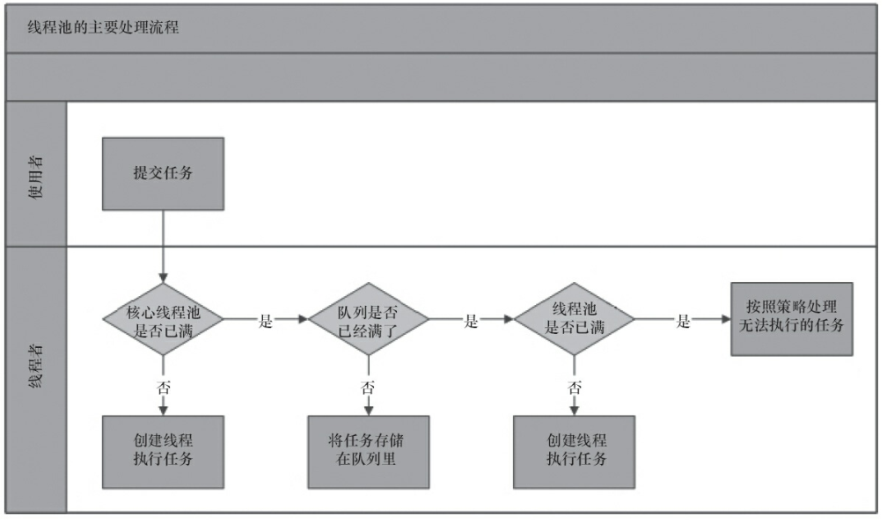

# 五、辅助类介绍

### 5.1 CountDownLatch

需求：班上六个人上自习，班长最后要将教室锁门，也就是说班长只有等待着六个人上完自习后才能将教室锁住，也就是说这里需要进程的先后执行，只有这6个人执行完后，班长所在的进程才能执行。使用join方法可以完成这个需求，但是JUC中有强大的工具类CountDownLatch提供使用

```java
public class CountDownLatchDemo {
    public static void main(String[] args) throws InterruptedException {
        CountDownLatch countDownLatch = new CountDownLatch(6);
        for(int i = 1;i <= 6;i++){
            new  Thread(() -> {
                System.out.println(Thread.currentThread().getName() + "\t离开了教室");
                countDownLatch.countDown();
            },"" + i).start();
        }
        countDownLatch.await();
        System.out.println(Thread.currentThrea 0.d().getName()+"\t****** 班长关门  走人，main线程是班长");
    }
}
```

原理：

 * CountDownLatch主要有两个方法，当一个或多个线程调用await方法时，这些线程会阻塞。
 * 其它线程调用countDown方法会将计数器减1(调用countDown方法的线程不会阻塞)，
 * 当计数器的值变为0时，因await方法阻塞的线程会被唤醒，继续执行。

### 5.2 CyclicBarrier

需求：一个小组开会，组长只有在等待其他组员全部到来的时候才能开会，也就是说必须等到组长这个线程到来时，其他线程才能继续干活

```java
public class CyclicBarrierDemo {
    public static void main(String[] args) {
		//设置 需要多少个线程进来才执行这个方法的线程
        CyclicBarrier cyclicBarrier = new CyclicBarrier(7, () -> {
            System.out.println("组长开会----");
        });

        for (int i = 1; i <= 7; i++) {
            new Thread(() -> {
                try {
                    System.out.println(Thread.currentThread().getName() + "\t组员到来");
                    cyclicBarrier.await();
                } catch (InterruptedException e) {
                    e.printStackTrace();
                } catch (BrokenBarrierException e) {
                    e.printStackTrace();
                }
            },String.valueOf(i)).start();
        }
    }
}
```


组员到来的时间不一样，但是组长这个线程一定是在最后得

原理： CyclicBarrier的字面意思是可循环（Cyclic）使用的屏障（Barrier）。它要做的事情是，让一组线程到达一个屏障（也可以叫同步点）时被阻塞，直到最后一个线程到达屏障时，屏障才会开门，所有被屏障拦截的线程才会继续干活。线程进入屏障通过CyclicBarrier的await()方法。

Cyclicbarrier和CountDownLatch比较相似，不过Cyclicbarrier是做加法，CountDownLatch是做减法

### 5.3 Semaphore

需求：现在停车场上有3个停车位，但是有6辆汽车，要求这些停车位一旦有空闲的，汽车就要过去停车。

这个有点类似于PV操作对临界区资源的访问

```java
public class SemaphoreDemo {

    public static void main(String[] args) {
        Semaphore semaphore = new Semaphore(3);	//设置3个停车位
        for (int i = 1; i <= 6; i++) {
            new Thread(() -> {
                try {
                    semaphore.acquire();	//获取停车位资源
                    System.out.println(Thread.currentThread().getName() + "\t抢占到了车位");	
                    TimeUnit.SECONDS.sleep(5);	//休眠5秒
                    System.out.println(Thread.currentThread().getName() + "\t离开到了车位");
                } catch (InterruptedException e) {
                    e.printStackTrace();
                }finally {
                    semaphore.release();	//释放停车位资源
                }
            },String.valueOf(i)).start();

        }
    }
}
```


原理：

 在信号量上我们定义两种操作：
 * acquire（获取） 当一个线程调用acquire操作时，它要么通过成功获取信号量（信号量减1），要么一直等下去，直到有线程释放信号量，或超时。
 * release（释放）实际上会将信号量的值加1，然后唤醒等待的线程。

信号量主要用于两个目的，一个是用于多个共享资源的互斥使用，另一个用于并发线程数的控制。

# 六、ReentrantReadWriteLock读写锁

例如下例子，有5个线程想资源类里写数据，5个线程读数据

```java
class MyCache {
     //volatile:，保证可见性，不保证原子性，一个线程修改后，通知更新
    private volatile Map<String, Object> map = new HashMap<>();


    public void put(String key, Object value) {
        System.out.println(Thread.currentThread().getName() + "\t 正在写" + key);
        //暂停一会儿线程
        try {
            TimeUnit.MILLISECONDS.sleep(300);
        } catch (InterruptedException e) {
            e.printStackTrace();
        }
        map.put(key, value);
        System.out.println(Thread.currentThread().getName() + "\t 写完了" + key);
        System.out.println();

    }

    public Object get(String key) {
        Object result = null;
        System.out.println(Thread.currentThread().getName() + "\t 正在读" + key);
        try {
            TimeUnit.MILLISECONDS.sleep(300);
        } catch (InterruptedException e) {
            e.printStackTrace();
        }
        result = map.get(key);
        System.out.println(Thread.currentThread().getName() + "\t 读完了" + result);
        return result;
    }
}

public class ReadWriteLockDemo {
    public static void main(String[] args) {
        MyCache myCache = new MyCache();
        for (int i = 1; i <= 5; i++) {
            final int num = i;
            new Thread(() -> {
                myCache.put(num + "", num + "");
            }, String.valueOf(i)).start();
        }
        for (int i = 1; i <= 5; i++) {
            final int num = i;
            new Thread(() -> {
                myCache.get(num + "");
            }, String.valueOf(i)).start();
        }

    }
}
```

输出结果


这里已经可以看出问题了，由于没有加锁，写和读同时进行会造成脏读，那加把锁就可以解决了这个问题！加入Synchronized锁，但是可以有更好的方法？

我们知道，读一个数据是不需要加锁的，例如前面说过的写时复制的思路，我们可以在写入的时候加入锁，防止其他人写入，但是在读取的时候就不需要加锁了。这就是读写分离

ReentrantReadWriteLock就是一种读写分离锁，看下面代码

```java
class MyCache {
     //volatile:，保证可见性，不保证原子性，一个线程修改后，通知更新
    private volatile Map<String, Object> map = new HashMap<>();
    private ReadWriteLock rwLock = new ReentrantReadWriteLock();	//读写锁

    public synchronized void put(String key, Object value) {
        rwLock.writeLock().lock();	//加锁
        try {
            System.out.println(Thread.currentThread().getName() + "\t 正在写" + key);
            //暂停一会儿线程
            TimeUnit.MILLISECONDS.sleep(300);
            map.put(key, value);
            System.out.println(Thread.currentThread().getName() + "\t 写完了" + key);
            System.out.println();
        }catch (InterruptedException e){
            e.printStackTrace();
        }finally {
            rwLock.writeLock().unlock();	//解锁
        }
    }

    public synchronized Object get(String key) {
        rwLock.readLock().lock();
        try {
            Object result = null;
            System.out.println(Thread.currentThread().getName() + "\t 正在读" + key);
             TimeUnit.MILLISECONDS.sleep(300);

            result = map.get(key);
            System.out.println(Thread.currentThread().getName() + "\t 读完了" + result);
            return result;
        }catch (InterruptedException e){
            e.printStackTrace();
        }finally {
            rwLock.readLock().unlock();
        }
        return null;
    }
}

public class ReadWriteLockDemo {
    public static void main(String[] args) {
        MyCache myCache = new MyCache();
        for (int i = 1; i <= 5; i++) {
            final int num = i;
            new Thread(() -> {
                myCache.put(num + "", num + "");
            }, String.valueOf(i)).start();
        }
        .
        for (int i = 1; i <= 5; i++) {
            final int num = i;
            new Thread(() -> {
                myCache.get(num + "");
            }, String.valueOf(i)).start();
        }

    }
}

```


# 七、BlockingQueue阻塞队列       

### 7.1 概念

阻塞队列(BlockingQueue)是一个支持两个附加操作的队列。这两个附加操作支持阻塞的插入和移除方法 ，使用BlockingQueue使得我们不需要关心什么时候需要阻塞线程，什么时候需要唤醒线程，因为这一切BlockingQueue都给你一手包办了

阻塞队列常用于生产者消费者模型，生产者是向队列里添加元素的线程，消费者是向队列里取元素的线程

### 7.2 JAVA中的阻塞队列

java中提供了7中阻塞队列：

- ArrayBlockingQueue：一个有数组组成的有界阻塞队列

ArrayBlockingQueue是一个用数组实现的有界阻塞队列，此队列按照FIFO的原则对元素进行排序，默认情况下不保证线程公平的访问队列，也就是说对先等待的线程是不公平的，当队列可以用时，阻塞的线程都可以争夺访问队列的资格，有可能先阻塞的线程最后才访问队列

- LinkedBlockingQueue：由链表结构组成的有界（但大小默认值为integer.MAX_VALUE）阻塞队列。

- PriorityBlockingQueue：支持优先级排序的无界阻塞队列。
- DelayQueue：使用优先级队列实现的延迟无界阻塞队列。·
- SynchronousQueue：不存储元素的阻塞队列，也即单个元素的队列。每一个put操作必须等待一个take操作
- LinkedTransferQueue：由链表组成的无界阻塞队列。
- LinkedBlockingDeque：由链表组成的双向阻塞队列。

### 7.3 核心方法

这些队列支持阻塞的插入和移除方法

- 插入方法：当队列满时，队列会阻塞插入元素的线程，知道队列不满
- 移除方法：当队列为空时，获取元素的线程会等待队列变为非空

| 方法     | 抛出异常  | 返回特殊值 | 一直阻塞 | 超时退出           |
| -------- | --------- | ---------- | -------- | ------------------ |
| 插入方法 | add(e)    | offer()    | put()    | offer(e,time,unit) |
| 移除方法 | remove(e) | poll()     | take()   | poll(time,unit)    |
| 检查方法 | element() | peek()     | 不可用   | 不可用             |

#####   7.3.1 抛出异常

当队列满时，如果再往队列里插入元素，会抛出IllegalStateException异常，当队列为空时获取元素会抛出NoSuchElementException异常

```java
BlockingQueue<String> blockingQueue = new ArrayBlockingQueue<>(3);
System.out.println(blockingQueue.add("a"));
System.out.println(blockingQueue.add("b"));
System.out.println(blockingQueue.add("c"));
System.out.println(blockingQueue.add("d"));
```


```java
BlockingQueue<String> blockingQueue = new ArrayBlockingQueue<>(3);
System.out.println(blockingQueue.add("a"));
System.out.println(blockingQueue.add("b"));
System.out.println(blockingQueue.add("c"));
//System.out.println(blockingQueue.add("d"));

System.out.println(blockingQueue.remove());
System.out.println(blockingQueue.remove());
System.out.println(blockingQueue.remove());
System.out.println(blockingQueue.remove());
```


##### 7.3.2 返回特殊值

当队列插入元素时，会返回元素是否插入成功，成功放回true，如果是移除方法，则从队列里取出一个元素，如果没有则放回null

```java
BlockingQueue<String> blockingQueue = new ArrayBlockingQueue<>(3);

System.out.println(blockingQueue.offer("a"));
System.out.println(blockingQueue.offer("b"));
System.out.println(blockingQueue.offer("c"));
System.out.println(blockingQueue.offer("x"));

System.out.println(blockingQueue.poll());
System.out.println(blockingQueue.poll());
System.out.println(blockingQueue.poll());
System.out.println(blockingQueue.poll());
```


##### 7.3.3 一直阻塞

当堵塞队列满时，如果生产者线程往队列里put元素，队列会一直阻塞生产者线程，直到队列可用或者响应中断退出，当队列为空时，如果消费者线程从队列里take元素，队列会阻塞消费者线程，知道队列不为空

```java
//写入
BlockingQueue<String> blockingQueue = new ArrayBlockingQueue<>(3);
blockingQueue.put("a");
blockingQueue.put("b");
blockingQueue.put("c");
blockingQueue.put("x");
```


可见线程一直堵塞在这里

```java
BlockingQueue<String> blockingQueue = new ArrayBlockingQueue<>(3);
//取出
blockingQueue.put("a");
blockingQueue.put("b");
blockingQueue.put("c");
//blockingQueue.put("x");
System.out.println(blockingQueue.take());
System.out.println(blockingQueue.take());
System.out.println(blockingQueue.take());
System.out.println(blockingQueue.take());
```


##### 7.3.4 超时退出

当阻塞队列满时，如果生产者线程往队列里插入元素，队列会阻塞生成者消费者线程一段时间，如果超时了指定的时间，生成者线程将会退出

```java
BlockingQueue<String> blockingQueue = new ArrayBlockingQueue<>(3);
System.out.println(blockingQueue.offer("a"));
System.out.println(blockingQueue.offer("b"));
System.out.println(blockingQueue.offer("c"));
System.out.println(blockingQueue.offer("a",3L, TimeUnit.SECONDS));
```

线程会先阻塞3秒钟，然后直接退出

### 7.4 阻塞队列的实现原理

如果队列是空的，消费者会一直等待，当生产者添加元素时，消费者是如何知道当前队列有元素的呢？

==使用通知模式实现==，所谓通知模式，就是当生产者往满的队列中添加元素时会阻塞住生产者，当消费者消费了一个队里中的元素后，会通知生产者当前队列可以用，

ArrayBlockingQueue使用了Condition来实现其中的通知机制

# 八、线程池

### 8.1 线程池的好处

说到线程池，很容易想起来数据库连接池c3p0等等数据库连接池技术，数据库连接池和线程池的好处都是一样的：

- 降低资源消耗：通过重复利用已创建的线程降低线程创建和销毁造成的消耗
- 提高响应速度：当任务到达时，任务可以不需要等到线程创建就能立即执行
- 提高线程的可管理性：线程是稀缺资源，如果无限制的创建，不仅会消耗系统资源，还会降低系统的稳定性，使用线程池技术可以进行统一分配、调优和监控

### 8.2 Executor简介

Executor框架主要由3部分组成：

- 任务：包括被执行任务需要实现的接口：Runnable接口和Callable接口
- 任务的执行：包括任务执行机制的核心接口Executor，以及继承至Executor接口的ExecutorService接口，其中有两个关键类实现了ExecutorService接口：ThreadPoolExecutor，ScheduledThreadPoolExecutor
- 异步计算的结果：包括Future接口和实现Future接口的FutrueTask类


### 8.3 使用线程池

通过Executors这个工具类，可以创建3种类型的ThreadPoolExecutor：

- FixedThreadPool
- SingleThreadExecutor
- CachedThreadPool

##### 8.3.1 FixedThreadPool

FixedThreadPool被称为可重用固定线程数的线程池，里面传入一个参数表示线程池里最多有多少个线程

```java
public class MyThreadPoolDemo1 {
    public static void main(String[] args) {
        //创建固定数量的线程池
        ExecutorService threadPool = Executors.newFixedThreadPool(4);
        for (int i = 1; i <= 10; i++) {
            //执行每个线程里的方法
            threadPool.execute(() -> {
                System.out.println(Thread.currentThread().getName() + "\t进来了");
                try {
                    //暂停1秒
                    TimeUnit.SECONDS.sleep(1);
                } catch (InterruptedException e) {
                    e.printStackTrace();
                }
            });
        }
        //关闭线程池
        threadPool.shutdown();
    }
}
```


##### 8.3.2 SingleThreadExecutor

SingleThreadExecutor是使用单个worker线程的Executor，使用方法和FixedThreadPool一样

```java
ExecutorService  threadPool = Executors.newSingleThreadExecutor();
for (int i = 1; i <= 10; i++) {
    //执行每个线程里的方法
    threadPool.execute(() -> {
        System.out.println(Thread.currentThread().getName() + "\t进来了");
        try {
            //暂停1秒
            TimeUnit.SECONDS.sleep(1);
        } catch (InterruptedException e) {
            e.printStackTrace();
        }
    });
}
//关闭线程池
threadPool.shutdown();
```

##### 8.3.3 CachedThreadPool

CachedThreadPool是一个会根据需要创建新线程的线程池，使用方法和上面两个一样

### 8.4 线程池七大参数

虽然Executors工具类提供了3个可用的线程池，分别有单个线程的，指定线程数的，可根据需要扩展的，下面来看看其中的源码

```java
//固定线程数的线程池
public static ExecutorService newFixedThreadPool(int nThreads) {
    return new ThreadPoolExecutor(nThreads, nThreads,
                                  0L, TimeUnit.MILLISECONDS,
                                  new LinkedBlockingQueue<Runnable>());
}
//单个work工作的线程
public static ExecutorService newSingleThreadExecutor() {
    return new FinalizableDelegatedExecutorService
        (new ThreadPoolExecutor(1, 1,
                                0L, TimeUnit.MILLISECONDS,
                                new LinkedBlockingQueue<Runnable>()));
}
//可根据需要扩展的线程池
public static ExecutorService newCachedThreadPool() {
    return new ThreadPoolExecutor(0, Integer.MAX_VALUE,
                                  60L, TimeUnit.SECONDS,
                                  new SynchronousQueue<Runnable>());
}
```

看到上面源码，可发现共同之处，调用的都是ThreadPoolExecutor方法，也就是说Executors提供的3个线程池只不过帮我们向ThreadPoolExecutor传递了一些参数而已，下面是ThreadPoolExecutor的源码


ThreadPoolExecutor一共有七大参数，下面一一介绍

##### 8.4.1 corePoolSize 

corePoolSize 是线程池的基本大小，线程池中的常驻核心线程数

当提交一个任务到线程池时，线程池会创建一个线程来执行任务，即使其他空闲的基本线程能够执行新任务也会创建线程，等到需要执行的任务数大于线程池基本大小时就不再创建。如果调用了线程池的prestartAllCoreThreads()方法，线程池会提前创建并启动所有基本线程。  

##### 8.4.2 maximumPoolSize

maximumPoolSize是线程池的最大数量，线程池允许创建的最大线程数。==如果队列满了，并
且已创建的线程数小于最大线程数==，则线程池会再创建新的线程执行任务。值得注意的是，如
果使用了无界的任务队列这个参数就没什么效果。 此值必须大于等于1

##### 8.4.3 keepAliveTime和unit

keepAliveTime是线程活动的保持时间，多余的空闲线程的存活时间，当前池中线程数量超过corePoolSize时，当空闲时间达到keepAliveTime时，多余线程会被销毁直到只剩下corePoolSize个线程为止

unit是keepAliveTime的单位 

##### 8.4.4 workQueue

workQueue：任务队列，被提交但尚未被执行的任务，可以选择的有以下几个：

- ArrayBlockingQueue：是一个基于数组结构的有界阻塞队列，此队列按FIFO（先进先出）原
  则对元素进行排序。
- LinkedBlockingQueue：一个基于链表结构的阻塞队列，此队列按FIFO排序元素，吞吐量通
  常要高于ArrayBlockingQueue。静态工厂方法Executors.newFixedThreadPool()使用了这个队列。
- SynchronousQueue：一个不存储元素的阻塞队列。每个插入操作必须等到另一个线程调用
  移除操作，否则插入操作一直处于阻塞状态，吞吐量通常要高于Linked-BlockingQueue，静态工
  厂方法Executors.newCachedThreadPool使用了这个队列。
- PriorityBlockingQueue：一个具有优先级的无限阻塞队列。  

这些队列其实就是前面的堵塞队列

##### 8.4.5 threadFactory

表示生成线程池中工作线程的线程工厂，用于创建线程，一般默认的即可

##### 8.4.6 handler

handler饱和策略，当队列和线程池都满了，说明线程池处于饱和状态，那么必须采取一种策略处理提交的新任务。这个策略默认情况下是AbortPolicy，表示无法处理新任务时抛出异常。在JDK 1.5中Java线程池框架提供了以下4种策略。

- AbortPolicy：直接抛出异常。
- CallerRunsPolicy：只用调用者所在线程来运行任务。
- DiscardOldestPolicy：丢弃队列里最近的一个任务，并执行当前任务。
- DiscardPolicy：不处理，丢弃掉。

当然，也可以根据应用场景需要来实现RejectedExecutionHandler接口自定义策略。如记录日志或持久化存储不能处理的任务。  


可见，饱和策略默认使用的是AbortPolicy

### 8.5 线程池的底层工作原理

1. 在创建了线程池后，开始等待请求。
2. 当调用execute()方法添加一个请求任务时，线程池会做出如下判断：
   1. 如果正在运行的线程数量小于corePoolSize，那么马上创建线程运行这个任务；
   2. 如果正在运行的线程数量大于或等于corePoolSize，那么将这个任务放入队列；
   3. 如果这个时候队列满了且正在运行的线程数量还小于maximumPoolSize，那么还是要创建非核心线程立刻运行这个任务；
   4. 如果队列满了且正在运行的线程数量大于或等于maximumPoolSize，那么线程池会启动饱和拒绝策略来执行。

3. 当一个线程完成任务时，它会从队列中取下一个任务来执行。
4. 当一个线程无事可做超过一定的时间（keepAliveTime）时，线程会判断：
   1. 如果当前运行的线程数大于corePoolSize，那么这个线程就被停掉。

   2. 所有线程池的所有任务完成后，它最终会收缩到corePoolSize的大小。

下面通过图再次加深理解



1. 线程池判断核心线程池里的线程是否都在执行任务。如果不是，则创建一个新的工作线程来执行任务。如果核心线程池里的线程都在执行任务，则进入下个流程。
2. 线程池判断工作队列是否已经满。如果工作队列没有满，则将新提交的任务存储在这
   个工作队列里。如果工作队列满了，则进入下个流程。
3. 线程池判断线程池的线程是否都处于工作状态。如果没有，则创建一个新的工作线程
   来执行任务。如果已经满了，则交给饱和策略来处理这个任务。  

也就是说，线程池的工作流程要检查3个地方，当线程数越来越多的时候，检查corePoolSize，workQueue堵塞队列是否已满，maxmumPoolSize最大线程数是否已经达到，如果再增加线程，那么启动饱和策略，这和线程池的七大参数都是相关的

### 8.6 合理的配置线程池

虽然Executors向我们提供了3中创建线程的方式，而且CachedThreadPool还可以根据需要创建线程，但是在真正的工作中还是需要自己定义线程池的参数的，具体原因可以看看CachedThreadPool的源码

```java
public static ExecutorService newCachedThreadPool() {
    	//可以看到最大容量为Integer.MAX_VALUE
    return new ThreadPoolExecutor(0, Integer.MAX_VALUE,
                                  60L, TimeUnit.SECONDS,
                                  new SynchronousQueue<Runnable>());
}
```

那么其他两个呢？FixedThreadPool和SingleThreadExecutor使用的是无界的LinkedBlockingQueue(虽然叫做有界的，但是最大容量是Integer.MAX_VALUE，所以这里也叫无界的，我强行解释，因为《Java并发艺术编程》里说这个是无界的)，CachedThreadPool使用的是SynchronousQueue。

所以说，FixedThreadPool、SingleThreadExecutor和CachedThreadPool都有可能会撑爆内存，造成oom，所以一般使用自定义参数的线程池