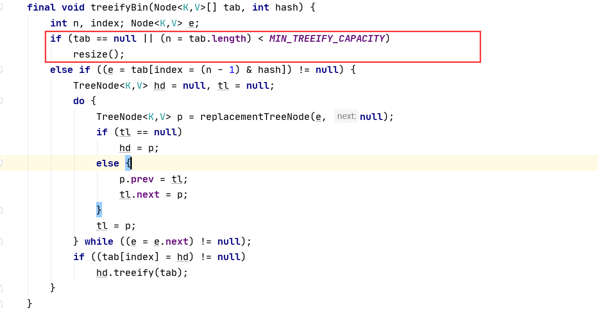
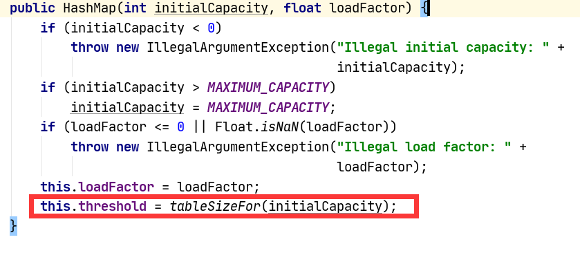

# 一、HashMap的底层实现？

## 1.jdk1.8之前

在jdk1.8之前，HashMap的底层是`数组`+`链表`也就是使用链表散列。HashMap通过key的hashCode经过扰动函数处理后得到hash值，然后通过(n - 1)&hash的方法得到当前元素存放的位置，如果当前位置存在元素，那么判断要存入的元素的hash值以及key是否相同，如果相同则直接覆盖，如果不同则通过拉链法解决hash冲突

在hash方法中要进行一些扰动是为了防止一些比较差的hashcode方法减少碰撞

> 常见的哈希冲突的解决方法：
>
> 1. 拉链法：当出现hash冲突时，直接将元素放置到该节点的单链表中
> 2. 开放地址法：当冲突发生时，使用某种探查技术寻找散列表中下一个空的散列地址，只要散列表的长度足够大，那么散列地址就总能找到

## 2.jdk1.8之后

在jdk1.8之后，相比于之前的版本底层数据结构增加了红黑树，当链表的长度大于阈值8并且当前数组的长度大于64时，会将链表转为红黑树

> 红黑树就是为了解决二叉查找树有可能高度不平衡有可能会转为线性结构这个问题

# 二、 JDK1.8中为什么要使用红黑树

HashMap中的数据结构jdk1.8较jdk1.7增加了红黑树

- JDK1.7：数组+链表
- JDK1.8：数组+链表+红黑树

但是为什么要增加使用红黑树呢？增加效率。因为JDK7中是用数组+链表来作为底层的数据结构的，但是如果数据量较多，或者hash算法的散列性不够，可能导致链表上的数据太多，导致链表过长，考虑一种极端情况：如果hash算法很差，所有的元素都在同一个链表上。那么在查询数据的时候的时间复杂度和链表查询的时间复杂度差不多是一样的，我们知道链表的一个优点是插入快，但是查询慢，所以如果HashMap中出现了很长的链表结构会影响整个HashMap的查询效率，我们使用HashMap时插入和查询的效率是都要具备的，而红黑树的插入和查询效率处于完全平衡二叉树和链表之间，所以使用红黑树是比较合适的。  

# 三、什么时候从链表变为红黑树

具体可以直接看hashmap将链表转为红黑树这块逻辑，具体在putVal方法（注意这块是jdk1.8的源码）,

在jdk1.8中，点击put方法，可以看到调用putVal方法：

```java
public V put(K key, V value) {
    return putVal(hash(key), key, value, false, true);
}

final V putVal(int hash, K key, V value, boolean onlyIfAbsent,
               boolean evict) {
    
    Node<K,V>[] tab; Node<K,V> p; int n, i;
    //如果底层数组为空 或者 底层长度为0就将调用resize()方法进行数组扩容
    if ((tab = table) == null || (n = tab.length) == 0)
        n = (tab = resize()).length;
    // (n - 1) & hash为计算索引下标的方法，判断该索引下标位置上是否为null，如果为null，说明没有发生哈希冲突，那么直接存入数据
    if ((p = tab[i = (n - 1) & hash]) == null)
        tab[i] = newNode(hash, key, value, null);
    //下面的方法便是解决hash冲突
    else {
        Node<K,V> e; K k;
        //如果发现当前下标的节点和传入的节点相同(hashcode一样)，则直接进行覆盖操作，在代码的最下面会判断e是不是为空，如果e不为空，说明不需要进行覆盖
        if (p.hash == hash &&
            ((k = p.key) == key || (key != null && key.equals(k))))
            e = p;
        //判断p也就是table[i]的头结点是不是树形节点，也就是判断当前是不是已经转为红黑树了
        else if (p instanceof TreeNode)
            e = ((TreeNode<K,V>)p).putTreeVal(this, tab, hash, key, value);
        //下面else说明当前结构还是链表
        else {
            //binCount统计当前链表的节点数
            for (int binCount = 0; ; ++binCount) {
                if ((e = p.next) == null) {
                    p.next = newNode(hash, key, value, null);
                    //判断是否要转为红黑树
                    if (binCount >= TREEIFY_THRESHOLD - 1) // -1 for 1st
                        treeifyBin(tab, hash);
                    break;
                }
                if (e.hash == hash &&
                    ((k = e.key) == key || (key != null && key.equals(k))))
                    break;
                p = e;
            }
        }
        //e如果不为空，说明存在节点一样的情况，需要进行覆盖，那么这段代码要放在遍历完链表(红黑树)之后，因为在链表中也有可能存在节点一样的情况
        if (e != null) { // existing mapping for key
            //返回老的值
            V oldValue = e.value;
            if (!onlyIfAbsent || oldValue == null)
                e.value = value;
            afterNodeAccess(e);
            return oldValue;
        }
    }
    ++modCount;
    //长度加1，判断是否需要扩容
    if (++size > threshold)
        //具体的扩容方法
        resize();
    afterNodeInsertion(evict);
    return null;
}
```

通过分析，下面这段代码就是判断是否将链表转为红黑树

```java
static final int TREEIFY_THRESHOLD = 8;

if (binCount >= TREEIFY_THRESHOLD - 1) // -1 for 1st
    treeifyBin(tab, hash);
```

可以知道TREEIFY_THRESHOLD - 1=7，所以链表里元素数目到8个时，会开始调用treeifyBin方法，但是==是不是只要链表的长度大于8时，就进行链表转红黑树呢？答案：不是==

接着进入treeifyBin方法



可以看到在treeifyBin方法中，==还加了一个判断==

```java
static final int MIN_TREEIFY_CAPACITY = 64;
if (tab == null || (n = tab.length) < MIN_TREEIFY_CAPACITY)
         resize();
```

resize之前讲到过，是一个扩容的方法，也就是说要想从链表转为红黑树必须满足两个条件：

- 是链表的长度达到8个
- 是数组的长度达到64个

# 四、hash算法与计算table下标的方法

哈希算法的好坏将直接影响哈希表的效率，我们一般的构思是，如果有一个数组table[16]，那么要将值散列到数组中，可以使用取模的方式，对15进行取模，这样的结果一定在0-15内，但是在hashmap中并没有使用取模的算法，因为这样效率不高，在hashmap中使用的是位运算

先看JDK1.7的的put方法源码

```java
    if (table == EMPTY_TABLE) {
        inflateTable(threshold);
    }
    //key为null，这里说明运行null值
    if (key == null)
        return putForNullKey(value);
    //计算hash的方法
    int hash = hash(key);
    //计算数组下标的方法
    int i = indexFor(hash, table.length);
    //遍历链表，判断是否存在覆盖情况
    for (Entry<K,V> e = table[i]; e != null; e = e.next) {
        Object k;
        if (e.hash == hash && ((k = e.key) == key || key.equals(k))) {
            V oldValue = e.value;
            e.value = value;
            e.recordAccess(this);
            return oldValue;
        }
    }

    modCount++;
    //具体的添加节点方法
    addEntry(hash, key, value, i);
    return null;
}
```

先来看看**JDK1.7中的indexFor**方法，也就是计算数组下标的方法

```java
static int indexFor(int h, int length) {
    // assert Integer.bitCount(length) == 1 : "length must be a non-zero power of 2";
    return h & (length-1);
}
```

可以看到就一行代码，并没有使用取模运算。上面有一行注释很重要“length must be a non-zero power of 2”，也就是说长度必须是2的非零次幂，这点在后面会讲到。

假设数组长度为16，可以手动的来进行计算一下，首先要明确数组下标是一定要在0-15之间的，看源码中的哈希算法是如何实现的

```
//假设hash值计算下来是1010 1100(当然这里只是模拟一下，int类型总共有32个bit，这里假设8个bit)
	1010 1100
&	0000 1111	//15的二进制
	0000 1100	//12
//在假设一种极端情况,*表示该为可为0，可为1
	**** 1111
&	0000 1111
	0000 1111 	//15
```

也就是说，不论hash值为多少，通过这种算法算下来，高位一定为0(0与任何数与都为0)，低4位一定不大于1111也就是15，这样就将数组下标控制在了0-15，很巧妙，其实这也就是==为什么长度必须是2的非零次幂==

但是这里也有点小问题，就是hash值得高位全部都被浪费掉了，哈希算法的本意是减少哈希冲突增大散列程度，但是使用与运算直接将hash的高位浪费，所以在真正计算哈希方法的时候使用了一系列位运算来增大散列程度，下面是jdk1.7中的hash方法

```java
final int hash(Object k) {
    int h = hashSeed;
    if (0 != h && k instanceof String) {
        return sun.misc.Hashing.stringHash32((String) k);
    }

    h ^= k.hashCode();

    // This function ensures that hashCodes that differ only by
    // constant multiples at each bit position have a bounded
    // number of collisions (approximately 8 at default load factor).
    h ^= (h >>> 20) ^ (h >>> 12);
    return h ^ (h >>> 7) ^ (h >>> 4);
}
```

**再来看看jdk1.8中的方法**，jdk1.8中直接取消了indexFor方法，因为这就一行代码，可以在putval方法中看到它的踪迹，可以看到同样也是(n - 1) & hash采用与运算，但是hash方法没有jdk1.7那么复杂了，这样能提高效率，因为jdk1.8中采用了链表＋红黑树的方法，如果链表过长直接转为红黑树，那么也就不太需要例如jdk1.7中的hash方法那样复杂区提高散列程度了

```java
static final int hash(Object key) {
    int h;
    return (key == null) ? 0 : (h = key.hashCode()) ^ (h >>> 16);
}
 final V putVal(int hash, K key, V value, boolean onlyIfAbsent,
                   boolean evict) {
     //......i = (n - 1) & hash
     if ((p = tab[i = (n - 1) & hash]) == null)
            tab[i] = newNode(hash, key, value, null);
        else {
     //......
```


# 五、 怎么实现的将数组长度控制在2的的非零次幂

从第4个问题之中已经知道了，HashMap要将长度控制为2的非0次幂，这样做是因为在计算数组下标时采用了位运算&，这样提高效率，但是HashMap中是采用什么方法来控制数组长度是2的非零次幂呢？


1. HashaMap有三个构造方法，可选数组容量，转载因子，默认的数组容量是16，这是2的次幂没有问题。分析jdk1.7中的源码：下面的代码都是jdk1.7中的：

```java
static final int DEFAULT_INITIAL_CAPACITY = 1 << 4; // aka 16
public HashMap() {
    this(DEFAULT_INITIAL_CAPACITY, DEFAULT_LOAD_FACTOR);
}
public HashMap(int initialCapacity) {
    this(initialCapacity, DEFAULT_LOAD_FACTOR);
}
public HashMap(int initialCapacity, float loadFactor) {
    if (initialCapacity < 0)
        throw new IllegalArgumentException("Illegal initial capacity: " +
                                           initialCapacity);
    if (initialCapacity > MAXIMUM_CAPACITY)
        initialCapacity = MAXIMUM_CAPACITY;
    if (loadFactor <= 0 || Float.isNaN(loadFactor))
        throw new IllegalArgumentException("Illegal load factor: " +
                                           loadFactor);

    this.loadFactor = loadFactor;
    threshold = initialCapacity;
    init();
}
```

**jdk1.8的构造方法和jdk1.7的大同小异，这里不做分析**

2. 当自定义initialCapacity时会破坏数组长度是2的次幂这个规则吗？

**先看jdk1.7的代码**

在jdk1.7中创建初始数组的方法在inflateTable中

```java
private void inflateTable(int toSize) {
    // Find a power of 2 >= toSize
    int capacity = roundUpToPowerOf2(toSize);

    threshold = (int) Math.min(capacity * loadFactor, MAXIMUM_CAPACITY + 1);
    table = new Entry[capacity];
    initHashSeedAsNeeded(capacity);
}


public static int bitCount(int i) {
    // HD, Figure 5-2
    i = i - ((i >>> 1) & 0x55555555);
    i = (i & 0x33333333) + ((i >>> 2) & 0x33333333);
    i = (i + (i >>> 4)) & 0x0f0f0f0f;
    i = i + (i >>> 8);
    i = i + (i >>> 16);
    return i & 0x3f;
}
```

在inflateTable方法中可以看到roundUpToPowerOf2，那么继续看roundUpToPowerOf2

```java
private static int roundUpToPowerOf2(int number) {
    // assert number >= 0 : "number must be non-negative";
    int rounded = number >= MAXIMUM_CAPACITY
        ? MAXIMUM_CAPACITY
        : (rounded = Integer.highestOneBit(number)) != 0
            ? (Integer.bitCount(number) > 1) ? rounded << 1 : rounded
            : 1;

    return rounded;
}
```

继续看Integer类的highestOneBit方法：

```java
//Integer类
public static int highestOneBit(int i) {
    // HD, Figure 3-1
    i |= (i >>  1);
    i |= (i >>  2);
    i |= (i >>  4);
    i |= (i >>  8);
    i |= (i >> 16);
    return i - (i >>> 1);
}
```

先明白这个方法的作用，可以测试一下

```java
public class IntegerTest {
    public static void main(String[] args) {
        System.out.println(Integer.highestOneBit(9));
        System.out.println(Integer.highestOneBit(15));
        System.out.println(Integer.highestOneBit(17));
    }
}
//输出
8
8
16
```

由此看见highestOneBit是输出小于当前数的最大2的次幂，4例如9那么输出8，那么就以9为例子，看这个方法是如何实现的还是假设只有8bit

```
	0000 1001	//原数9
// i |= (i >>  1);
//i >>  1	//先进行右移1位
	0000 0100
| 	0000 1001	//和之前的数进行与运算
	0000 1101
//i |= (i >>  2);	//右移两位
//i >>  2
	0000 0110
|	0000 1101	//和之前的数进行与运算
	0000 1111
//i |= (i >>  4);
//i >>  4		//右移四位
	0000 0000
|	0000 1111	//和之前的数进行与运算
	0000 1111	//后面的运算不做分析了，因为只有8bit
//i >>> 1
	0000 0111
//i - (i >>> 1)
	0000 1111
-	0000 0111
	0000 1000	//得到8
```

总结：highestOneBit方法可以得到小于当前数的最大的2次幂，例如0000 1###这个数，#代表这个位置可以为0和1，先进行右移或运算，得到0000 0111，再将这个数右移得到0000 0011，最后用0000 0111 - 0000 0011最终得到了0000 0100

接着回到roundUpToPowerOf2方法：

```java
private static int roundUpToPowerOf2(int number) {
    // assert number >= 0 : "number must be non-negative";
    int rounded = number >= MAXIMUM_CAPACITY
        ? MAXIMUM_CAPACITY
        : (rounded = Integer.highestOneBit(number)) != 0
            ? (Integer.bitCount(number) > 1) ? rounded << 1 : rounded
            : 1;

    return rounded;
}
```

这里用了很多的三元运算符，首先是判断rounded是不是大于最大容量

```JAVA
static final int MAXIMUM_CAPACITY = 1 << 30;
```

可见这个容量挺大的，接着调用highestOneBit方法获得number(自定义的容量)2的次幂最大值，接着bitCount方法判断当前数2进制中1的个数，接着 rounded << 1这样一来就获得了大于当前容量的最小2的次幂例如，输入的15先调用highestOneBit得到8，然后左移得到16，这样就将数组初始容量控制在了2的次幂

==上面是jdk1.7中的源码，下面看看jdk1.8的源码==



当自定义容量时调用的是tableSizeFor方法

```java
static final int tableSizeFor(int cap) {
    int n = cap - 1;
    n |= n >>> 1;
    n |= n >>> 2;
    n |= n >>> 4;
    n |= n >>> 8;
    n |= n >>> 16;
    return (n < 0) ? 1 : (n >= MAXIMUM_CAPACITY) ? MAXIMUM_CAPACITY : n + 1;
}
```

自己写了一个测试方法

```java
public static int test(int cap){
    int n = cap - 1;
    n |= n >>> 1;
    n |= n >>> 2;
    n |= n >>> 4;
    n |= n >>> 8;
    n |= n >>> 16;
    return (n < 0) ? 1 : (n >= MAXIMUM_CAPACITY) ? MAXIMUM_CAPACITY : n + 1;
}
public static void main(String[] args) {
    System.out.println(test(6));
    System.out.println(test(8));
    System.out.println(test(15));

}
//输出
8
8
16
```

有了之前highestOneBit方法的基础，分析这个方法轻而易举了，例如0000 1###经过一系列的右移、或运算之后得到的计算0000 1111那么最后在将其+1不就是可以得到0001 0000了啊，可见jdk1.8在1.7的基础上优化了好多。

# 六、put方法流程(jdk1.8)

put方法的源码解析如下：

```java
public V put(K key, V value) {
    return putVal(hash(key), key, value, false, true);
}

final V putVal(int hash, K key, V value, boolean onlyIfAbsent,
               boolean evict) {
    
    Node<K,V>[] tab; Node<K,V> p; int n, i;
    //如果底层数组为空 或者 底层长度为0就将调用resize()方法进行数组扩容
    if ((tab = table) == null || (n = tab.length) == 0)
        n = (tab = resize()).length;
    // (n - 1) & hash为计算索引下标的方法，判断该索引下标位置上是否为null，如果为null，说明没有发生哈希冲突，那么直接存入数据
    if ((p = tab[i = (n - 1) & hash]) == null)
        tab[i] = newNode(hash, key, value, null);
    //下面的方法便是解决hash冲突
    else {
        Node<K,V> e; K k;
        //如果发现当前下标的节点和传入的节点相同(hashcode一样)，则直接进行覆盖操作，在代码的最下面会判断e是不是为空，如果e不为空，说明不需要进行覆盖
        if (p.hash == hash &&
            ((k = p.key) == key || (key != null && key.equals(k))))
            e = p;
        //判断p也就是table[i]的头结点是不是树形节点，也就是判断当前是不是已经转为红黑树了
        else if (p instanceof TreeNode)
            e = ((TreeNode<K,V>)p).putTreeVal(this, tab, hash, key, value);
        //下面else说明当前结构还是链表
        else {
            //binCount统计当前链表的节点数
            for (int binCount = 0; ; ++binCount) {
                if ((e = p.next) == null) {
                    p.next = newNode(hash, key, value, null);
                    //判断是否要转为红黑树
                    if (binCount >= TREEIFY_THRESHOLD - 1) // -1 for 1st
                        treeifyBin(tab, hash);
                    break;
                }
                if (e.hash == hash &&
                    ((k = e.key) == key || (key != null && key.equals(k))))
                    break;
                p = e;
            }
        }
        //e如果不为空，说明存在节点一样的情况，需要进行覆盖，那么这段代码要放在遍历完链表(红黑树)之后，因为在链表中也有可能存在节点一样的情况
        if (e != null) { // existing mapping for key
            //返回老的值
            V oldValue = e.value;
            if (!onlyIfAbsent || oldValue == null)
                e.value = value;
            afterNodeAccess(e);
            return oldValue;
        }
    }
    ++modCount;
    //长度加1，判断是否需要扩容
    if (++size > threshold)
        //具体的扩容方法
        resize();
    afterNodeInsertion(evict);
    return null;
}
```

总体判断流程如下：

1. 底层数组是否为空，如果为空，则调用resize方法
2. 使用hash & (n-1)计算出该key在数组的下标，判断该下标的节点是否为空，如果为空说明没有出现hash冲突则直接存入数据
3. 出现hash冲突，使用hashCode和equals方法判断key是否一样，如果一样进行覆盖操作
4. 判断该节点是否已经是树节点，如果是则进入到树节点的插入逻辑
5. 循环遍历该节点引入的链表，同时也判断是否该链表节点是否与key相等，如果有相等的直接break，如果不相等插入到链表尾部，同时判断当前链表长度是否大于8，大于8进入红黑树转化逻辑
6. 如果在遍历链表查找hash冲突的时候发现有需要覆盖的，就进行覆盖
7. 判断是否需要扩容，需要则进行扩容

总体上说，就是在查找是否有key相等的过程，如果有key相等则需要进行覆盖，同时在这个过程中判断是否需要改为红黑树，是否需要扩容

这里贴一张图，完整的显示了上面的put方法逻辑