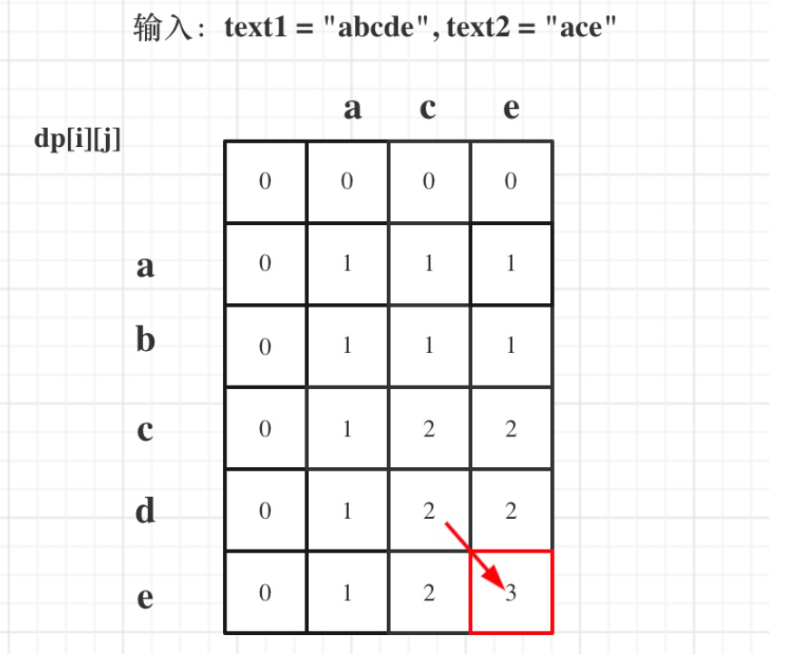

## 1.最长公共子串

```
给定两个字符串str1和str2,输出两个字符串的最长公共子串
题目保证str1和str2的最长公共子串存在且唯一。
示例1

输入
"1AB2345CD","12345EF"

输出
"2345"
```

==思路：子串和子序列不同的是，子串是需要连续的，对付这种题目可以使用二维矩阵dp[i] [j] 如果str1(i) == str2(j) 那么dp[i] [j] = dp[i - 1] [j - 1] + 1 ，如果不相等则dp[i] [j] = 0==

例如：str=acbcbcef，str2=abcbced，则str和str2的最长公共子串为bcbce，最长公共子串长度为5。则画表如下：


这种题目的思路是基于两点 ①最小子结构 ② 重叠子问题

对付dp[i] [j] 有两种情况(dp[i] [j]表示的是字符串str(0,i)与str2(0,j) 的最长公共子串的长度，这里使用长度表示字符串)：

- str(i) == str(j) ：继续分割子问题 那么dp[i] [j] = dp[i - 1] [j - 1] + 1(1代表当前已经有一个)
- str(i) != str(j) ：说明当前已经不符合公共子串了

也就是说对于dp[i] [j]已经可以写出如上的两个递归方程了，那么是不是使用递归呢？递归时可以做的，但是递归做了和多重复的子问题，举个简单的例子：斐波那契数列的求法是f(n) =  f(n - 1) + f(n - 2)，如果使用递归则很容易爆栈，因为有很多的子问题的存在，解决这个问题的办法之一便是使用数组将其存起来，需要的时候直接使用即可

同样的这里使用一个dp数组，将所有结构存起来，使得在需要使用时是直接取出，而不是再接着求解子问题，下面是代码

```java
import javautil.*;


public class Solution {
    /**
     * longest common substring
     * @param str1 string字符串 the string
     * @param str2 string字符串 the string
     * @return string字符串
     */
    public String LCS (String str1, String str2) {
        // write code here
        int[][] dp = new int[str1.length()][str2.length()];
        int index = 0;
        int res = 0;
        for(int i = 0;i < dp.length;i++){
            for(int j = 0;j < dp[0].length;j++){
                //如果不相等 则dp[i][j] = 0
                if(str1.charAt(i) != str2.charAt(j)){
                    dp[i][j] = 0;
                }else{
                    if(i ==0 || j == 0) dp[i][j] = 1;
                    //如果相等 则应该加上上一个字符的最大长度
                    else dp[i][j] = dp[i - 1][j - 1] + 1;
                }
                //求出最优解
                if(dp[i][j] > res){
                    res = dp[i][j];
                    index = i;
                }
            }
        }
        System.out.println(res);
        return str1.substring(index - res + 1, index + 1);

    }
}
```


## 2.最长公共子序列

```
给定两个字符串str1和str2，输出连个字符串的最长公共子序列。如过最长公共子序列为空，则输出-1。
示例1
输入
"1A2C3D4B56","B1D23CA45B6A"
输出
"123456"
说明
"123456"和“12C4B6”都是最长公共子序列，任意输出一个。
```

==子序列与子串之间的区别在于，子序列不是连续的，其实还是重复使用如上的思路==

对于dp[i] [j] 的定义需要稍微做点改变 表示的是str1(0,i-1) ，str2(0,j - 1)，和上面不一样的原因是为了更好的处理后续的，这点后续再说

对于dp[i] [j] 来说 有以下情况：

- str(0, i - 1)  == str(0, j - 1)：两者相等，那么dp[i] [j] = dp[i - 1] [j - 1] + 1
- str(0, i - 1)  != str(0, j - 1)：两者不相等，那么dp[i] [j] = Math.max(dp[i] [j - 1], dp[i - 1] [j])

代码如下：

```java
class Solution {
    public int longestCommonSubsequence(String text1, String text2) {
        int[][] dp = new int[text1.length() + 1][text2.length() + 1];
        for(int i = 0;i <= text1.length(); i++){
            for(int j = 0;j <= text2.length(); j++){
                if(i == 0 || j == 0){
                    dp[i][j] = 0;
                    continue;
                }
                
                if(text1.charAt(i - 1) == text2.charAt(j - 1) ){
                    dp[i][j] = dp[i - 1][j - 1] + 1;
                }else{
                    dp[i][j] = Math.max(dp[i - 1][j], dp[i][j - 1]);
                }
            }
        }
        return dp[text1.length() ][text2.length() ];
    }
}
```




## 3. 最长回文子串

给定字符串**A**以及它的长度**n**，请返回最长回文子串的长度。

==思路一：暴力法，维护一个动态窗口，然后去判断这个窗口内的字符串是不是一个回文串，判断回文串使用左右指针即可==

```java
public class Solution {
    public int getLongestPalindrome(String A, int n) {
        // write code here
        Deque<Character> q = new LinkedList<>();
        int res = 0;
        for(int i = 0;i < n;i++){
            for(int j = i + 1;j <= n;j++){
                String str = A.substring(i, j);
                if(isPalind(str)){
                    res = Math.max(res, str.length());
                }
            }
        }
        return res;
         
    }
    public boolean isPalind(String s){
        int left = 0, right = s.length() - 1;
        while(left < right){
            if(s.charAt(left) != s.charAt(right))    return false;
            left++;
            right--;
        }
        return true;
    }
}
```

==思路二：动态规划这里只提供思路==

对于dp[i] [j] 表示字符串从下标i到j的字符串是否是回文自子串，则有dp[i] [j] = dp[i + 1] [j - 1] && (s(i) == s(j))，使用动态规划要注意填表的顺序，然后也要注意i + 1 < j - 1