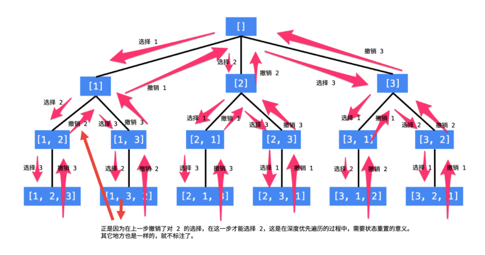

# 1. 电话号码的字母组合

给定一个仅包含数字 2-9 的字符串，返回所有它能表示的字母组合。答案可以按 任意顺序 返回。

给出数字到字母的映射如下（与电话按键相同）。注意 1 不对应任何字母。


```
输入：digits = "23"
输出：["ad","ae","af","bd","be","bf","cd","ce","cf"]
```

==思路：递归+回溯题目==

根据题意，本题就是一个排列题目，假设digits的长度是固定的，那么本题就很好做了，如果是长度为2那个两个for循环，如果为3那么三个for循环...

问题就出在digits的长度是不固定的也就是for循环的层数是不确定的，怎么回溯？

其实就是模板题目，首先需要使用map存储每一个数组对应的字符串，这些工作做好之后现在就变为取 “abc” "def" “ghi”（这里假设digits  = “234“）

对于这种排列问题，一般采取循环加回溯进行解决：

- 递归终止条件：选取的字符串的长度等于digits的长度
- 递归开始：每一层选取一个元素
- 状态标记：将当前元素加入临时结果字符串
- 状态撤销：将临时结果字符串的最后一个元素delete

看代码即可

```java
class Solution {
    List<String> res = new ArrayList<>();
    Map<Character, String> map = new HashMap<>();
    public List<String> letterCombinations(String digits) {
        if(digits.length() == 0) return res;
        //hash映射
        map.put('2', "abc");
        map.put('3', "def");
        map.put('4', "ghi");
        map.put('5', "jkl");
        map.put('6', "mno");
        map.put('7', "pqrs");
        map.put('8', "tuv");
        map.put('9', "wxyz");
        dfs(new StringBuffer(), digits, 0);
        return res;
    }
    public void dfs(StringBuffer temp, String digits, int index){
        //递归终止
       if(temp.length() == digits.length()){
           res.add(temp.toString());
       }else{
           String str = map.get(digits.charAt(index));
           for(int i = 0;i < str.length();i++){
               //状态标记
               temp.append(str.charAt(i));
               dfs(temp, digits, index + 1);
               //状态撤销
               temp.deleteCharAt(temp.length() - 1);
           }
       }
    }
}
```

# 2.全排列

[46. 全排列](https://leetcode-cn.com/problems/permutations/)

给定一个 **没有重复** 数字的序列，返回其所有可能的全排列。

```java
输入: [1,2,3]
输出:
[
  [1,2,3],
  [1,3,2],
  [2,1,3],
  [2,3,1],
  [3,1,2],
  [3,2,1]
]
```

分析：下图是来自其他人的题解上的图，很形象的描述出了DFS的过程以及回溯

1. 递归终止条件：
   - 如果已经选择的数组长度和原数组长度相等，递归终止
2. 状态撤销
   - 由于要回退到之前的转态，要对转态进行撤销，也就是递归时怎么添加的转态，就对递归怎么撤销



```java
class Solution {
    //最终结果集数组
    List<List<Integer>> res = new ArrayList<>();
    public List<List<Integer>> permute(int[] nums) {
        //dfs递归
        dfs(nums,new ArrayList<Integer>(), new int[nums.length]);
        return res;
    }
    public void dfs(int[] nums, List<Integer> temp, int[] visited){
        //终止条件
        if(temp.size() == nums.length){
            //这里add的时候可不能直接把tmep这个引用add进去了
            res.add(new ArrayList<>(temp));
            return;
        }
        for(int i = 0;i < nums.length;i++){
            if(visited[i] == 1) continue;
            //状态标记
            visited[i] = 1;
            //添加到结果数组中
            temp.add(nums[i]);
            dfs(nums, temp, visited);
            //撤销转态标记
            visited[i] = 0;
            temp.remove(temp.size() - 1);
        }
    }
}
```

# 2. 全排列2

给定一个可包含重复数字的序列 `nums` ，**按任意顺序** 返回所有不重复的全排列。

```
输入：nums = [1,1,2]
输出：
[[1,1,2],
 [1,2,1],
 [2,1,1]]
```

这个题目在1的基础上，输入的是可重复数字的序列，很显然要对结果进行剪枝

==思路一：==我的思路比较简单，最后的序列不就是不能重复嘛，那么我把他方法set集合里就可以解决这个问题了

```java
class Solution {
    Set<List<Integer>> res = new HashSet<>();
    public List<List<Integer>> permuteUnique(int[] nums) {
        dfs(nums, new ArrayList<>(), new int[nums.length]);
        return new ArrayList<>(res);
    }
    public void dfs(int[] nums, List<Integer> temp, int[] visited){
        //递归终止条件
        if(temp.size() == nums.length){
            res.add(new ArrayList<>(temp));
        }
        for(int i = 0;i < nums.length;i++){
            if(visited[i] == 1) continue;
            visited[i] = 1;
            temp.add(nums[i]);
            dfs(nums, temp, visited);
            visited[i] = 0;
            temp.remove(temp.size() - 1);
        }
    }
}
```

==解法二：==剪枝

首先要明确那种情况需要剪枝，对于数组[1,1',2]来说重复值[1,1',2]和[1',1,2]就是一对重复的值，那么剪枝条件就可以出来了

```java
 (i > 0 && nums[i] == nums[i - 1] && visited[i - 1] == 1)
```

表示当前的第二个数和第一个数相等并且第一个数已经被访问过了

```java
class Solution {
    //Set<List<Integer>> res = new HashSet<>();
     List<List<Integer>> res = new ArrayList<>();
    public List<List<Integer>> permuteUnique(int[] nums) {
        Arrays.sort(nums);
        dfs(nums, new ArrayList<>(), new int[nums.length]);
        return res;
    }
    public void dfs(int[] nums, List<Integer> temp, int[] visited){
        //递归终止条件
        if(temp.size() == nums.length){
            res.add(new ArrayList<>(temp));
        }
        for(int i = 0;i < nums.length;i++){
            if(visited[i] == 1 ||   (i > 0 && nums[i] == nums[i - 1] && visited[i - 1] == 1)) continue;
            visited[i] = 1;
            temp.add(nums[i]);
            dfs(nums, temp, visited);
            visited[i] = 0;
            temp.remove(temp.size() - 1);
        }
    }
}
```

