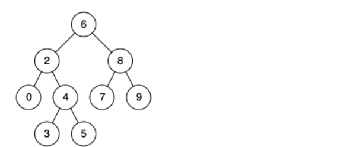

# 二叉搜索树的第k大节点

[二叉搜索树的第k大节点](https://leetcode-cn.com/problems/er-cha-sou-suo-shu-de-di-kda-jie-dian-lcof/)

给定一棵二叉搜索树，请找出其中第k大的节点

```
输入: root = [3,1,4,null,2], k = 1
   3
  / \
 1   4
  \
   2
输出: 4
```

==思路一：==起初的思路很简单，因为是二叉搜索树，所以先中序遍历一定是有序的，可以将这些节点存在list上，然后取出list.lenght - k下标的元素即可

==思路二：==上面思路是最容易想到的思路，但是这样额外的消耗了一个O(N)的空间吗，这个空间是完全可以避免的，因为在中序遍历的时候可以维护一个计数器吗，当计数器的值到达k时，将该值返回即可

```java
int count = 0;
int res = 0;
public int kthLargest(TreeNode root, int k) {    
  	count = k;
 	dfs(root);
  	return res;
}
public void dfs(TreeNode root){
    if(root.right != null)	dfs(root.right);
    if(--count == 0)	res = root.val;
    if(root.left != null)	dfs(root.left);
}
```

# 对称的二叉树

[剑指 Offer 28. 对称的二叉树](https://leetcode-cn.com/problems/dui-cheng-de-er-cha-shu-lcof/)

请实现一个函数，用来判断一棵二叉树是不是对称的。如果一棵二叉树和它的镜像一样，那么它是对称的。

```
请实现一个函数，用来判断一棵二叉树是不是对称的。如果一棵二叉树和它的镜像一样，那么它是对称的。

例如，二叉树 [1,2,2,3,4,4,3] 是对称的。

    1
   / \
  2   2
 / \ / \
3  4 4  3
但是下面这个 [1,2,2,null,3,null,3] 则不是镜像对称的:

    1
   / \
  2   2
   \   \
   3    3
```

==思路：==采用递归，相关的条件，对于整颗树的根节点来说：

- 如果左右子树都为空，则为true
- 如果左右子树有一个为空，则为false

对于普通的两个节点来说：

- 如果左右子树都为空，则为true
- 如果左右子树有一个为空，则为false
- 如果这两个节点的值不想等则为false

对称二叉树定义： 对于树中 任意两个对称节点 L 和 R ，一定有：

- L.val=R.val ：即此两对称节点值相等。
- L.left.val = R.right.val  ：即 L 的 左子节点 和 R 的 右子节点 对称；
- L.right.val = R.left.val ：即 L 的 右子节点 和 R 的 左子节点 对称。

```java
public boolean isSymmetric(TreeNode root) {
    if(root == null)    return true;
    if(root.left == null && root.right == null) return true;
    if(root.left == null || root.right == null) return false;
    return helper(root.left, root.right);
}
public boolean helper(TreeNode left, TreeNode right){
    if(left == null && right == null)   return true;
    if(left == null || right == null) return false;
    if(left.val != right.val)   return false;
    return helper(left.left, right.right) && helper(left.right, right.left);
}
```

# 平衡二叉树

[剑指 Offer 55 - II. 平衡二叉树](https://leetcode-cn.com/problems/ping-heng-er-cha-shu-lcof/)

输入一棵二叉树的根节点，判断该树是不是平衡二叉树。如果某二叉树中任意节点的左右子树的深度相差不超过1，那么它就是一棵平衡二叉树。

```
    3
   / \
  9  20
    /  \
   15   7
返回 true 
```

==思路：==还是采取递归，判定一个节点是平衡二叉树，只需要左右子树都是平衡二叉树即可，这里的前提是需要引入计算深度的函数

```java
public boolean isBalanced(TreeNode root) {
    if(root == null)    return true;
    if(Math.abs(deepth(root.left) - deepth(root.right)) > 1)  return false;
    return isBalanced(root.left) && isBalanced(root.right);
}
public int deepth(TreeNode root){
    if(root == null)    return 0;
    return Math.max(deepth(root.left), deepth(root.right)) + 1;
}
```

# 二叉搜索树的最近公共祖先

[剑指 Offer 68 - I. 二叉搜索树的最近公共祖先](https://leetcode-cn.com/problems/er-cha-sou-suo-shu-de-zui-jin-gong-gong-zu-xian-lcof/)

给定一个二叉搜索树, 找到该树中两个指定节点的最近公共祖先。

百度百科中最近公共祖先的定义为：“对于有根树 T 的两个结点 p、q，最近公共祖先表示为一个结点 x，满足 x 是 p、q 的祖先且 x 的深度尽可能大（一个节点也可以是它自己的祖先）。”

例如，给定如下二叉搜索树:  root = [6,2,8,0,4,7,9,null,null,3,5]



我的思路：因为是二叉搜索树，所以找到p所在节点，将该节点路径上的节点存入一个栈中，然后遍历这个栈依次将栈内节点当做根节点遍历，最后如果遍历得到q节点，那么返回该栈内节点，结果就是时间复杂度直接爆炸，空间复杂度还好一点，超过100%的人

```java
    public TreeNode lowestCommonAncestor(TreeNode root, TreeNode p, TreeNode q) {
        Deque<TreeNode> stack = new LinkedList<>();
        dfs(root,stack,p);
        for(int i = 0; i < stack.size();i++){
            TreeNode node = stack.pop();
            if(have(node, q)){
                return node;
            }
        }
        return null;
    }

    public void dfs(TreeNode root, Deque<TreeNode> stack, TreeNode p){
        if(root.val == p.val) {
            stack.push(root);
            return;   //
        }
        if(p.val < root.val) {
            stack.push(root.left);
            dfs(root.left, stack, p);
        }
        if(p.val > root.val){
            stack.push(root.right);
            dfs(root.right, stack, p);
        }
    }

    public boolean have(TreeNode root, TreeNode p){
        if(root == null)    return false;
        if(root.val == p.val)  return true;
        return have(root.right, p) || have(root.left, p);
    }
```

题解思路：题解思路也非常的清晰：

- 最近公共祖先的定义： 设节点 root 为节点 p,q 的某公共祖先，若其左子节点 root.left 和右子节点 root.right 都不是 p,q 的公共祖先，则称 root 是 “最近的公共祖先” 。

根据以上定义，若 root 是 p,q 的 最近公共祖先 ，则只可能为以下情况之一：

①p 和 q 在 root 的子树中，且分列 root 的 异侧（即分别在左、右子树中）；
		②p = root，且 q 在 root 的左或右子树中；
		③q = root，且 p 在 root 的左或右子树中；

本题给定了两个重要条件：① 树为 二叉搜索树 ，② 树的所有节点的值都是 唯一 的。根据以上条件，可方便地判断 p,q 与 root 的子树关系，即：

- 若 root.val < p.val，则 p 在 root右子树 中；
- 若 root.val > p.val ，则 p 在 root左子树 中；
- 若 root.val = p.val ，则 p 和 root指向同一节点 。

==具体解法：==

- 循环搜索： 当节点 root 为空时跳出；
- 当 p, q 都在 root 的 右子树 中，则遍历至 root.right；
- 否则，当 p,q 都在 root的 左子树 中，则遍历至 root.left；
- 否则，说明找到了 最近公共祖先 ，跳出。

```java
class Solution {
    public TreeNode lowestCommonAncestor(TreeNode root, TreeNode p, TreeNode q) {
        while(root != null) {
            if(root.val < p.val && root.val < q.val) // p,q 都在 root 的右子树中
                root = root.right; // 遍历至右子节点
            else if(root.val > p.val && root.val > q.val) // p,q 都在 root 的左子树中
                root = root.left; // 遍历至左子节点
            else break;
        }
        return root;
    }
}
```

# 序列化二叉树

[剑指 Offer 37. 序列化二叉树](https://leetcode-cn.com/problems/xu-lie-hua-er-cha-shu-lcof/)

请实现两个函数，分别用来序列化和反序列化二叉树。

```
你可以将以下二叉树：

    1
   / \
  2   3
     / \
    4   5

序列化为 "[1,2,3,null,null,4,5]"
```

==思路：==序列化二叉树的过程采取栈+层序遍历的方式，和层序遍历的处理方式大致一样，只不过增加了null值的处理，在普通层序遍历中需要判断当前节点的子节点是否为空，那么在本题中就不需要判断这个了，因为我们将空节点加入然后可以将空节点处理成null，下面是普通层序遍历

```java
public int[] levelOrder(TreeNode root) {
    List<Integer> res = new ArrayList<>();
    Deque<TreeNode> q = new LinkedList<>();
    if(root == null)    return new int[]{};
    q.add(root);
    while(!q.isEmpty()){
        TreeNode temp = q.poll();                
        res.add(temp.val);
        if(temp.left != null) q.add(temp.left);
        if(temp.right != null) q.add(temp.right);
    }
    int[] r = new int[res.size()];
    for(int i = 0;i < res.size();i++){
        r[i] = res.get(i);
    }
    return r;
}
```

而在本题中，则只需要判断当前节点是否为空即可

```java
    public String serialize(TreeNode root) {
        StringBuffer sb = new StringBuffer();
        Deque<TreeNode> q = new LinkedList<>();
        if(root == null)    return "";
        q.offer(root);
        while(!q.isEmpty()){
            TreeNode node = q.pop();
            if(node != null){
                q.offer(node.left);
                q.offer(node.right);
                sb.append(node.val + ",");
            }else{
                sb.append("#" + ",");
            }
        }
        sb.deleteCharAt(sb.length()- 1);
        String res = sb.toString();
        // int i = 0;
        // for(i = res.length() - 1;i >= 0;i--){
        //     if(res.charAt(i) >= '0' && res.charAt(i) <= '9') break;
        // }
        // i++;
        // res = res.substring(0, i);
        System.out.println(res);
        return res;

    }
```

需要注意的是，上面会输出{1,2,3,#,#,4,5,#,#,#,#}，而将注释的代码打开会生成{1,2,3,#,#,4,5}，这里有个细节就是如果增加了后面尾巴的处理，那么在后续的反序列的过程中需要不断的判断数组是否为空

反序列化的过程需要用到队列，首先先将第一个节点加入队列里面，然后进行while循环(判断条件是队列为空)，不断的增加子节点同时增加数组下标index，因为我们在序列化的处理过程中没有去掉后面的小尾巴，所以一定不会出现数组下标越界

```java
public TreeNode deserialize(String data) {
    if(data == null || data.length() == 0)  return null;
    int index = 0;
    String[] tree = data.split(",");
    Deque<TreeNode> q = new LinkedList<>();
    TreeNode head = new TreeNode(Integer.valueOf(tree[index++]));
    q.offer(head);
    while(!q.isEmpty()){
        TreeNode node = q.pop();

        String temp = tree[index++];
        if(!temp.equals("#")){
            node.left = new TreeNode(Integer.valueOf(temp));
            q.offer(node.left);
        }

        temp = tree[index++];
        if(!temp.equals("#")){
            node.right = new TreeNode(Integer.valueOf(temp));
            q.offer(node.right);
        }

    }
    return head;
}
```

